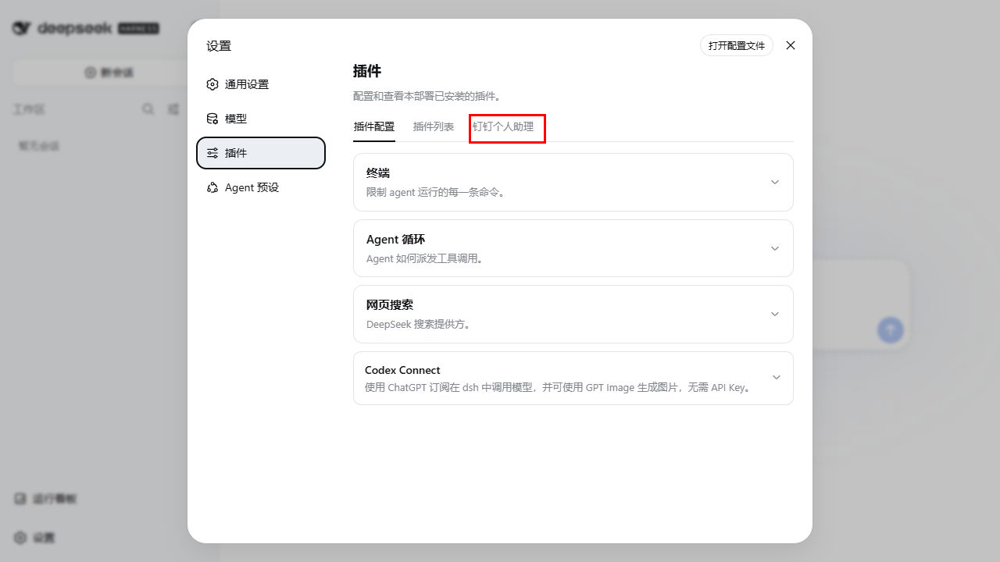
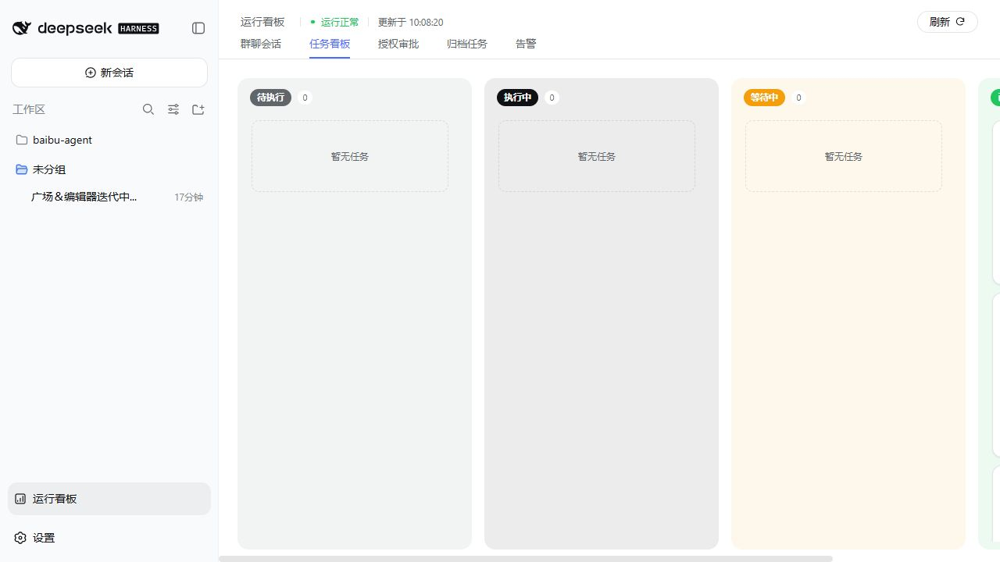

# DingTalk DSH Assistant

`dingtalk-dsh-assistant` 是一组运行在 [DeepSeek Harness（DSH）](https://github.com/deepseek-ai/DeepSeek-Harness) 中的钉钉个人助理插件，不是独立 Agent 平台，也不自行实现第二套 Session、Agent 或任务执行引擎。

插件负责把钉钉群消息接入 DSH，并将群聊协作映射到 DSH 原生能力：每个常驻群绑定一个固定主 Session，主 Session 负责沟通与协调；实际任务由独立叶子 Session 和 Goal 执行。Agent 身份、工作规则与可用工具由配置的工作区及其 `AGENTS.md` 决定，插件本身不包含个人姓名或数字分身设定。

## 与 DSH 的关系

插件直接复用以下 DSH 机制：

- `Session`：每个群一个常驻主会话，每个 Task 一个独立叶子会话。
- `subagent`：主会话只协调，叶子会话独立执行任务。
- `Goal`：维持叶子任务的持续执行、恢复和完成状态。
- `systemPrompt.section`：向主会话注入群名称、群 ID、群职责与决策协议；向叶子会话注入任务流程和证据要求。
- Agent Registry 与原生 descriptor：在 DSH Web 中展示并打开常驻会话、叶子对话和轨迹。
- 默认模型、推理深度与权限 preset：由 DSH 原生服务保存和应用。
- storage domain：持久化群订阅、消息、Task、可靠投递、授权申请和告警。
- attachment service：将钉钉图片作为 DSH 原生多模态附件传入会话。

插件只补充钉钉渠道和群聊工作流特有的能力：DWS 订阅与补拉、消息去重排序、任务准入与关联、可靠 outbox、授权审批、任务看板和运行告警。

```text
DWS 群消息
  → dingtalk-dsh-assistant
  → DSH resident 主 Session（判断、沟通、协调）
  → DSH leaf Session + Goal（独立执行）
  → 主 Session（组织结果）
  → outbox + DWS 回读确认
  → 原群引用回复并 @任务提出人
```

不依赖 Agent Studio，也不要再并行启动另一套会话或任务 Runtime。

## 包结构

- `packages/dingtalk-dsh-assistant`：核心业务插件。负责 DWS 接入、群与 Session 绑定、消息处理、Task 调度、授权审批、可靠回复和配置页面。
- `packages/dingtalk-dsh-observer`：DSH Web 展示扩展。提供群聊会话、任务看板、归档任务、授权审批和告警页面。
- `.dsh/profiles/resident`：resident Runtime 的参考 profile 与 Cordis patch。
- `.dsh/profiles/web`：Web contribution 的参考 profile。
- `docs/spec`：关键状态机和工作流设计说明。
- `test`：插件单元测试和 Runtime 契约测试。

## 环境要求

- Windows 11 与 PowerShell 7。
- Node.js 24 或更高版本。较低版本缺少 DSH Session JSONL 持久化所需的 zstd API。
- 已安装 DSH，并能正常启动 `dsh web`。
- 已安装并配置所选模型对应的 DSH provider。只有使用 ChatGPT/Codex 订阅时才需要 `dsh-codex-connect`。
- 已安装并登录 DWS。只有启用真实钉钉订阅时才需要。

网络环境需要代理时，可在插件的 Agent 配置中填写代理地址，也可以在启动前设置 `HTTP_PROXY` / `HTTPS_PROXY`。

### Skill 文件路径

DSH 根据 Session 的 Agent 工作目录发现项目级 Skill，同时加载用户级 Skill。默认扫描顺序如下，靠前的同名 Skill 优先：

1. `<Agent工作区>\.dsh\skills\<skill-name>\SKILL.md`
2. `<Agent工作区>\.agents\skills\<skill-name>\SKILL.md`
3. profile 显式配置的 `customSkillDirs`
4. `%DSH_HOME%\skills\<skill-name>\SKILL.md`，`DSH_HOME` 默认是 `%USERPROFILE%\.dsh`
5. `%DSH_AGENTS_HOME%\skills\<skill-name>\SKILL.md`，`DSH_AGENTS_HOME` 默认是 `%USERPROFILE%\.agents`

给本机所有 DSH 项目共享的 Skill，推荐安装到 `%USERPROFILE%\.agents\skills`；只服务当前 Agent 工作区的 Skill，推荐安装到 `<Agent工作区>\.agents\skills`。DSH 不扫描 `%USERPROFILE%\.codex\skills`，仅安装在 Codex Skill 目录中的 `write-pr`、`dingtalk-*` 等 Skill 不会进入 resident 或叶子 Session。

复制时必须保留完整的 `<skill-name>` 目录，不能只复制 `SKILL.md`，因为 Skill 可能引用同目录下的 `references`、`scripts` 或其他资源。目录被发现只表示 Skill 已进入会话目录；模型仍会在任务命中触发条件后调用 `skill` 工具加载完整指令。验证是否真正加载时，应在 Session JSONL 中同时确认对应的 `tool/call` 和 `isError: false` 的 `tool/result`，不能只检查文件存在。

## 安装到 DSH

推荐让 Web、resident Runtime 和看板运行在同一个 DSH Web 进程中，避免两个进程同时写同一份 Session JSONL 和 storage domain。

### 1. 获取源码并验证

```powershell
git clone https://github.com/HiQ-AI/dingtalk-dsh-assistant.git
Set-Location .\dingtalk-dsh-assistant
pnpm install
pnpm test
```

### 2. 将插件加入 DSH Web profile

在 `%USERPROFILE%\.dsh\profiles\web\package.json` 中加入两个本地依赖。路径应替换为仓库的真实绝对目录：

```json
{
  "dependencies": {
    "@zzusp/dingtalk-dsh-assistant": "file:D:/path/to/dingtalk-dsh-assistant/packages/dingtalk-dsh-assistant",
    "@zzusp/dingtalk-dsh-observer": "file:D:/path/to/dingtalk-dsh-assistant/packages/dingtalk-dsh-observer"
  },
  "dsh": {
    "profile": {
      "bundles": [
        "@deepseek-ai/dsh-base",
        "@deepseek-ai/dsh-web-app",
        "@zzusp/dingtalk-dsh-assistant",
        "@zzusp/dingtalk-dsh-observer"
      ]
    }
  }
}
```

保留 profile 中原有的 DSH 依赖和 bundle，不要用上面的片段覆盖完整文件。

若使用 ChatGPT/Codex 订阅，再把 `dsh-codex-connect` 同时加入 `dependencies` 和 `bundles`；使用其他模型来源时保留对应 provider，不需要安装 `dsh-codex-connect`。

### 3. 装配 resident Runtime

把 [`.dsh/profiles/resident/cordis.patch.yml`](.dsh/profiles/resident/cordis.patch.yml) 中的 resident 配置按需合并到实际使用的 Web profile patch。Web 基础 bundle 已包含 storage 相关插件，只覆盖 `storage-json` 配置并插入 `dingtalk-dsh-assistant/resident`，不要重复插入同名 storage 项。

仓库模板有意保持以下安全默认值：

```yaml
groups: []
dws:
  enabled: false
  writesAuthorized: false
```

不要把个人群 ID、DWS profile、Agent 名称、工作目录或职责写入仓库模板；这些内容应保存在本机 DSH 配置和插件 storage 中。

### 4. 安装 profile 依赖

```powershell
Set-Location "$env:USERPROFILE\.dsh\profiles\web"
pnpm install
```

### 5. 启动 DSH Web

```powershell
Set-Location D:\path\to\dingtalk-dsh-assistant
pwsh -NoProfile -File .\scripts\start-web.ps1
```

默认 Web 地址由 DSH 提供；resident 插件监听 `127.0.0.1:18998`。`GET http://127.0.0.1:18998/health` 可检查插件 Runtime 状态。

`scripts/start-web.ps1` 使用当前用户的 `%USERPROFILE%\.dsh` 作为默认 `DSH_HOME`；若需要隔离 profile，可在启动前显式设置 `DSH_HOME`。脚本从当前项目根启动，并自动发现 `PATH` 中的 Node.js 和全局安装的 DSH。

## 首次配置

启动后，在 DSH Web 的“设置 → 插件 → 钉钉个人助理”中完成配置：



1. 设置 Agent 名称和别名，多个名称使用英文逗号分隔。
2. 设置 Agent 工作区绝对目录。DSH 会从该目录原生发现 `AGENTS.md`。
3. 设置默认模型、推理深度和叶子任务并行上限，默认并行上限为 5。
4. 按需设置网络代理。
5. 填写任务流程引导和完成证据要求；这两项只注入叶子 Session。
6. 通过群名称模糊搜索添加常驻群，并为每个群配置会话职责。

确认页面的环境检查显示 DWS 已安装、已登录后，再在实际 profile 中启用：

```yaml
dws:
  enabled: true
  writesAuthorized: false
```

先验证真实消息能够进入固定 resident Session，再将 `writesAuthorized` 改为 `true` 开放群聊回复。修改 profile 后需要重启 DSH Web。

完整的逐步安装、页面字段说明和“先收后发”验收流程见[安装插件并在 DSH Web 中完成配置](docs/manual/install-and-configure-dsh-web.md)。

## 群聊工作流

### 常驻主会话

每个群唯一绑定一个 resident Session。群名称、群 ID、职责和稳定决策协议通过 DSH `systemPrompt.section` 注入。主会话可以按职责主动补充事实、纠错或解除讨论阻塞，但只有消息明确指向已配置的 Agent 名称、别名、DWS 登录人或使用 `cc:`，并形成职责范围内的可验证目标时，才创建或续接 Task。

### 叶子任务

Runtime 使用 DSH 原生 subagent 和 Goal 创建叶子 Session。主会话不执行具体工作。Task 正式执行状态为 `running`、`waiting`、`completed`，超过并行上限时进入产品层 `queued`。归档只影响看板展示，不删除 Task、Session、Goal 或历史上下文，后续消息仍能重新打开原 Task。

### 阻塞与授权

- 缺少任务信息：叶子进入 information waiting，由主会话回群向任务提出人询问。
- 受控操作或必须真人确认：叶子创建授权申请，页面“授权审批”和 DWS 登录人本人私聊共享同一申请状态机。
- 钉钉批复必须引用申请消息并明确回复“批准”或“拒绝”；等待不设超时。
- 相同操作范围复用原申请，已批准范围不会重复申请；范围变化才创建新申请。

### 完成通知

任务完成后，叶子把结构化结果交回主会话。Runtime 使用 DWS 原生引用回复任务发起消息，并通过结构化 `atOpenDingTalkIds` @任务提出人。发送后必须回读钉钉真实消息才将 outbox 标记为已投递。

## Web 运行看板

`dingtalk-dsh-observer` 在 DSH Web header 中提供：



- 群聊会话：查看不同 resident Session 的分页消息和 Agent 投递状态。
- 任务看板：按待执行、执行中、等待中、已完成展示 Task，并打开 DSH 原生叶子对话和轨迹。
- 归档任务：查看已归档 Task，相关群消息仍可重新打开原任务。
- 授权审批：分页查看完整申请单，并在页面批准或拒绝。
- 告警：按类型查看当前异常和分页的已恢复历史。

看板不读取或重建 DSH Session JSONL，只通过插件状态接口展示业务投影；对话与轨迹仍由 DSH 原生页面负责。

## 状态与数据目录

正式运行使用标准用户级 `DSH_HOME`：

- 插件状态：`%USERPROFILE%\.dsh\storages\dingtalk-dsh-assistant\`
- DSH Session：`%USERPROFILE%\.dsh\sessions\`
- profile：`%USERPROFILE%\.dsh\profiles\`

仓库不提交本机 Session、消息、Task、授权记录、DWS profile、群 ID、打包产物或凭据。

## 开发与测试

```powershell
pnpm install
pnpm test
```

测试接口仅在 `testApiEnabled` 显式开启时可用。生产状态接口默认只监听本机地址，不应直接暴露到外网。

关键设计说明：

- [DSH 原生常驻闭环](docs/spec/dsh-native-resident-closure.md)
- [任务 Supervisor](docs/spec/running-task-supervisor.md)
- [授权审批中心](docs/spec/authorization-approval-center.md)
- [运行看板](docs/spec/dingtalk-resident-observer.md)
