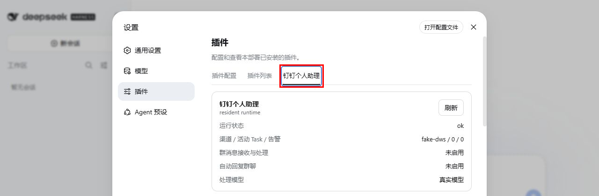

# DingTalk DSH Assistant

`dingtalk-dsh-assistant` 是一组运行在 [DeepSeek Harness（DSH）](https://github.com/deepseek-ai/DeepSeek-Harness) 中的钉钉数字员工插件。它把钉钉群聊直接接入 DSH，让 Agent 不再只是等待 `@` 后回答问题的机器人，而是一个能够理解完整群聊上下文、主动参与协作并持续推进任务的团队成员。

在 DSH 与 DWS 已完成安装和登录的前提下，插件安装与基础接入可在约三分钟内完成。接入后，每个常驻群绑定一个固定主 Session，持续理解群聊中的讨论、决策和任务状态；需要实际执行的工作则交给独立叶子 Session 与 Goal。多个叶子任务可以并行推进，因此数字员工既能参与讨论和编写方案，也能排查问题、执行工具，甚至完成代码与功能开发。

插件不是独立 Agent 平台，也不自行实现第二套 Session、Agent 或任务执行引擎。Agent 身份、工作规则与可用工具由配置的工作区及其 `AGENTS.md` 决定，插件本身不包含个人姓名或数字分身设定。

## 从群聊机器人到数字员工

常见的群聊机器人或 Agent 接入方式通常需要被 `@` 才会唤醒，只能获得当前消息附近的片段上下文，更适合问答、检索等单次工作。`dingtalk-dsh-assistant` 通过 DSH 原生 Session、subagent 与 Goal，把群聊协作变成可持续、可并行、可追踪的任务闭环。

| 能力 | 普通机器人 / Agent | DingTalk DSH 数字员工 |
| --- | --- | --- |
| 参与方式 | 被 `@` 后响应 | 常驻群聊，主动判断并参与 |
| 上下文 | 当前消息或片段上下文 | 持续维护完整群聊上下文 |
| 工作范围 | 问答、检索等单次任务 | 讨论、方案、排障、工具执行、功能开发 |
| 任务处理 | 一次处理一件事 | 多个独立叶子任务并行推进 |
| 持续执行 | 回复结束后停止 | 通过 Goal 持续执行、等待、恢复和完成 |
| 结果交付 | 返回一次性答案 | 回到原群引用回复，保留证据与任务状态 |

## 与 DSH 的关系

插件直接复用以下 DSH 机制：

- `Session`：每个群一个常驻主会话，每个 Task 一个独立叶子会话。
- `subagent`：主会话只协调，叶子会话独立执行任务。
- `Goal`：维持叶子任务的持续执行、恢复和完成状态。
- `systemPrompt.section`：向主会话注入群名称、群 ID、群职责与决策协议；向叶子会话注入任务流程和证据要求。
- Agent Registry 与原生 descriptor：在 DSH Web 中展示并打开常驻会话、叶子对话和轨迹。
- 默认模型、推理深度与权限 preset：由 DSH 原生服务保存和应用。
- storage domain：持久化群订阅、消息、Task、可靠投递、授权申请和告警。
- attachment service：将钉钉图片作为 DSH 原生多模态附件传入会话。

插件只补充钉钉渠道和群聊工作流特有的能力：DWS 订阅与补拉、消息去重排序、任务准入与关联、可靠 outbox、授权审批、任务看板和运行告警。

```text
DWS 群消息
  → dingtalk-dsh-assistant
  → DSH resident 主 Session（判断、沟通、协调）
  → DSH leaf Session + Goal（独立执行）
  → 主 Session（组织结果）
  → outbox + DWS 回读确认
  → 原群引用回复并 @任务提出人
```

不依赖 Agent Studio，也不要再并行启动另一套会话或任务 Runtime。

## 包结构

- `packages/dingtalk-dsh-assistant`：核心业务插件。负责 DWS 接入、群与 Session 绑定、消息处理、Task 调度、授权审批、可靠回复和配置页面。
- `packages/dingtalk-dsh-observer`：DSH Web 展示扩展。提供群聊会话、任务看板、归档任务、授权审批和告警页面。
- `.dsh/profiles/resident`：resident Runtime 的参考 profile 与 Cordis patch。
- `.dsh/profiles/web`：Web contribution 的参考 profile。
- `docs/spec`：关键状态机和工作流设计说明。
- `test`：插件单元测试和 Runtime 契约测试。

## 环境要求

- Windows 11 与 PowerShell 7。
- Node.js 24 或更高版本。较低版本缺少 DSH Session JSONL 持久化所需的 zstd API。
- 已安装 DSH，并能正常启动 `dsh web`。
- 已安装并配置所选模型对应的 DSH provider。只有使用 ChatGPT/Codex 订阅时才需要 `dsh-codex-connect`。
- 已安装并登录 DWS。只有启用真实钉钉订阅时才需要。

网络环境需要代理时，可在插件的 Agent 配置中填写代理地址，也可以在启动前设置 `HTTP_PROXY` / `HTTPS_PROXY`。

### Skill 文件路径

DSH 根据 Session 的 Agent 工作目录发现项目级 Skill，同时加载用户级 Skill。默认扫描顺序如下，靠前的同名 Skill 优先：

1. `<Agent工作区>\.dsh\skills\<skill-name>\SKILL.md`
2. `<Agent工作区>\.agents\skills\<skill-name>\SKILL.md`
3. profile 显式配置的 `customSkillDirs`
4. `%DSH_HOME%\skills\<skill-name>\SKILL.md`，`DSH_HOME` 默认是 `%USERPROFILE%\.dsh`
5. `%DSH_AGENTS_HOME%\skills\<skill-name>\SKILL.md`，`DSH_AGENTS_HOME` 默认是 `%USERPROFILE%\.agents`

给本机所有 DSH 项目共享的 Skill，推荐安装到 `%USERPROFILE%\.agents\skills`；只服务当前 Agent 工作区的 Skill，推荐安装到 `<Agent工作区>\.agents\skills`。DSH 不扫描 `%USERPROFILE%\.codex\skills`，仅安装在 Codex Skill 目录中的 `write-pr`、`dingtalk-*` 等 Skill 不会进入 resident 或叶子 Session。

复制时必须保留完整的 `<skill-name>` 目录，不能只复制 `SKILL.md`，因为 Skill 可能引用同目录下的 `references`、`scripts` 或其他资源。目录被发现只表示 Skill 已进入会话目录；模型仍会在任务命中触发条件后调用 `skill` 工具加载完整指令。验证是否真正加载时，应在 Session JSONL 中同时确认对应的 `tool/call` 和 `isError: false` 的 `tool/result`，不能只检查文件存在。

## 安装到 DSH

推荐让 Web、resident Runtime 和看板运行在同一个 DSH Web 进程中，避免两个进程同时写同一份 Session JSONL 和 storage domain。

正式版本发布后，使用 DSH 原生插件命令安装根发行包；它会把 Assistant Runtime、Observer 看板和对应 bundle patch 一并装入 `web` profile。生产或验收环境建议固定版本：

```powershell
dsh plugin --profile web add dingtalk-dsh-assistant@0.5.8
```

需要跟随 npm 最新版本时可省略 `@0.5.8`。安装完成后必须重启 `dsh web`，仅看到依赖安装成功不代表插件 Runtime 已加载。

版本历史见 [CHANGELOG](CHANGELOG.md)，发行资产见 [GitHub Releases](https://github.com/HiQ-AI/dingtalk-dsh-assistant/releases)。设置页会通过 GitHub Release 检查新版本；“设置 → 插件 → 钉钉个人助理”的“版本与更新”卡片显示版本状态，并提供手动检查与更新命令复制入口。检查失败会明确显示错误，不会误报为最新版本。升级使用：

```powershell
dsh plugin --profile web add @zzusp/dingtalk-dsh-assistant@latest @zzusp/dingtalk-dsh-observer@latest --save-exact
```

升级后重启 DSH Web，并依次确认：profile 中的包版本、`GET http://127.0.0.1:18998/health`、设置页/运行看板、真实群消息收发。四层证据不能互相替代。

若 DSH 官方默认上下文压缩在长 Session 中出现摘要范围过小、反复压缩仍无法回到阈值的问题，可选装收敛式替换插件；安装、provider 互斥、验证和回滚步骤见[安装手册的上下文压缩接入章节](docs/manual/install-and-configure-dsh-web.md#可选接入收敛式上下文压缩插件)。该插件不随本发行包自动安装。

以下源码安装方式只用于开发未发布代码；普通安装和升级不需要克隆仓库，也不需要手工添加两个内部包。

维护者发布新版本时，先将根包、assistant 和 observer 的版本号及 `CHANGELOG.md` 更新为同一版本并合并到 `main`，再推送对应的 `v<version>` Tag。GitHub Actions 会在 Node.js 24.19.0 下重新构建、测试和打包，按 observer → assistant → 根发行包的顺序发布 npm；三个包回读一致后才创建 GitHub Release。发布 job 绑定 GitHub Environment `NPM_PUBLISH`，优先使用其中的 `NPM_PUBLISH_TOKEN`，未配置时回退到 `NPM_TOKEN`。

### 源码开发安装

#### 1. 获取源码并验证

```powershell
git clone https://github.com/HiQ-AI/dingtalk-dsh-assistant.git
Set-Location .\dingtalk-dsh-assistant
pnpm install
pnpm test
```

#### 2. 将插件加入 DSH Web profile

在 `%USERPROFILE%\.dsh\profiles\web\package.json` 中加入两个本地依赖。路径应替换为仓库的真实绝对目录：

```json
{
  "dependencies": {
    "@zzusp/dingtalk-dsh-assistant": "file:D:/path/to/dingtalk-dsh-assistant/packages/dingtalk-dsh-assistant",
    "@zzusp/dingtalk-dsh-observer": "file:D:/path/to/dingtalk-dsh-assistant/packages/dingtalk-dsh-observer"
  },
  "dsh": {
    "profile": {
      "bundles": [
        "@deepseek-ai/dsh-base",
        "@deepseek-ai/dsh-web-app",
        "@zzusp/dingtalk-dsh-assistant",
        "@zzusp/dingtalk-dsh-observer"
      ]
    }
  }
}
```

保留 profile 中原有的 DSH 依赖和 bundle，不要用上面的片段覆盖完整文件。

若使用 ChatGPT/Codex 订阅，再把 `dsh-codex-connect` 同时加入 `dependencies` 和 `bundles`；使用其他模型来源时保留对应 provider，不需要安装 `dsh-codex-connect`。

#### 3. 装配 resident Runtime

把 [`.dsh/profiles/resident/cordis.patch.yml`](.dsh/profiles/resident/cordis.patch.yml) 中的 resident 配置按需合并到实际使用的 Web profile patch。Web 基础 bundle 已包含 storage 相关插件，只覆盖 `storage-json` 配置并插入 `dingtalk-dsh-assistant/resident`，不要重复插入同名 storage 项。

仓库模板有意保持以下安全默认值：

```yaml
groups: []
dws:
  enabled: false
  writesAuthorized: false
```

不要把个人群 ID、DWS profile、Agent 名称、工作目录或职责写入仓库模板；这些内容应保存在本机 DSH 配置和插件 storage 中。

#### 4. 安装 profile 依赖

```powershell
Set-Location "$env:USERPROFILE\.dsh\profiles\web"
pnpm install
```

#### 5. 启动 DSH Web

```powershell
Set-Location D:\path\to\dingtalk-dsh-assistant
pwsh -NoProfile -File .\scripts\start-web.ps1
```

默认 Web 地址由 DSH 提供；resident 插件监听 `127.0.0.1:18998`。`GET http://127.0.0.1:18998/health` 可检查插件 Runtime 状态。

`scripts/start-web.ps1` 使用当前用户的 `%USERPROFILE%\.dsh` 作为默认 `DSH_HOME`；若需要隔离 profile，可在启动前显式设置 `DSH_HOME`。脚本从当前项目根启动，并自动发现 `PATH` 中的 Node.js 和全局安装的 DSH。

## 首次配置

启动后，在 DSH Web 的“设置 → 插件 → 钉钉个人助理”中完成配置：



1. 设置 Agent 名称和别名，多个名称使用英文逗号分隔。
2. 设置 Agent 工作区绝对目录。DSH 会从该目录原生发现 `AGENTS.md`。
3. 设置默认模型、推理深度和叶子任务并行上限，默认并行上限为 5。
4. 按需设置网络代理。
5. 填写任务流程引导和完成证据要求；这两项只注入叶子 Session。
6. 通过群名称模糊搜索添加常驻群，并为每个群配置会话职责。

确认页面的环境检查显示 DWS 已安装、已登录后，再在实际 profile 中启用：

```yaml
dws:
  enabled: true
  writesAuthorized: false
```

先验证真实消息能够进入固定 resident Session，再将 `writesAuthorized` 改为 `true` 开放群聊回复。修改 profile 后需要重启 DSH Web。

完整的逐步安装、页面字段说明和“先收后发”验收流程见[安装插件并在 DSH Web 中完成配置](docs/manual/install-and-configure-dsh-web.md)。

## 群聊工作流

### 常驻主会话

每个群唯一绑定一个 resident Session。群名称、群 ID、职责和稳定决策协议通过 DSH `systemPrompt.section` 注入。消息明确指向已配置的 Agent 名称/别名、使用 `cc:`，或明确确认此前“是否需要我处理”的询问，并形成职责范围内的可验证目标时，主会话可以创建 Task；未明确指名但判断事项应形成任务时，主会话先在群里询问“这个事项是否需要我处理？”，收到肯定答复后再结合原消息和后续补充创建。主会话只负责选择 Task 路由；Runtime 使用原始群消息生成来源证据信封交给叶子，主会话生成的根因、完成度、方案优劣或排除性判断不作为叶子事实。

新消息先立即持久化到 Inbox，5 秒窗口不占用同群决策锁；窗口结束后即使 resident 正在运行，也会通过 DSH `steer` 在下一个 step 边界注入。Task 创建、上下文追加和重开仍按群串行收口，避免多条并发插话的结构化决策相互串线。因此“进入 Inbox / 插话”不再等待上一条群消息处理完成，但业务决策落地仍保持确定顺序。

### 叶子任务

Task 可设置独立的简短标题用于看板展示；标题与 objective 分离，重命名不会改变任务授权范围、Goal 或验收标准。运行看板通过 DSH 官方 `sidebar.footer.action` 提供左侧菜单入口，并由 `shell.overlay` 承载右侧完整内容区域；点击运行看板时切换到看板并清除 Session 选中状态，点击任意 Session 时关闭看板、恢复该 Session 的选中状态与对话/轨迹。运行看板复用 Session 的实际选中背景色，不额外显示焦点边框。

运行看板 Header 的高度和字体规格与 Session 页面一致。各页不再重复显示页面标题和子标题；任务列按 Header 与主内容实际占用计算剩余视口高度，卡片在列内独立滚动，页面本身不会因状态桶高度产生额外补白或纵向滚动。

Runtime 使用 DSH 原生 subagent 和 Goal 创建叶子 Session。主会话不执行具体工作。Task 将简短任务名、当前有效目标和叶子执行用的来源证据信封分开持久化；任务看板和原生子会话展示任务名，叶子 Goal 同时接收当前目标与完整来源证据。来源信封包含消息 ID、发送者、时间、引用 ID、原始正文和附件异常，并明确要求结合当前代码、运行态和工具证据独立核验。Task 正式执行状态为 `running`、`waiting`、`completed`，超过并行上限时进入产品层 `queued`。归档只影响看板展示，不删除 Task、Session、Goal 或历史上下文；已完成或已归档 Task 收到关联上下文时会重新打开原 Task，并复用同一个叶子 Session，但创建独立的新执行轮次和全新 Goal。新轮次会覆盖当前目标、来源消息与发送人、验收标准、阶段任务、开始时间、阻塞和结果；上一轮的 Session、目标、来源、验收、阶段和结果快照进入 `runHistory`，只作为历史参考。后续消息明确扩大或收窄动作范围时，Runtime 在同一 Task 中修订当前有效目标并保留旧目标历史；普通事实补充不会修改目标。每轮重开会把新的群消息与发送人记录为当前触发来源，同时保留历次触发历史；该轮完成通知引用并 @当前触发人。

主会话向运行中或等待中的叶子传递任务上下文、目标修订、真人批复、恢复提示和结果驳回时统一使用 DSH `steer`，在叶子的下一个 step 边界插入，不使用 `followup` 排队到下一 Turn。

### 阻塞与授权

- 缺少任务信息：叶子进入 information waiting，由主会话回群向任务提出人询问。
- 受控操作或必须真人确认：叶子创建授权申请，页面“授权审批”和 DWS 登录人本人私聊共享同一申请状态机。
- 钉钉批复必须引用申请消息并明确回复“批准”或“拒绝”；等待不设超时。
- 相同操作范围复用原申请，已批准范围不会重复申请；范围变化才创建新申请。

### 完成通知

任务完成后，叶子把结构化结果交回主会话。Runtime 使用 DWS 原生引用回复任务发起消息，并通过结构化 `atOpenDingTalkIds` @任务提出人。发送后必须回读钉钉真实消息才将 outbox 标记为已投递。

任务进度、阻塞和完成通知只有 Runtime 一个群聊发送出口；叶子会话不得自行调用 DWS 向来源群发送通知。叶子提交完成结果后，Runtime 会把摘要、证据、交付物及部署信息完整交给常驻主会话组织群通知；任务处理中若形成有证据且可复用的任务处理、流程或踩坑学习信号，叶子可通过独立内部上下文交给主会话，普通完成或未收敛事件不生成学习信号。内部学习信号不进入群聊结果投影或发信箱。通知可合并重复表述，但必须保留不同关注点、限定条件、失败项和未验证/未部署边界，不能为了简短只复述摘要。完成通知优先引用当前真实群触发消息；Web 与内部恢复来源只用于触发内部操作，不得覆盖 Task 当前真实消息及发送人，也不得写入消息触发历史；发现旧数据中的伪来源时会回溯最近一条带真实发送人 ID 的群消息并清理伪触发记录。通知层仍会独立回溯真实来源，避免旧数据清理前丢失引用和结构化 @。同事或其 AI 助理发送的回复、任务回执和状态通知不会按文案或发送者在模型外过滤，而是进入常驻模型，由模型结合引用、上下文和任务索引决定忽略、回答或关联任务。判断复用已有任务还是新建任务时，必须综合消息前后文、连续消息的信息组、当时场景，以及候选任务的目标、动作范围、状态、历史触发和已记录上下文；关键词、词面重合或标题相似只用于寻找候选任务，不能直接作为关联或新建结论。

群消息中的图片、文档、文件、链接或其他外部资源如果承载任务所需信息，Resident 必须先完整读取。无法访问、下载、解析或读取不完整时，Resident 会先明确回复未获取到的具体信息并要求重新提供，不创建、不续接、不重开 Task；不得根据文件名、链接标题、缩略图或零散文字猜测资源正文。Runtime 还会对已知附件读取失败执行硬拦截，避免模型误判后提前启动任务。

叶子提交 `completed` 后，Runtime 会先让常驻模型对照当前最新目标审查本轮结果和证据。若新增或修订范围未完成、缺少验证，Task 保持 `running`，缺口反馈给原叶子继续执行，不生成完成通知。

`running` 和 `waiting`（包括阻塞中）任务收到新增信息时只追加 `task-context`，继续同一执行轮次；只有 `completed` 任务（包括已归档展示）才允许 reopen 并初始化下一轮。

## Web 运行看板

`dingtalk-dsh-observer` 在 DSH Web header 中提供：


- 群聊会话：查看不同 resident Session 的分页收信箱和发信箱；状态固定在最左列，长内容最多显示两行，完整内容可通过悬停标题或详情查看。
- 任务看板：按待执行、执行中、等待中、已完成展示 Task，并打开 DSH 原生叶子对话和轨迹。活动任务卡片中的“任务”面板默认收起，只显示完成数/总数和进度；展开后显示各阶段任务、状态和耗时。
- 归档任务：查看已归档 Task，相关群消息仍可重新打开原任务。
- 授权审批：以与消息表格一致的状态列、行高和内容密度分页查看申请单，并在页面批准或拒绝。
- 告警：按类型查看当前异常和分页的已恢复历史。

看板不读取或重建 DSH Session JSONL，只通过插件状态接口展示业务投影；对话与轨迹仍由 DSH 原生页面负责。

## 状态与数据目录

正式运行使用标准用户级 `DSH_HOME`：

- 插件状态：`%USERPROFILE%\.dsh\storages\dingtalk-dsh-assistant\`
- DSH Session：`%USERPROFILE%\.dsh\sessions\`
- profile：`%USERPROFILE%\.dsh\profiles\`

仓库不提交本机 Session、消息、Task、授权记录、DWS profile、群 ID、打包产物或凭据。

## 开发与测试

```powershell
pnpm install
pnpm test
```

测试接口仅在 `testApiEnabled` 显式开启时可用。生产状态接口默认只监听本机地址，不应直接暴露到外网。

关键设计说明：

- [DSH 原生常驻闭环](docs/spec/dsh-native-resident-closure.md)
- [任务 Supervisor](docs/spec/running-task-supervisor.md)
- [授权审批中心](docs/spec/authorization-approval-center.md)
- [运行看板](docs/spec/dingtalk-resident-observer.md)
