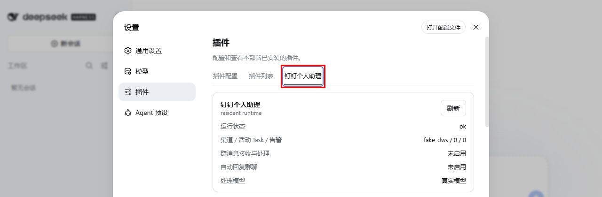
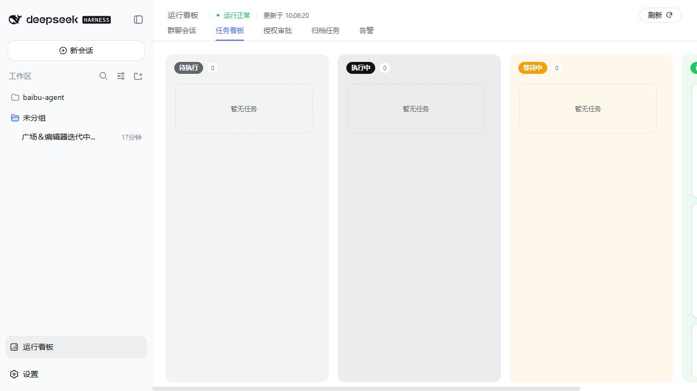

# DingTalk DSH Assistant

`dingtalk-dsh-assistant` 是一组运行在 [DeepSeek Harness（DSH）](https://github.com/deepseek-ai/DeepSeek-Harness) 中的钉钉数字员工插件。它把钉钉群聊直接接入 DSH，让 Agent 不再只是等待 `@` 后回答问题的机器人，而是一个能够理解完整群聊上下文、主动参与协作并持续推进任务的团队成员。

在 DSH 与 DWS 已完成安装和登录的前提下，插件接收群消息并维护话题事实。已切换到 workflow-v2 的群先拆分、关联和判断意图，再由消息事项的原生 Agent 会话完成问答；需要持续交付的工作进入 Task 与阶段编排。各项执行独立保存进度，支持查询、等待补充、恢复和交付。

插件不是独立 Agent 平台，也不自行实现第二套 Session、Agent 或任务执行引擎。Agent 身份、工作规则与可用工具由配置的工作区及其 `AGENTS.md` 决定，插件本身不包含个人姓名或数字分身设定。

已切换群的入站门禁统一复用未变动的封存快照核验，并持续检查文件身份；追加群不再逐条消息重读完整历史快照。历史发件的替换关系使用邻接索引核对，保留环、未知目标和分叉拒绝。

每次模型调用的执行窗口由当前 Host 显式传入并从该次节点实际领取开始，不沿用旧消息 policy 的调用时限，维护和重试排队不消耗执行窗口；真实失败按 lease 计入有界恢复次数，重复扫描不重复扣次数。无业务命令且纯状态通知已独立确认送达时，也可保留通知审计后重处理。旧消息可通过本机受控接口逐条重处理。没有业务命令、全消息澄清通知已独立确认送达且答复已接纳时，恢复会保留原通知并继承答复，不重复询问；发送结果未确认或已有业务命令时仍拒绝重处理。操作及回读要求见 [本地部署说明](docs/ops/resident-review-local-deployment.md)。

## 从群聊机器人到数字员工

常见的群聊机器人或 Agent 接入方式通常需要被 `@` 才会唤醒，只能获得当前消息附近的片段上下文，更适合问答、检索等单次工作。`dingtalk-dsh-assistant` 通过 DSH 原生 Session、subagent 与 Goal，把群聊协作变成可持续、可并行、可追踪的任务闭环。

| 能力 | 普通机器人 / Agent | DingTalk DSH 数字员工 |
| --- | --- | --- |
| 参与方式 | 被 `@` 后响应 | 常驻群聊，主动判断并参与 |
| 上下文 | 当前消息或片段上下文 | 持续维护完整群聊上下文 |
| 工作范围 | 问答、检索等单次任务 | 讨论、方案、排障、工具执行、功能开发 |
| 任务处理 | 一次处理一件事 | 多个独立叶子任务并行推进 |
| 持续执行 | 回复结束后停止 | 通过 Goal 持续执行、等待、恢复和完成 |
| 结果交付 | 返回一次性答案 | 回到原群引用回复，保留证据与任务状态 |

## 与 DSH 的关系

### workflow-v2 的问答与调查

普通项目、代码、数据库问答使用 `answer.objective`：意图节点交付问题，执行 Agent 根据需要调用受信只读工具并组织答案，普通问答不创建业务 Task。一次问答拥有独立会话，同一执行的必要补充沿用会话；话题提供事实与来源，不维持永久增长的执行上下文。慢查询不阻塞后续消息的判断。

明确要求持续排查或独立调查交付时，Task Owner 选择统一的 `task-investigation`。调查 Agent 自主安排搜索、读文件、查询和反证，不为每次工具调用创建阶段。方案、PR评审、数据分析及复盘的专业要求集中到共享调查指引。修改代码、写库、提测与上线继续使用各自授权和验收编排。

新接纳的验收条件在消息、Web、Owner 与工程准备入口共用合同：1–32 条，每条原始长度不超过 2000 个字符，去除首尾空白后不能为空。首阶段与后续阶段由各领域的准备合同处理，前序产物通过带类型、版本及生产阶段身份的 `handoff` 交接。新调查使用 v6，返回事实/判断/建议、未解决项和逐项验收意见；调查结束不代表开发或业务验收已经完成。已冻结的 v5 调查仍按原定义恢复。已取消任务仅保留历史，不再要求加载其退役的 Owner 阶段定义；暂停任务仍要求原冻结定义，以便后续恢复。

Owner 完成前核对当前成功阶段、逐项证据及必交文件清单。Host 将证据对应的验收项分派到生产领域，调用领域完成合同，全部通过才生成绑定当前决定和清单的 `businessValidation.status=accepted` 回执；Owner 只能汇总已接纳结果，不能用总结把调查不足改成满足。清单 `complete` 只证明结构、来源、版本与文件绑定有效；要求外发时仍须独立渠道回读，三者不能互相替代。

新通用阶段 v6、外部操作 Owner v2 和文件投递 v2 均检查分派给本领域的验收项，混合流程不跳过业务检查。通用材料整理保留确定性快速路径，其他分派项使用原生模型零工具限定判断，并独立核验逐项结果及引用；缺少模型、超限、协议异常或证据不足不放行。调查沿用显式逐项意见，工程匹配冻结原需求和实际业务用例回执。工程消费者声明支持的交接类型/版本，目录结果合同从权威 Owner 合同派生。整体完成仍要求全部验收项满足，没有新增部分成功终态。

失败诊断记录恢复类别、责任方及下一步，但不新增自动重试权限；未知外部结果继续先对账。旧定义按原摘要恢复，仅完成准入采用当前修正规则；回执分别保存冻结执行摘要与实际验收 policyDigest，不补造历史回执或重跑效果。本次合同调整不需要存储 schema 迁移，受理范围、职责和恢复边界见[节点合同](docs/api/workflow-node-contracts.md#workflow-v2-领域准备与交付合同)及[升级说明](docs/ops/workflow-storage-migration.md#本次领域合同调整的适用边界)。协议夹具验证不等于真实模型语义质量、部署或渠道验收。

消息处理详情显示“查询与答复”的状态、耗时和会话；结果正文与依据按需分页读取。取消问答时引用本人原问题；同一原消息有多个未完成事项时，先澄清选择，再核对身份和输入版本取消选定执行。

### 任务产物发送到群聊

明确要求“处理完成后把报告、Markdown、SQL或图片文件发到本群”时，工作进入同一个持久 Task。意图保存逐字引用的发送要求与完整文件清单；Owner 先生成并登记产物，再安排 `task-group-file-delivery`。目标绑定任务来源群与配置的 DWS profile。普通问答、Web-only 任务以及只要求生成文件的任务，不因此自动外发附件。

`write-task-file` 可生成精确授权名称的 `.md/.txt/.sql/.csv/.json` 文件，UTF-8 内容最多 64 KiB。图片、Office、PDF 等传输保留真实原字节，但必须先有真实来源及已登记的产物；传输能力不提供这些格式的生成器，不能把文字改扩展名当文档。图片首版以可下载文件附件发送，不承诺聊天气泡预览。SQL 脚本交付不执行 SQL。

已有文件可通过 `import-task-file` 纳入当前 Task：Host 在 `workflow.generalFileRead` 配置固定 `root` 和精确 `readablePaths`，Owner 输入仅为 `{role,fileName,relativePath}`，同时受当前任务的角色/名称及 `readableFiles` 授权约束。Host 只读真实来源后冻结大小/SHA-256，执行时再次核对并复制原字节到受管快照；Owner 不提供绝对根或猜摘要。导入保留真实扩展名，不能靠改名转换格式。Office、PDF、图片已有可信文件时可直接登记交付；没有源文件时仍需实际生成器。

新任务的受管快照位于 `<Agent工作区>/tasks/<logicalTaskId>/outputs/<taskId>/<artifactId>/<fileName>`；升级前已有任务仍使用 `workflow.artifactDirectory/task-files/<taskId>/<artifactId>/<fileName>`。快照保留中文可读名称、需求版本、生产者和 SHA-256；文件元数据独立读回，二进制不塞入 JSON。当前 Host 默认每文件 20 MiB、每批 50 MiB、20 件，这些是本地保护值，不能当作租户平台上限。全部文件先预检，再逐件通过效果账发送；ACK 后查询真实消息并下载核对大小和摘要，全部必交文件通过才允许完成。未知发送保持待对账，不能重发来消除等待。

文件发送授权必须是当前消息的精确连续原文，可含句末标点或跨句；完整源句中的否定与其他群限制仍拒绝。Owner 使用通用写入时每轮仅安排一个阶段，核验产物后下一轮追加发送。复合验收项可联合读取该项明确绑定的当前任务成功阶段证据，各领域的结构和效果仍独立校验；投递回执不能代替业务结果证明。

本节描述源码能力，正式实例须按[本地部署与文件验收说明](docs/ops/resident-review-local-deployment.md#任务产物群聊文件交付切换与验收)完成安装和真实渠道回读。2026-09-29，PR #142 已合并，本地正式实例已安装合并版本，并完成专用群真实文件交付验收及重启后回读；结果见[最终验收报告](docs/acceptance/task-unified-file-storage/report.md)。其他实例仍须独立完成部署与渠道验收。

### 一个任务一个文件目录

新任务统一使用 `<Agent工作区>/tasks/<logicalTaskId>/`：`work/` 保存会话工作文件、JSON 工件、工程副本与验证记录，`tmp/` 保存受管检查和验收子进程的临时文件，`outputs/` 保存正式文件。逻辑任务 ID 复用现有任务关系；Web 重执行沿用同一个根目录，内部任务、节点及执行代次各自隔离。工程旁路证据位于源码副本之外。

DSH 原始会话日志和公共附件仍由宿主管理。历史任务、工件及会话原路径恢复，不自动迁移；消息问答等非任务会话仍使用原职责目录。新 JSON 引用携带 `tasks/<logicalTaskId>/` 前缀，直接定位 `work/artifacts/`，无需额外索引。文件下载、发送和完成验收继续核对原有 descriptor、摘要和授权。目录约定覆盖插件受管入口；外部工具显式写入的其他绝对路径与公共缓存不因此被重定向。

升级后备份必须同时保留控制库、原工件/会话目录和 Agent 工作区的 `tasks/`；部署参数与回退边界见[任务目录部署说明](docs/ops/resident-review-local-deployment.md#任务文件统一目录的部署与备份)。

启用 workflow 后，在线切换 Agent 工作区会被拒绝，避免会话和工件落到不同根；同根配置及模型设置仍可更新。需要换根时先停稳并制定完整迁移方案，本次不提供自动迁移。任务备份明确排除受管工程源码副本中的可再生 `node_modules`，恢复后按锁文件重新安装依赖。

只读资源通过 `workflow.directQueries` 登记，由 `permissions` 显式声明 Agent 自身的资源授权，与发送者身份无关。不同群成员使用同一 Agent 职责范围，每次调用仍重新校验资源权限。数据库默认使用低权限只读身份；用户明确指定使用现有 UAT 账号时，仅对显式登记的 UAT 资源启用 Host 强制只读事务模式。模型始终不能获得连接凭据或提交任意 SQL。配置合同见 [Agent 查询工具](docs/api/agent-query-tool-contract.md)，切换步骤见 [本地部署说明](docs/ops/resident-review-local-deployment.md)。

旧材料分析、固定规划/执行循环及逐次只读能力阶段退出新入口；切换前必须确认没有活动引用。历史记录继续按原状态读取，不重放旧命令。以下常驻主会话与叶子 Goal 说明适用于尚未切换的旧 Resident 群。

插件直接复用以下 DSH 机制：

- `Session`：每个群一个常驻主会话，每个 Task 一个独立叶子会话。
- `subagent`：主会话只协调，叶子会话独立执行任务。
- `Goal`：维持叶子任务的持续执行、恢复和完成状态。
- `systemPrompt.section`：向主会话注入群名称、群 ID、群职责与决策协议；向叶子会话注入任务流程和证据要求。
- Agent Registry 与原生 descriptor：在 DSH Web 中展示并打开常驻会话、叶子对话和轨迹。
- 默认模型、推理深度与权限 preset：由 DSH 原生服务保存和应用。
- storage domain：持久化群订阅、消息、Task、可靠投递、人工介入事项和告警。
- attachment service：将钉钉图片作为 DSH 原生多模态附件传入会话。

插件只补充钉钉渠道和群聊工作流特有的能力：DWS 订阅与补拉、消息去重排序、任务准入与关联、可靠 outbox、人工介入、任务看板和运行告警。

UAT 部署、生产发布、数据变更与 UAT 同提交重建采用显式目标白名单和受信平台端口。UAT 部署只确认精确提交在目标环境运行；业务回归、提测与验收另行记录。 普通 UAT 构建在完整同提交扫描确认流水线已失败、且无成功或进行中的等价流水线时，保留失败收据并将节点及运行收口为失败；读取异常和未决状态继续只读对账，不重发原操作。 同提交重建也核对超时前已成功构建并部分部署的精确镜像来源；整条流水线失败不抹去已验证的构建事实。生产发布在创建 Tag 前等待真人审批，并逐段核对提交到运行镜像的来源链；新数据变更 v6 的简单加列只核对准确目标、创建 Bytebase 工单并提交插件人工审批，复杂 SQL 保留 UAT 演练；Bytebase 可能在送审时创建未执行 Rollout/Task，只有插件对本次精确 SQL 真人批准后才发送执行；Bytebase 平台审批状态不作为插件批准，生产验收通过只读连接独立回读。配置、平台只读检查与执行后回读的要求见[本地受信平台接入说明](docs/ops/trusted-platform-workflows.md)；缺少任何必要能力时，流程目录保持不可发起。

```text
DWS 群消息
  → dingtalk-dsh-assistant
  → DSH resident 主 Session（判断、沟通、协调）
  → DSH leaf Session + Goal（独立执行）
  → 主 Session（组织结果）
  → outbox + DWS 回读确认
  → 原群引用回复并 @模型从任务历史选出的相关参与人
```

不依赖 Agent Studio，也不要再并行启动另一套会话或任务 Runtime。

## 包结构

- `packages/dingtalk-dsh-assistant`：核心业务插件。负责 DWS 接入、群与 Session 绑定、消息处理、Task 调度、阻塞时的人工介入、可靠回复和配置页面。
- 任务表格同步：可在插件设置中绑定钉钉在线电子表格的一个工作表，由 Resident 纯脚本每 3 分钟将全部未归档 Task 全量覆盖写入；同步不调用模型，状态与失败原因在设置页单独显示。
- `packages/dingtalk-dsh-observer`：DSH Web 展示扩展。提供群聊会话、任务看板、归档任务、人工介入和告警页面。
- DWS 文件卡片的监听与历史回补保留 `fileId` 资源；同版本消息仅允许同发送者、同文件名及同 fileId 的固定下载提示展示差异，按重复接收处理，保留原始正文与版本。其他正文或身份变化仍须可信编辑版本。

同一任务通过 Web 再次执行时，看板保持一张卡片。详情只展示当前完整计划的有效步骤与结果：保留未受影响的成功前段，重执行更新对应步骤，已移除步骤从列表删除，新增步骤按当前计划加入。不同阶段的同名步骤按工作流分组独立展示，并显示真实开始时间与本次耗时；需求变化后旧结果失效。卡片与详情使用最多32字符的简短标题，详情可展开完整任务目标；卡片内步骤列表使用中文名称及本次节点耗时。详情不提供历史切换，旧任务链接打开当前详情；完整正文、产物和当前步骤会话仍可读取。关联以已保存的重执行事件为准，不按相似标题合并。新的追加、取消、重执行和归档须携带当前执行版本；归档核对整项任务均结束且操作排空，底层运行记录保留。接口见[工作流节点契约](docs/api/workflow-node-contracts.md#任务汇总与当前完整详情)。

旧版任务归档清理开发目录前核验提交已包含在 origin 当前公布的分支中，同名分支已推进或删除不等于代码未保存；无法证明提交保留、脏代码或未登记文件仍拒绝清理。目录已移除时，缺少归档摘要的登记文档只能从准确登记提交的普通文件恢复到任务专属归档目录，不使用同名文件猜测。预检不写文件，目标冲突、缺源或摘要不符会停止。

登记后在原分支继续开发的提交必须是登记提交的后代且已保存到远端，才可归档；路径、Git目录、主库、分支和 origin 身份仍须一致。清理进度记录本次核验的实际提交，文档复制后再次固定核对该提交，期间出现新提交则停止删除。
- `.dsh/profiles/resident`：resident Runtime 的参考 profile 与 Cordis patch。
- `.dsh/profiles/web`：Web contribution 的参考 profile。
- `docs/spec`：关键状态机和工作流设计说明。
- `test`：插件单元测试和 Runtime 契约测试。

## 环境要求

- Windows 11 与 PowerShell 7。
- Node.js 24 或更高版本。较低版本缺少 DSH Session JSONL 持久化所需的 zstd API。
- 已安装 DSH `0.1.2-rc.1`，并能正常启动 `dsh web`。Assistant、Observer 与 DSH 核心包必须保持该版本边界，不能混装 `0.1.1-rc.2` 依赖树。
- 已安装并配置所选模型对应的 DSH provider。只有使用 ChatGPT/Codex 订阅时才需要 `dsh-codex-connect`。
- 已安装并登录 DWS。只有启用真实钉钉订阅时才需要。

网络环境需要代理时，可在插件的 Agent 配置中填写代理地址，也可以在启动前设置 `HTTP_PROXY` / `HTTPS_PROXY`。

### Skill 文件路径

DSH 根据 Session 的 Agent 工作目录发现项目级 Skill，同时加载用户级 Skill。默认扫描顺序如下，靠前的同名 Skill 优先：

1. `<Agent工作区>\.dsh\skills\<skill-name>\SKILL.md`
2. `<Agent工作区>\.agents\skills\<skill-name>\SKILL.md`
3. profile 显式配置的 `customSkillDirs`
4. `%DSH_HOME%\skills\<skill-name>\SKILL.md`，`DSH_HOME` 默认是 `%USERPROFILE%\.dsh`
5. `%DSH_AGENTS_HOME%\skills\<skill-name>\SKILL.md`，`DSH_AGENTS_HOME` 默认是 `%USERPROFILE%\.agents`

给本机所有 DSH 项目共享的 Skill，推荐安装到 `%USERPROFILE%\.agents\skills`；只服务当前 Agent 工作区的 Skill，推荐安装到 `<Agent工作区>\.agents\skills`。DSH 不扫描 `%USERPROFILE%\.codex\skills`，仅安装在 Codex Skill 目录中的 `write-pr`、`dingtalk-*` 等 Skill 不会进入 resident 或叶子 Session。

复制时必须保留完整的 `<skill-name>` 目录，不能只复制 `SKILL.md`，因为 Skill 可能引用同目录下的 `references`、`scripts` 或其他资源。目录被发现只表示 Skill 已进入会话目录；模型仍会在任务命中触发条件后调用 `skill` 工具加载完整指令。验证是否真正加载时，应在 Session JSONL 中同时确认对应的 `tool/call` 和 `isError: false` 的 `tool/result`，不能只检查文件存在。

## 安装到 DSH

从 0.5.x 升级到 1.0.0 前，先阅读[大版本升级边界](docs/ops/npm-release.md#100-升级边界)和[更新日志](CHANGELOG.md)。旧存储需要独立检查，不能仅替换包后直接打开。


推荐让 Web、resident Runtime 和看板运行在同一个 DSH Web 进程中，避免两个进程同时写同一份 Session JSONL 和 storage domain。

全新安装使用根发行包；它会把 Assistant Runtime、Observer 看板和对应 bundle patch 一并装入 `web` profile。以 1.0.0 为例，生产或验收环境固定版本：

```powershell
dsh plugin --profile web add dingtalk-dsh-assistant@1.0.0 --save-exact
```

安装完成后必须重启 `dsh web`；仅看到依赖安装成功不代表插件 Runtime 已加载。已有 profile 升级前须先确认安装形态，不能在仍直接依赖两个内部包时只添加根包。

版本历史见 [CHANGELOG](CHANGELOG.md)，发行资产见 [GitHub Releases](https://github.com/HiQ-AI/dingtalk-dsh-assistant/releases)。设置页会通过 GitHub Release 检查新版本；“版本与更新”卡片提供可复制的升级提示词，引导先核对 profile、在途任务及[大版本升级边界](docs/ops/npm-release.md#100-升级边界)，再按[本地部署规程](docs/ops/resident-review-local-deployment.md)安全切换。根包安装与旧式双内部包安装的精确命令见[安装手册](docs/manual/install-and-configure-dsh-web.md#二安装或升级正式版本)。检查失败会明确显示错误，不会误报为最新版本。

升级后重启 DSH Web，并依次确认：profile 中的包版本、`GET http://127.0.0.1:18998/health`、设置页/运行看板、真实群消息收发。四层证据不能互相替代。

若 DSH 官方默认上下文压缩在长 Session 中出现摘要范围过小、反复压缩仍无法回到阈值的问题，可选装收敛式替换插件；安装、provider 互斥、验证和回滚步骤见[安装手册的上下文压缩接入章节](docs/manual/install-and-configure-dsh-web.md#可选接入收敛式上下文压缩插件)。该插件不随本发行包自动安装。

以下源码安装方式只用于开发未发布代码；普通安装和升级不需要克隆仓库，也不需要手工添加两个内部包。

维护者发布新版本时，先将根包、assistant 和 observer 的版本号及 `CHANGELOG.md` 更新为同一版本并合并到 `main`，再推送对应的 `v<version>` Tag。GitHub Actions 会在 Node.js 24.19.0 下重新构建、测试和打包，使用 npm Trusted Publishing（OIDC）按 observer → assistant → 根发行包的顺序发布；三个包回读一致后才创建 GitHub Release。发布 job 绑定 GitHub Environment `NPM_PUBLISH`，不再使用长期 npm publish token。首次启用和故障恢复见 [npm 发布 Runbook](docs/ops/npm-release.md)。

### 源码开发安装

#### 1. 获取源码并验证

```powershell
git clone https://github.com/HiQ-AI/dingtalk-dsh-assistant.git
Set-Location .\dingtalk-dsh-assistant
pnpm install
pnpm test
```

#### 2. 将插件加入 DSH Web profile

在 `%USERPROFILE%\.dsh\profiles\web\package.json` 中加入两个本地依赖。路径应替换为仓库的真实绝对目录：

```json
{
  "dependencies": {
    "@zzusp/dingtalk-dsh-assistant": "file:D:/path/to/dingtalk-dsh-assistant/packages/dingtalk-dsh-assistant",
    "@zzusp/dingtalk-dsh-observer": "file:D:/path/to/dingtalk-dsh-assistant/packages/dingtalk-dsh-observer"
  },
  "dsh": {
    "profile": {
      "bundles": [
        "@deepseek-ai/dsh-base",
        "@deepseek-ai/dsh-web-app",
        "@zzusp/dingtalk-dsh-assistant",
        "@zzusp/dingtalk-dsh-observer"
      ]
    }
  }
}
```

保留 profile 中原有的 DSH 依赖和 bundle，不要用上面的片段覆盖完整文件。

若使用 ChatGPT/Codex 订阅，再把 `dsh-codex-connect` 同时加入 `dependencies` 和 `bundles`；使用其他模型来源时保留对应 provider，不需要安装 `dsh-codex-connect`。

#### 3. 装配 resident Runtime

把 [`.dsh/profiles/resident/cordis.patch.yml`](.dsh/profiles/resident/cordis.patch.yml) 中的 resident 配置按需合并到实际使用的 Web profile patch。Web 基础 bundle 已包含 storage 相关插件，只覆盖 `storage-json` 配置并插入 `dingtalk-dsh-assistant/resident`，不要重复插入同名 storage 项。

仓库模板有意保持以下安全默认值：

```yaml
groups: []
dws:
  enabled: false
  writesAuthorized: false
```

不要把个人群 ID、DWS profile、Agent 名称、工作目录或职责写入仓库模板；这些内容应保存在本机 DSH 配置和插件 storage 中。

#### 4. 安装 profile 依赖

```powershell
Set-Location "$env:USERPROFILE\.dsh\profiles\web"
pnpm install
```

#### 5. 启动 DSH Web

```powershell
Set-Location D:\path\to\dingtalk-dsh-assistant
pwsh -NoProfile -File .\scripts\start-web.ps1
```

默认 Web 地址由 DSH 提供；resident 插件监听 `127.0.0.1:18998`，允许从 `http://127.0.0.1:3080` 和 `http://localhost:3080` 两个等价的本机 Web 地址访问。通过 `GET http://127.0.0.1:18998/health` 和 `GET http://127.0.0.1:18998/state/dws-bridge` 分别检查 Runtime 与真实 DWS bridge 状态；完整判定和排障步骤见[安装手册](docs/manual/install-and-configure-dsh-web.md)。

`scripts/start-web.ps1` 使用当前用户的 `%USERPROFILE%\.dsh` 作为默认 `DSH_HOME`；若需要隔离 profile，可在启动前显式设置 `DSH_HOME`。脚本从当前项目根启动，并自动发现 `PATH` 中的 Node.js 和全局安装的 DSH。

## 首次配置

启动后，在 DSH Web 的“设置 → 插件 → 钉钉个人助理”中完成配置：



1. 设置 Agent 名称和别名，多个名称使用英文逗号分隔。群职责定义本群身份关系、负责范围和介入要求；需要作为任务称呼的名字同时加入别名配置。DWS 登录人姓名不享有特殊准入或静默规则。
2. 设置 Agent 工作区绝对目录。DSH 会从该目录原生发现 `AGENTS.md`。

群消息协调的原生常驻会话直接以 Agent 工作区根目录启动，原生权限为“完全权限”（`danger-full-access`，审批策略 `never`），名称使用完整群聊名称。旧职责子目录会话排空后由原生派生会话完整继承日志并切换绑定，原日志和任务身份保留；正常跨轮继续恢复同一会话。其他非任务新会话仍使用 `session-workspaces/` 职责目录，任务会话沿用下述任务目录。完全权限不扩大业务工具、数据库表列授权或生产审批范围。

下一轮协调前，原生模型可见历史保留原始消息、引用和附件，收紧此前重复的后台快照；本轮完整事实与任务目录照常提供，完整原始事件仍在 JSONL 中。自身通知通过同群已登记的外发消息 ID 排除回声，不依赖发送账号与任务所有者相同，也不按正文或署名忽略普通消息。长任务继续由独立 Task Owner/执行会话推进。

“任务已开始处理。”以同一 Task、群、源消息及来源版本作为一次开始事实；内部重评、阶段追加及尝试换 Run 不重复发送。发送前核对该事项已有的通知记录，并通过原消息 ID 回查群聊中的已发送通知；发送结果未知仍只回查，不再另发一次开始。不同 Task 或新的源消息独立处理，不按全群相同正文去重。

职责目录继承根目录指引依赖 DSH 原生 `agent-instructions.projectRootMarkers`：Git 工作区可使用 `.git`；普通工作区应将 `AGENTS.md`、`CLAUDE.md` 或已有的根标记加入该配置。插件不复制指引、不写入个人身份，也不覆盖宿主的指引配置。
3. 设置默认模型、推理深度和叶子任务并行上限，默认并行上限为 5。
4. 按需设置网络代理。
5. 已切换到 `workflow-v2` 的群使用代码注册的任务流程；配置页展示只读流程目录、消息处理阶段、准入状态、定义版本及节点职责。`GET /state/workflows/catalog` 提供该目录，不返回旧提示词正文。未切换群的旧版叶子任务配置折叠保留，历史 `taskPrompts` 数据不迁移或删除；只配置新流程群时，保存通用 Agent 配置不提交旧提示词字段。
6. 查询已有任务进展由平台内置 `task-progress-query@1` 即时流程处理：校验同群范围、检索候选、回读状态与交付标记、生成答复。定义见目录接口的 `builtInWorkflows`，四步摘要写入消息命令结果供审计；它不会创建任务看板任务。候选超过 8 项时回复明确说明截取范围，标题匹配不等于业务归属已确认。
7. 已切换群的身份识别读取当前 Agent 配置的 `agentNames` 名称和别名，状态问句、交办准入和恢复使用同一份配置；改名后不保留旧名称捷径，未配置不默认任何本机身份。通知首次准备时读取当前“会话职责”的确定性回复规则：明确指定唯一代回署名（例如 `- 资料助理代回`）时，持久正文末尾空一行附该署名；未指定则不自动添加，多个不同署名拒绝。要求引用回复时不允许缺来源而退化为普通群发。已保存通知的正文保持不可变，群职责后来调整不会阻断其发送或回读。第三方任务创建进展同步会静默入账，不生成追问或业务任务；引用能沿已送达通知定位唯一话题时，消息绑定该话题，否则在收信箱显示待归类。已完成的纯排查旧任务再次收到同一问题报告且没有明确修复交办时，先询问是否实施修复；肯定答复才准入新的工作流任务，不改写旧任务。澄清答复折叠进原消息后，结清答复留下的归类屏障；启动恢复以已送达澄清通知、引用消息和已解决请求三项持久证据补挂原话题，不重复派发业务任务。
8. 新消息完成话题关联后，先等待本群已收消息完成归类；同话题消息进入同一个批量意图判断，不同话题各自判断。判断中到达的同话题新消息会使旧候选失效并集合重判。已执行中的任务收到补充时，已应用动作保留，剩余动作重新判断；来源编辑使旧话题约束失效。原任务发送者明确说“暂停/取消/恢复这个任务”且目标 Task 已绑定时，可经过 Host 与持久账双重授权后越过无关消息的归类等待。新 Task 与负责会话先原子落账，初始没有业务阶段；意图节点只交接目标、验收和约束，唯一的 Task Owner 再按受信目录初始化或调整计划。Owner 可组合排查、方案、工程、UAT 和通用能力，每个阶段由独立 Run 执行，并能读取当前 Task 已成功阶段的真实产物。阶段成功不自动等于任务完成；未解决的限制或缺来源证据会阻止整体完成。任务级暂停、取消与恢复阻止旧确认或后续 Run 越过控制状态。IM 与 Web 补充均递增 Task 要求版本，运行中的旧 Run 输入保持冻结，Owner 据新版要求调整后续计划。已完成任务仅更改报告语言时，Owner 基于已核验产物重新报告，不重跑流程；纠正须指定精确报告身份。所有 Task 均可在授权范围内调用 `task-general-capability`，包括受信本地 Markdown 文件生成及独立回读；缺少实际调查、写入或目标验收能力时明确阻塞。旧 `task-general` 和 `task-general-intake` 仅供历史 Run 恢复。迁移及本地验证见[执行底座运维说明](docs/ops/execution-foundation-local.md)。
9. Task 看板区分流程结果与负责会话的整体验收；最终完成须覆盖全部当前验收项和真实阶段证据。负责人接纳的最终报告经原 Outbox 发送、ACK 与回读，单个流程成功不先冒充整体完成。历史承接和阶段结果保留各自证据，新增目标不自动撤回旧消息。通知撤回或补发仍经 `/workflows/notifications/operations` 逐条预检、执行与回读；群负责人授权消息须单独一行写 `撤回通知 <通知ID>` 或 `补发通知 <通知ID>`。ACK 后或外部结果未知时只查询原操作，不重发。
6. 运行看板中的新任务点击后查看节点执行详情：每个节点的状态、等待原因、产出记录和任务最终结果。节点确有模型会话时可从该节点打开会话记录；旧任务继续使用原有会话入口，卡片上的任务进度样式不变。新发起的工程发现任务由“检查并提出修改”节点按需列路径、搜正文、分段读取文件，不再建立整仓目录索引或单独选文件；Host 在实际写入前校验准入目录和文件哈希。节点领取次数仅用于统计，不设持久上限。文件发现、读取及工件交接不设置插件层字节上限，模型和运行环境的实际容量仍需由节点状态回读。

叶子的 `plan-confirmed` 必须用 `workflowAssessment` 绑定当前流程组合，说明沿用证据、不适用步骤以及例外依据。流程例外必须引用固定 Topic 中明确提出该要求的原始消息；主会话生成的目标、验收标准或旧摘要不能覆盖流程。常驻主会话结合可用流程索引和选择原因核查是否漏选，按需读取候选流程；允许有明确理由的无匹配和多个流程组合，不固化业务任务类型。读完已选流程后审阅计划，冲突时返回结构化拒绝。计划、阶段、审阅提交及最终落盘都核对当前启用流程的修订号；配置修改、停用或删除立即使受影响旧审阅失效，无需等待叶子重载。失效待审项归档到执行事件，历史证据保留，重新规划后才可推进。`stage-completed` 每次只提交上一检查点 `remainingItems` 的第一项，`completedItems` 不是累计历史。 checkpoint 按 kind 使用同源契约：plan-confirmed 才允许 workflowAssessment；stage-completed 必须有 stageTask 和非空 evidence；scope-conflict/evidence-gap/risk-changed 可用 stageTask/stageId 标明受影响阶段，但 completedItems 必须为空，不能推进阶段。工具 JSON Schema 由同一 Zod 投影到 DSH 支持的子集，kind/status 分支保留；长度及复杂关联约束由执行时 Zod 精确校验并返回字段路径。错误推进会得到 reviewStatus=rejected 的报告回执及具体缺口，原进度不变；核对该项真实证据并按回执修正，确认接受后再推进下一阶段。
6. 通过群名称模糊搜索添加常驻群，并为每个群配置会话职责。

确认页面的环境检查显示 DWS 已安装、已登录后，再在实际 profile 中启用：

```yaml
dws:
  enabled: true
  writesAuthorized: false
```

先验证真实消息能够进入固定 resident Session，再将 `writesAuthorized` 改为 `true` 开放群聊回复。修改 profile 后需要重启 DSH Web。

完整的逐步安装、页面字段说明和“先收后发”验收流程见[安装插件并在 DSH Web 中完成配置](docs/manual/install-and-configure-dsh-web.md)。

## 群聊工作流

流程契约使用存储 domain v9。已有 v8 数据须按[工作流存储迁移](docs/ops/workflow-storage-migration.md)进行零写自检、独立目标转换和真实 SDK 回读；v6/v7 先按[旧 Topic 迁移](docs/ops/topic-storage-migration.md)得到 v8，再转换到 v9。不能直接用新 Runtime 打开旧存储。活动任务迁移后停在系统等待，显式恢复并重新确认结构化计划后才继续。下文说明代码契约，不代表该版本已发布或本机 profile 已升级。

任务负责人读取成功工程阶段时，Host 先核对同一运行、候选和提交的交付证明，再提供构建检查、本地验收要求、业务结果和清理收据的原始节点引用；PR 结果不单独代表业务验收通过。此材料展开不改变已冻结的工作流或重跑成功节点。

节点接口与恢复语义见[工作流节点契约](docs/api/workflow-node-contracts.md)。计划以稳定 criterionId/stageId、来源和版本为准；阶段产出引用产物及证据，完成提交包含逐项验收。报告 received、审阅批准、业务应用和通知送达分别记录。完成结果与通知意图同次持久化，通知失败恢复原意图，不重做业务。

已接纳 Decision 的已知本地瞬时存储错误最多尝试三次；未知错误进入 blocked，保留原 operationId 和冲突保留记录。普通消息重试不能解锁未知结果，Host 必须对账后按原操作恢复。Task 取消先保存 stopRequest，未确定的外部动作继续对账，不能把“取消已请求”显示成副作用已撤销。执行许可与 Task 状态分离，等待审阅时停止叶子并释放许可，恢复必须重新排队取得许可。

材料清单、版本和完整性检查由 Host 提前计算；只读注册检查器目前包含产物 SHA256 核验，摘要匹配不代表业务验收通过。外部动作账本只约束已注册适配器，未接入的任意 shell、SQL、部署不会自动获得去重或资源锁保障。

### 常驻主会话

每个群唯一绑定一个 resident Session。群名称、群 ID、职责和稳定决策协议通过 DSH `systemPrompt.section` 注入。消息明确指向已配置的 Agent 名称/别名、使用 `cc:`，或明确确认此前“是否需要我处理”的询问，并形成职责范围内的可验证目标时，主会话可以创建 Task；未明确指名但判断事项应形成任务时，主会话先在群里询问“这个事项是否需要我处理？”，收到肯定答复后再结合原消息和后续补充创建。Host 在接受 `new-task` 时再次校验群职责非空，并要求依据消息明确指向 Agent，或引用本插件此前持久化的 `task-proposal` 询问，不能只信任模型结论。主会话只负责选择 Task 路由；Runtime 使用原始群消息生成来源证据信封交给叶子，主会话生成的根因、完成度、方案优劣或排除性判断不作为叶子事实。

每条新消息先可靠持久化到 Inbox，接收接口随后返回；Resident 使用 `group_topic_route_submit` 对冻结的消息批次先拆分可独立补充、取消、交付、验收和反馈的事项 unit，再分别匹配持久 Topic。一个消息可包含多个 unit，每个 unit 有精确来源、唯一动作 owner 和自己的 `unitId + unitRevision`；四个属于同一交付目标的验收点保持一个事项，独立需求分别处理。超长路由原文通过 `group_topic_route_context_get` 按固定坐标读完，Host 在完整读取、范围覆盖和归属校验前不会接受部分路由。Topic 跨 turn 存在，已归类的无关话题不会使当前话题决策失效。已有 Topic 可与待路由批次交错准备决策；同群模型仍串行，有竞争时每个请求执行一个原生步骤并在工具结果落稳后让出。提交仍核对全部未知输入；返回 `routing-required` 后 Host 保留未接纳草稿，路由完成即按当前来源、版本和回复审阅结果重新校验提交，无需模型重算。同话题新增输入使旧草稿失效，重启则按当前输入重建。无限未分类输入下不承诺提交等待有固定上限。已接受的业务意图仍独立恢复；归类、Topic 决策与 Task 执行分别维护进度，DWS 补拉完成只证明可靠接收。

路由工具成功时只返回 `status` 和 `requestId`（重提已落盘请求另有 `recovered: true`），不在工具输出中复制待决策 Topic 的正文或临时 ID 映射。Host 将各 Topic 的 `[GROUP_TOPIC_DECISION]` 分别投递到常驻会话；`accepted` 仅证明路由落盘，不代表决策、Task 或群回复已完成。决策首屏优先提供本次事项、直接引用、原始点名和 Topic 摘要；同一消息的引用与原文只提供一份。超长段使用 `group_decision_context_get(requestId, section, offset)` 按固定请求连续续读；历史使用 `group_topic_context_get` 按需读取。

Topic 的 `title` 是对齐 Task 名称的 8–20 字短语，最多 30 字，细节保存在 `summary`。v6 迁移形成的历史 Topic 如果摘要为空，Runtime 会先让 Resident 根据其固定版本引用消息生成独立摘要；随后再根据摘要重新概括标题并通过 `group_topic_title_submit` 原子写回，禁止直接截断摘要。摘要和标题分两步提交，每步都校验 Topic 快照，过期结果不会覆盖新内容。

入站消息引用其他钉钉消息时，Steer 信封只携带稳定的引用消息 ID；正常情况下 Resident 直接使用同一会话已经收到的正文。如果该正文因消息传递异常、会话恢复或上下文压缩而不在当前可见上下文，Resident 必须加载 `dingtalk-chat` Skill，并使用插件配置的同一 DWS profile 执行 `chat +messages-mget` 主动读取；取回的消息仍有 `quotedMessage.messageId` 时继续向上查询，直至整条引用链结束。查询结果必须校验完整性，必要时读取链上的图片或文件。查询失败、结果不完整、未命中或检测到循环时，不得要求群成员补发原问题、正文或截图，也不得猜测并回复；本次判断进入 `decision-retrying`，由 Runtime 在故障恢复后自动重试。

`group_decision_submit` 每次提交一个 Topic 的决策，绑定 topicId、revision 和持久 decisionId。决策及每个 Task action 都携带 `basisUnitRefs`，Host 按事项逐动作校验 owner、当前增量和执行版本；接受一个事项不会消费同消息的其他事项。Task 仍只保存 topicRefs，固定版本读取只投影本事项的来源与共享背景。任何 Task 动作都必须带非空确认；确认先可靠写入 Outbox，再创建、续接或重开 Task，但单独确认不消费后续业务动作资格。取消仍优先发送止损信号。决策接受后保留动作回执，按固定 operationId 恢复，不通过重建 ID 重复执行。Topic 工具参数错误返回精简的 `invalid-arguments` 字段问题；归类请求过期时返回当前请求，已落盘的重复提交从 RouteHistory 恢复原回执，Resident 不猜测或盲目重放未知请求。

动作的条件必填字段由同一份规则生成协调工具 schema 和 Host 校验，例如 `report` 必须提供 `language`；缺参拒绝，不补默认值。

历史主会话回复候选按 Topic 决策或 Task 通知绑定并有界读取，不随全群历史重复注入。Resident 准备回复时调用 `group_reply_review_get`，完整审阅绑定快照；Topic ID、引用 ID 或关键词不能替代语义判断。重启后从持久的归类进度、Topic 未处理版本和已接受决策恢复；已归类话题的失败只阻塞该话题及共享 Task 的关联操作。

图片及其紧邻短消息在归类阶段共同理解；附件读取失败不能据标题或缩略图猜测正文并启动 Task。原始消息保存附件与事实版本，Topic 固定版本解析相应原始事实，重启后仍能追溯输入。

Task 完成和信息阻塞通知使用 `group_reply_submit` 结构化提交，绑定 Task runSequence、inputVersion、事项来源、相关 Topic 版本及回复快照。每个事项完成后立即进入自己的验收和 Outbox 链路，不等待同消息其他事项；通知请求冻结创建时已接收入站的序号边界，边界后的无关新消息不会扩展旧请求。Resident 根据所引用 Topic 的原始消息选择 `replyToMessageId`；省略 `atOpenDingTalkIds` 时，Runtime 统一从被引用消息推导发送人，显式接收人仍必须属于当前 Topic。当前事项的 Topic 或执行版本变化会使旧通知失效，并在持久协调账中进入 `superseded` 终态。Outbox 待投递、DWS 发送和群回读确认分别计量；通知使用提交 requestId 派生稳定 Outbox 身份，运行层重启或调用方未收到返回值时可读取已接受回执，找不到回执的未知请求不会自动重发。

Topic 决策产生非空回复时，Runtime 使用 DWS 原生引用回复，并验证选定消息属于当前 Topic 快照。原消息的引用链只提供上下文，不自动成为出站引用目标。发送人 ID 缺失时不得猜测引用参数。回读必须匹配正文与精确的引用消息 ID；同文但属于其他话题的引用回复不能认领为本次投递。

任何非空回复提交前，Resident 必须通过 `group_reply_review_get` 按请求 ID 读取 Runtime 绑定的历史确认、近期回复、内容相关回复和当前 Task 关联回复。Resident 根据正文、目标、动作范围和时间线判断同一事项，引用 ID 和相似度只定位候选。等价确认没有新信息时保持静默；必须补全或纠正时，完整审阅后选择当前群真实 Outbox。接纳前校验替换图，原子持久化新通知与替换关系；旧 pending 进入 superseded，不再发送，但这不证明历史从未送达。历史发送未知只核验，迟到回执仍记录实际 messageId。

替换通知先经原生幂等发送及 DWS 回读确认，再独立撤回已授权的旧消息（包括替换链）。撤回失败不再阻塞纠正通知，也不把旧消息伪标撤回：明确服务端拒绝停止自动重试；其它异常按 30 秒间隔最多尝试 3 次，之后等待核验。历史未知查询未命中保留 replacement_delivery_unknown，可由迟到回执继续恢复，不等于确认未发送。发送入口共享群级串行队列，实际外发前再原子检查旧意图未被替换。看板分别展示已替代、撤回待处理、待回读与已回读，保留审计原因。

普通发送遇到明确服务端拒绝时持久化 deliveryBlockedAt，看板显示发送待处理，停止对相同意图自动重试；读取失败或送达未知不冒充明确拒绝，继续保留原生幂等与回读保护。

无任何业务动作或投递记录的阻断通知，可由运维持证据通过 `reconsider` 重新决策；有副作用或结果未知的记录拒绝此操作。阶段成功事件沿用稳定身份，升级不会将相同完成观察当作新输入。若既有版本已产生重复事件，仅允许在维护排空后依据原完成决定和完全相同的事件内容原生对账，保留失败回合；不能据此重新判定业务完成。详见[本地部署与恢复规程](docs/ops/resident-review-local-deployment.md)。

### 群聊协调决策

决策首包提供固定版本的 `promptIndex` 和合法 `contextSections`；内联消息直接复用，只有分页指针需要 `group_decision_context_get`。流程正文通过同一请求的 `group_task_prompt_get` 批量读取，已有任务用 `group_task_list` / `group_task_context_get` 查询。流程版本改变会使旧读取失效并重新调度。

同群模型保持串行。存在竞争时，决策与审阅每次可连续执行最多三步，或在累计30秒后的步骤边界让出；不会中断正在执行的模型或提交工具。路由仍在步骤边界优先，两批路由后给其他请求公平执行机会。这个预算控制轮转，不承诺真实渠道端到端30秒内完成。

活动记录恢复在后台处理固定快照，再按序接续新事件；启动不等待运行任务的历史统计完全追平。失败保留水位并可恢复，关闭仍等待已排队记录落盘。

### 性能观测与协调资源读取

`GET /state/performance` 是只读观测接口，可按 `day`、`sessionId`、`groupId`、`taskId`、`requestId`、`submissionId` 精确筛选。`rows` 按上海自然日返回模型和工具调用、首流事件/响应/工具耗时分布、上下文及 token 用量；分布包含 `count/sum/max/p50/p95`。`inputTokens` 是未缓存输入；`totalInputTokens` 合计已报告的未缓存、缓存读取和缓存写入，缺失分项另计，不能把未知用量当作已确认的零。模型/工具资源累计耗时与区间并集分别展示，不能把跨行累计值当作端到端等待时间。已有 `/state/task-timings` 继续提供 Task 状态耗时。

`workflow.taskWaits` 从持久状态历史和报告收发边界派生排队、运行、系统等待、人工等待、信息等待及审阅等待，按日对每类区间取并集。旧历史没有 `waitingKind` 时记为 `unknownWait`，不借当前状态猜测历史；报告等待可能与运行状态重叠，不能把这些列当作互斥阶段相加。状态历史没有精确请求/会话/报告关联时，相应筛选返回缺失说明。

`workflow.responses` 只匹配 `replyToMessageId` 精确指向入站消息、且已经保存送达消息 ID 和送达时间的回复；按入站日期归组。`firstReplyMs` 包含确认回执，`firstLabeledSubstantiveReplyMs` 只采用 `replyKind=substantive` 标签，标签不等于人工验证了实质回复内容。未匹配消息返回空值与缺失原因，不记为零耗时。

`coordination.requests` 按请求汇总会话数量、模型输入、未缓存输入及协调消息正文序列化后的字节数；不将字节数折算成 token 或费用。`rows.coordinationQueueMs` 使用 `dingtalk/coordination-dispatched` 中真实入队、分派时刻的差，包含等待轮到本请求及准备会话的时间；重复分派同一消息不重复记录。缺失、倒序时间或请求身份不符单列缺失；旧队列边界没有自动回填。

`observedSince` 和 `coverage=observed-events-only` 标明本投影的观测范围。缺失 usage、首流事件、step 起点或工具配对由缺失计数明确记录；fork seed 和重复投影不计作新模型调用。投影在现有 scheduler 表按会话分区保存，逻辑上更新某会话不改变其它会话的历史，但 single-json 后端仍会重写整个 Domain 文件；计量写入使用全局单写入器，将等待中的同会话事件合成一次持久写，避免多会话计量占满业务写队列，回执仍在持久化后完成；step 结束清理配对状态并压缩已完成步骤身份，缺失工具结果仍保留计数。精确分位频数、去重范围与每日区间并集随保留历史增长，`retention` 明示这一限制，不作任意条数截断。只持久保存计量元数据，不保存正文或工具参数。首流事件不等于首个可见字，更不等于首次实质回复；人工内容标注、全部外部阶段归因和账单计价仍未完成，不能据此承诺费用或真实业务响应收益。

请求会话通过 `group_message_get` 读取本请求消息及引用链，通过 `group_resource_get` 读取消息明确引用的附件或 URL。任意消息 ID、资源 ID 或 URL 被拒绝；分页须连续读取，身份、版本、格式或完整性不符会明确失败。公网文本读取仅允许无凭据的 HTTPS/443、公网 IPv4 DNS 结果；固定本次连接地址，不跟随重定向，不读取内网或环回地址。资源不支持、缺少读取器、图片不可用或正文未读完整时，不得猜测内容或当作证据齐全。

本轮源码实现及验证状态见[性能优化目标与验收记录](docs/acceptance/performance-flow-optimization/goal.md)。本轮尚未部署；独立 DSH glob 责任包只产出本地补丁，未安装到运行 profile。22条带固定前缀的历史失败搜索已完成对照，8条无固定前缀及4条宽 worktrees 查询仍需准确目录输入。上下文、首次实质回复与费用等真实流量收益仍待部署后独立观测，不能由本地用例通过代替。

### 叶子任务

Task 可设置独立的简短标题用于看板展示；标题与 objective 分离，重命名不会改变任务授权范围、Goal 或验收标准。运行看板通过 DSH 官方 `sidebar.footer.action` 提供左侧菜单入口，并由 `shell.overlay` 承载右侧完整内容区域；点击运行看板时切换到看板并清除 Session 选中状态，点击任意 Session 时关闭看板、恢复该 Session 的选中状态与对话/轨迹。运行看板复用 Session 的实际选中背景色，不额外显示焦点边框。

执行控制账使用 schema 8，按事件类型与序号建立原生索引，避免详情查询与后台通知轮询反复全表扫描。已有 schema 7 必须先按[受控部署说明](docs/ops/resident-review-local-deployment.md)执行零写预检、完整备份和封存迁移；启动不会自动升级数据库，缺失或错误索引会拒绝启动。

运行看板 Header 的高度和字体规格与 Session 页面一致。各页不再重复显示页面标题和子标题；任务列按 Header 与主内容实际占用计算剩余视口高度，卡片在列内独立滚动，页面本身不会因状态桶高度产生额外补白或纵向滚动。人工介入列表区分待处理、已处理和已失效请求；只有待发送或等待回复的请求提供处理操作，未知状态以异常标记展示且不会导致整个看板崩溃。

Runtime 使用 DSH 原生 subagent 和 Goal 创建叶子 Session。Task 保存标题、目标、验收标准、执行状态、结果，以及 `topicRefs: [{topicId, revision}]` 和 `inputVersion`；不保存 sourceMessageId、triggerHistory、messageHistory 或群消息正文副本。`group_task_context_get` 返回执行约定与 Topic 引用，原始上下文由 `group_topic_context_get` 按固定 revision 分页读取。只有确实影响任务的新增信息才推进 inputVersion，不向每个关联 Task 广播全部讨论。运行中和等待中的 Task 接纳上下文时继续原轮次；完成或归档 Task 只有被明确重开才开启新轮次。目标发生实质变化时，续接动作必须同时提交概括当前完整目标的新标题；Runtime 原子更新目标和标题，并由 objectiveHistory、titleHistory 与 runHistory 保留旧值。普通信息补充、等待恢复和异常唤醒不修改标题，归档不删除历史。叶子完成自身交付与必要自验证后即可提交 `completed`；原群参与者或其他机器人的后续检查属于 Topic 协作，不阻塞叶子 Task。若信息或人工介入确实阻塞本职交付，等待报告需列出 `blockedItems`（未完成要求、来源消息、必要依赖和原因），经 resident 内部审阅后才能进入 waiting。误把他人职责写入目标时，resident 按原消息修订 Task 目标、验收和阶段，保留已完成证据；外部反馈经正常 Topic 输入处理。历史 `coordination` 结果只读兼容，不再重发检查请求。

内部审阅预算等确定性系统故障会将原报告记为 `failed`，Task 进入 `waitingKind=system` 并释放运行名额；Host 通过可靠 Outbox 通知暂停，同一轮次、版本和错误码不重复通知，也不要求叶子反复改稿。恢复入口仍为 `POST /tasks/<taskId>/reports/<submissionId>/retry`。恢复前在 Task 提交锁内只读重建审阅输入，复核报告版本、轮次、当前流程、待处理输入和人工授权；探测失败保持系统等待，不启动叶子或清除故障。通过后在并发容量允许时处理原 submissionId，不能靠创建新报告或会话绕过故障。

派发及重开时，Runtime 从已登记的本地 worktree、已有报告工件、检查点证据和交接记录提取原生绝对路径，检查当前是否存在，随任务输入提供可确认的工作位置。不会遍历工作区寻找这些位置；无法确认时明确标记 unknown。位置存在不代表旧验收仍有效，也不扩大任务授权。优先在已确认的目录检索，避免重新扫描整个工作区。

叶子新建受管理工作区 `worktrees/` 下的 Git linked worktree 后，调用 `task_worktree_register` 登记路径、当前执行版本、创建归属和应保留的 `docs/<类别>/...` 文件清单；文档形成后再次登记更新清单。Host 校验真实路径、Git 身份、当前叶子 Session 及任务归属，并把记录保存到 Task 的 `localWorktrees`。提交 completed 时，`localWorktrees` 列出所有仍登记的目录路径，与 Task 记录一致。任务完成时保留目录和开发分支。归档时先只读预检：Git HEAD 与登记一致、远端分支指向该提交、代码无未提交修改，未跟踪文件全部已列为待迁出文档。然后将文档按原分类复制到当前 Agent 工作区 `docs/<类别>/<taskId>/<仓库名>/`，核对 SHA256，正常执行 `git worktree remove`，并分别回查实际目录及 Git 登记。借用的目录仅记录、不删除；归档失败保留 completed 且不写 `archivedAt`，任务看板显示原因并支持重试。开发分支不会随目录删除；跨轮续作仍使用同一分支。此流程不依赖 `goal.md` 或个人绝对路径。

消息的 `routingStatus` 表示待归类、已归类或归类失败；Topic 的 `processedRevision` 表示决策及所需动作已可靠落地；Task 的输入下发、输入确认与任务完成另行记录。任何一项均不能替代另一项。运行看板的“话题”页在左侧只展示名称与摘要，右侧分开展示完整标题、话题摘要、待解决问题和关联任务；固定版本消息列表直接展示并支持分页，每条消息所引用的上一条消息默认折叠。群消息状态由 `routingStatus`、Topic revision 与 `processedRevision` 投影为“待归类、话题处理中、已处理、归类失败”，不再把旧 `agentDeliveryStatus` 当成业务处理完成度。Task 卡片上的话题链接打开该任务接纳的版本。Topic 归属仅表示消息延续同一讨论目标，或实质改变该 Topic 的事实、范围、结论或动作；为回答问题查询旧分支、PR 或任务资料不会建立 Topic 归属。多 Topic 路由必须逐项声明关系和理由，并显式指定唯一动作主归属。路由回执最多 1 KiB，决策首屏及 `group_decision_context_get` 单页最多 12 KiB，均按完整 UTF-8 JSON 计费；Topic 历史分页仍按原有 40,000 字符预算读取。`omittedDeltaCount` 非零时，Resident 必须读完固定请求的 `messages` 段；其他标记为必要的来源或归属段也须读完。Host 在必要依据读完前拒绝决策，旧历史未读完不会阻塞本次事项。

每个协调 requestId 使用独立的路由、决策或审阅 Session；同一请求的多步读取与有限重试复用该会话，终态释放运行句柄并保留原生日志。Host 继续拥有 Topic、Task、授权、版本和 Outbox 的唯一提交权。工具调用检查当前 groupId、requestId、角色及请求状态，旧会话不能提交新请求或跨群动作。常驻群主会话保留管理用途和原配置权限；请求会话只开放本角色的读取及结构化提交工具，不暴露工程写工具或 Goal 工具。完整工具权限不扩大群消息或 Task 的业务授权，Task 动作仍经 Topic 决策和 Runtime 校验。任务授权与“明确交给其他人”的校验按动作引用的事项判断：从固定版本原文读取该事项之前最近的点名，即使称呼列为 ignoredRefs 也保留证据；同一消息中后续改为点名其他人时，不得借用前一事项的授权。`sourceRefs.quote`、`contextRefs.quote` 只引用当前消息中唯一出现的原文；被引用消息作为独立的 `quotedMessage` 背景提供，不填入当前消息的 `contextRefs`。Task 叶子会话由 Runtime 使用 DSH Goal 管理执行、阻塞、恢复与完成，权限 preset 同为 `danger-full-access`，可按 Task objective 和工作区规则使用完整本机能力。DWS 群通知仍只有 Runtime 一个出口；叶子不得绕过结构化结果链路直接向来源群发送消息。

主会话向运行中或等待中的叶子传递任务上下文、目标修订、真人批复、恢复提示和结果驳回时统一使用 DSH `steer`，在叶子的下一个 step 边界插入，不使用 `followup` 排队到下一 Turn。

群成员明确撤销原任务授权，例如“不要处理、不用做、停止、取消、忽略刚才”时，Resident 将当前撤销消息关联到唯一的 queued、running 或 waiting Task，并提交 `task-cancel`，不得继续作为普通 `task-context` 发送给叶子。Runtime 在等待全局 Task 串行队列前同步调用 DSH `agent.cancel()`，立即中止叶子的当前 Turn 并清空尚未执行的输入；取消建立后拒绝叶子迟到提交的 checkpoint/result。任务随后持久化为已取消，撤销消息及其归属保存在 Topic 历史；叶子 handle 的 dispose 在状态落盘后异步收敛，不阻塞群消息回复或 Web 取消响应，Runtime 关闭时仍会等待其完成。没有待清理自有 worktree 时立即归档；有登记的自有 worktree 时在叶子释放后走同一归档清理流程，失败保留已取消但未归档状态和原因。模糊讨论、普通目标收窄或只暂停某一步不能推断为取消整个 Task。

人工 Web Task 输入通过 `POST /tasks`、`POST /tasks/{taskId}/context` 和 `POST /tasks/{taskId}/reopen` 提交。三者均需由调用方提供稳定 `requestId` 与原始 `context`；新建还需 groupId、title、objective、acceptanceCriteria，可不提供 topicRefs，由 Runtime 建立 Web 来源 Topic。追加和重开需提供 topicRefs、inputVersion、runSequence，均从当前 Task/Topic 查询获得。相同 requestId 只可重试同一内容；版本或身份冲突返回 HTTP 409，持久接受但动作未完成返回 202。body 不接受 taskId、childSessionId 或伪造渠道来源。Resident 不持有这三个 Web 写入口，只通过带原始依据的 `group_decision_submit` 发起业务动作。

取消入口 `POST /tasks/{taskId}/cancel` 同样要求 requestId、topicRefs、inputVersion、runSequence，以 reason 保存人工原文。Web 来源不伪造钉钉引用或 @。Resident 已移除 `group_task_create`、`group_task_context_append`、`group_task_reopen` 直写工具；误归类通过 `group_topic_route_review` 提交修订，所有非空回复必须带 `replyReview.kind`。Task 补充输入按实际值判断范围变化，同值目标、验收和阶段数组不触发重规划。`preserve` 保留仍有效的已确认 checkpoints 及其原 inputVersion，不改写成新版本验收。确需否定既有进展时通过 `impactEvidence` 提供原始 basisMessageIds、原因与 affectedStageIds；从最早受影响阶段失效后续进展，保留此前证据，重新确认实际阶段顺序。明确影响证据不能被 preserve 忽略；未提供依据的同范围 replan 会被拒绝。阶段按稳定 stageId 关联，重复标题或冲突 ID 拒绝。跨 Topic 补充会合并固定版本引用，不覆盖此前执行依据。

叶子报告通过可选 submissionId 或规范内容身份持久接纳，同 ID 不同内容拒绝。回执 contractVersion=2，received:true 只表示已保存；reviewStatus=pending 表示尚未批准推进，approved/rejected/stale/failed 分别表示审阅通过、业务缺口、版本失效和系统故障；applicationStatus 单独表示是否应用；叶子等待 Runtime 事件，不重复提交探测状态。旧版本合法报告只归历史，不覆盖新目标；输入解除或重启从持久记录恢复，审阅和通知复用稳定身份。最终接受、阶段通过与业务验收仍独立核对。

生产发布与数据变更流程的前置核验、离线 revision 候选和配置 CAS 操作见[发布准备证据与流程修订](docs/ops/release-preflight-evidence.md)。缺基础对象为 FAIL，证据或依赖清单不完整为 UNKNOWN，均不能进入生产执行；检查脚本 PASS 仅表示证据契约完整。

Topic 查询的 `processing` 提供最新未完成意图的 decisionId、status、appliedOperations、totalOperations 和有界 error，不返回动作正文。Observer 对应显示处理失败或处理中及动作进度，便于区分消息已接收、Topic 已决策与动作实际完成。

同一消息版本产生过已接受的 Task 动作或确认后，其执行归属保留在持久决策中；将消息从 Topic A 改归 Topic B 不会重新授予执行权。新的授权消息或新的事实版本需要重新判断，历史动作不会因归类修订而自动撤销。

Task 创建和重开时即生成稳定 `stagePlan`，主会话查询与叶子输入使用同一份阶段身份；阶段 ID 的存在不代表计划已批准。`affectedStageIds` 只接受真实 ID，不接受标题或猜测值。创建、重开和上下文修订在 Store 原子接纳点校验阶段及修订参数，接纳和执行共用参数规范化；错误参数不会生成决策、预约或确认，主会话可读取当前上下文后用同一请求纠正重提。

历史已接受的无效上下文修订，仅在整份决策都是 `task-context`、动作映射完整、所有动作未执行且 Task 幂等账本和执行版本均确认安全时，原子标记 `rejected` 并释放自身预约。原消息、Task、历史回复和 processedRevision 保留，Runtime 使用新的稳定请求身份重新判断尚未处理的输入。部分执行、含取消动作或结果不明的记录不会自动退回重放；存储错误仍按原错误链处理。`rejected` 是意图终态，不代表业务输入处理完成。

### 阻塞与人工介入

- 缺少任务信息：叶子进入 information waiting，由主会话结合 Task 所引用 Topic 固定版本的消息时间线，向真正能够补充该信息的一位或多位参与人询问。
- Task 遇到操作红线、环境异常或需要真人判断时进入 `human-intervention`，页面“人工介入”和 DWS 登录人本人私聊共享同一阻塞状态机。批准只对应阻塞单中精确列出的动作；处理意见可以收窄执行方式，不能授权另一动作，和原动作冲突时任务必须继续停住并提交范围冲突。
- waiting 不占 `maxConcurrentTasks` 执行名额；信息或人工回复到达时统一进入 FIFO queued，保留待恢复上下文。调度器把正在创建或恢复 Session 的 Task 计入容量，获得唯一名额后续接原叶子 Session 和 Goal。
- 钉钉人工处理必须引用阻塞消息并提供非空意见；明确回复“拒绝”“不同意”或“不批准”时记为不执行，其余回复使 Task 继续，并保留完整原文。Runtime 使用独立的个人 IM 实时订阅按被引用消息的 `messageId` 精确关联并恢复 Task，历史查询仅用于离线恢复；等待不设超时。
- 批准复用指纹绑定 taskId、runSequence、阻塞类别、规范化动作和风险；旧版本没有这些字段的记录不会自动授权当前轮次。

### 完成通知

任务完成后，叶子把结构化结果交回主会话。主会话结合 Task 所引用 Topic 固定版本的消息时间线选择最适合承接结果的历史消息，并通过结构化 `atOpenDingTalkIds` 通知所有确实需要获知结果或采取后续行动的参与人；Runtime 只接受所引用 Topic 版本中的消息和稳定人员 ID。发送前后均回读钉钉真实消息；包括组织未授权在内的读取失败不能绕过回读，发送受理或空回执不能代替送达证据。未确认的记录保持 pending。Outbox 记录尝试次数、最近尝试时间、失败环节和原因，看板区分待发送、发送受阻、投递异常与待回读。

信息等待通知由 Runtime 固定说明任务已暂停、已完成阶段、剩余缺口、所需资料和恢复条件，并引用相关消息通知反馈人与任务发起人。只有 Outbox 独立回读确认后才标为已送达；30 分钟无新信息提醒一次，2 小时后向发起人升级一次，随后不再自动催促。任务版本变化或恢复会使旧待发通知失效。任务进度、阻塞和完成通知只有 Runtime 一个群聊发送出口；叶子会话不得自行调用 DWS 向来源群发送通知。叶子提交完成结果后，Runtime 会把摘要、证据、交付物、部署信息和Task 所引用 Topic 固定版本的消息时间线交给常驻主会话组织群通知。叶子根据 DSH 注入的 Skill 描述自主选择适用 Skill；Runtime 不绑定具体 Skill，只要求已加载的 Skill 完成其资格判断、必要操作和验证闭环。工作区规则授权范围内的内部维护不扩大业务 Task 授权，也不得借此修改未授权的业务代码、业务数据、环境或外部系统。通知可合并重复表述，但必须保留不同关注点、限定条件、失败项和未验证/未部署边界，不能为了简短只复述摘要。Web 与内部恢复来源只用于触发内部操作，不得伪造群消息或参与人；历史 Task 必须经离线迁移生成可追溯 Topic 引用，不猜测缺失历史。同事或其 AI 助理发送的回复、任务回执和状态通知不会按文案或发送者在模型外过滤，而是进入常驻模型，由模型结合引用、上下文和任务索引决定忽略、回答或关联任务。判断复用已有任务还是新建任务时，必须综合消息前后文、连续消息的信息组、当时场景，以及候选任务的目标、动作范围、状态、完整消息历史和已记录上下文；关键词、词面重合或标题相似只用于寻找候选任务，不能直接作为关联或新建结论。

群消息中的图片、文档、文件、链接或其他外部资源如果承载任务所需信息，Resident 必须先完整读取。无法访问、下载、解析或读取不完整时，Resident 会先明确回复未获取到的具体信息并要求重新提供，不创建、不续接、不重开 Task；不得根据文件名、链接标题、缩略图或零散文字猜测资源正文。Runtime 还会对已知附件读取失败执行硬拦截，避免模型误判后提前启动任务。

叶子提交 `completed` 后，Runtime 会以 coordinator 内部上下文注入的方式，让常驻模型对照当前目标、runSequence、inputVersion 和 Topic 输入版本审查本轮结果和证据，并通过一次 `group_task_review_submit` 同时返回审阅回执与群通知草稿。审阅与回退通知最多内联 20 条、12,000 字符的相关 Topic 消息，整个请求限制为 40,000 字符。超长目标、验收、结果和索引保留 section 指针，通过 group_task_review_context_get 按 nextOffset 续读固定快照；长消息可通过同一工具或固定 Topic 原文分页读取。不能把截断片段当作完整证据。Runtime 只有在审阅通过且 Task 按当前版本原子完成后才将草稿写入发信箱；若期间出现新消息、Topic 或历史回复候选变化，则放弃旧草稿并重新协调。若新增或修订范围未完成、缺少验证，Task 保持 `running`，缺口反馈给原叶子继续执行，不生成完成通知。

除群成员明确撤销整个任务并提交 `task-cancel` 外，`running` 和 `waiting`（包括阻塞中）任务收到新增信息时只追加 `task-context`，继续同一执行轮次；只有 `completed` 任务（包括已归档展示）才允许 reopen 并初始化下一轮。完成轮次的 Session 空闲回收同时绑定 handle、Task 状态和 runSequence，不会释放已经重开的新轮次。Supervisor 发现 `running` Task 的叶子已 idle 时由 Runtime 幂等投递续执行请求；底层明确返回 Agent/Session unavailable 时，受控重建物理叶子并保留同一 Task、目标、Topic 固定版本和执行轮次，不让 Resident 绕用通用子代理消息接口。普通阶段 checkpoint 由 Host 校验版本、阶段身份和证据；按计划顺序推进可直接确认，跨序登记独立阶段必须交 Resident 审阅，不因此跳过业务前置条件。相同未审阅 checkpoint 以持久 checkpointId 复用同一审阅；Supervisor 只恢复该请求，不重复追加。scope-conflict、evidence-gap、risk-changed 在无计划、已拒绝或旧流程失效时仍可报告，不能携带完成项或修改剩余进度；新异常可抢占未确认审阅，旧待审项归档，迟到审阅不得回写。完成审阅发起时即记录 completion-review-requested，拒绝或失败也保留时间与关联尝试标识，Task 完成、通知入队及真实送达分别记录。

### 只读状态问答与模型重试

已明确关联 Task 的简单状态问答可使用独立、无工具的短模型请求，读取当前 Topic 增量、Task 事实快照、审批边界及回复候选；执行动作、授权、复杂冲突或上下文不足时交回常驻处理。短请求沿用当前 Provider、模型和推理设置，提交仍通过 Task 集合、事实版本、策略、Topic 及回复候选校验，并复用原有 Outbox。

直接调用 DSH `LlmRuntime` 不经过 `agent/request-error`，不能假定 AgentLoop 的重试插件会替短请求重试。短问答 handler 是这一条调用链唯一的重试执行者：通过 `prepareCall()` 获取原生 Provider policy，遵守可重试错误码、次数、指数退避、抖动和 Retry-After；所有尝试共享同一请求与输入身份，并受总30秒模型预算限制。失败的部分正文不会提交；耗尽、不可重试或超时才交回常驻。遥测分别记录尝试次数、累计 usage、原生 finish kind/code/status，不记录 Provider 原始错误正文或凭据。

重试规则的确定性测试与真实模型测量见[性能测量记录](docs/acceptance/resident-leaf-coordination-repair/performance-measurement.md)。短模型往返不含路由和钉钉发送，不能代替端到端响应指标。

## Web 运行看板

`dingtalk-dsh-observer` 在 DSH Web header 中提供：



- 群聊会话：查看不同 resident Session 的分页收信箱和发信箱；状态固定在最左列，长内容最多显示两行，完整内容可通过悬停标题或详情查看。
- 任务看板：按待执行、执行中、等待中、已完成展示 Task，并打开 DSH 原生叶子对话和轨迹。任务详情采用通栏步骤列表，每步左侧为编号、名称和状态，右侧显示耗时与业务产出；进入详情才读取产出，长文分页继续阅读，不展示原始 JSON。编号步骤显示本次执行耗时，运行中每秒更新，等待不累计后续等待时间，缺失记录明确提示；不增加诊断接口请求。无任务负责人会话且计划已成功的任务显示已完成，结果中保留“无法确认”等信息边界，不额外制造等待；有负责人会话的任务仍按当前版本验收结果展示。活动任务卡片中的“任务”面板默认收起，只显示完成数/总数和进度；展开后显示各阶段任务、状态和耗时。完成结果保留在卡片，完成通知已送达时不重复显示，待送达或受阻时显示状态；协调请求重试耗尽显示“系统协调受阻 · 待恢复”。执行轮次耗时统计不占用任务卡片空间，仍可通过 `/state/task-timings` 接口用于诊断。
- 叶子活动投影写盘遇临时故障会有限重试并暂停该任务的后续投影；监督器按原 Session 事件序号补齐后解除当前故障。任务完成时先补齐活动再释放叶子 Session，持续故障保留恢复问题供排查。
- Runtime 启动后还会逐个审计已完成 Task 的持久 Session；若曾在完成前后漏写活动，按原事件补齐。持续故障保留待审计队列和恢复问题，不会由下一条活动成功自动清除。
- 若历史已完成 Task 的 Session 已不存在，审计将其标为不可回填并从重试队列移出；`/state/activity-audit` 显示待审计、已审计和不可回填项，`/health` 汇总数量。缺少历史来源不伪装成当前写盘故障。
- Outbox 的 `deliveryAttemptCount` 表示投递流程轮数；`sendAttemptCount` 记录实际进入发送调用的次数，`readbackAttemptCount` 记录发送前后读群历史的次数。查询重复发送时应核对这两个计数和远端消息 ID，不能由投递轮数推断重复外发。
- 工具活动从 DSH 的 `tool/call` 和 `tool/result` 关联工具名、错误位、耗时及结果字节数；缺少可关联调用时显示 `unknown`，不推断为成功。
- Task 的 `activityProjection.aggregate` 保存上海本地日期的事件总数和类型计数；500 条活动明细裁剪后累计数仍在。旧存储若已裁剪历史，首次生成的聚合标为 `retained-only`，不可当作历史完整总量。
- 同一消息拆出多个事项时，Resident 新建 Task 必须提供 `dispatchAssessment`：业务对象、当前 Agent 交付、他人后续、来源 Unit、当前流程引用与选择原因。Host 校验来源 Unit、流程启用和版本；单事项可选。业务对象及交付的语义仍由 Resident 按原消息判断。
- Task 收到补充输入后，原版本待审报告转为历史并向仍在运行的叶子提示按当前版本核对后重提；不会自动重放业务操作。明确标记授权变化且有新来源消息时，原阶段批准保守失效，即使阶段名称不变也须重新核对。
- 任务表格同步：在“设置 → 插件 → 钉钉个人助理”填写钉钉在线电子表格地址，检查连接后选择目标工作表并启用。插件启动时立即同步，之后每 180 秒全量覆盖所选工作表；归档 Task 会在下一轮移除。所选工作表由插件托管，手工内容会被覆盖。
- 归档任务：查看已归档 Task，相关群消息仍可重新打开原任务。任务卡片不常驻展示工作目录和文档清单；有登记目录时点击“检查并归档”先核对迁出/清理范围，再确认操作。借用目录及其登记文档保留原处。归档失败在卡片提示，可查看原因后重试；归档后可按需查看目录记录。
- 人工介入：以与消息表格一致的状态列、行高和内容密度分页查看阻塞事项，并在页面明确选择“批准该事项并继续”或“不执行”。
- 告警：按类型查看当前异常和分页的已恢复历史。

看板不读取或重建 DSH Session JSONL，只通过插件状态接口展示业务投影；对话与轨迹仍由 DSH 原生页面负责。

## 状态与数据目录

正式运行使用标准用户级 `DSH_HOME`：

- 插件状态：`%USERPROFILE%\.dsh\storages\dingtalk-dsh-assistant\`
- DSH Session：`%USERPROFILE%\.dsh\sessions\`
- profile：`%USERPROFILE%\.dsh\profiles\`

仓库不提交本机 Session、消息、Task、授权记录、DWS profile、群 ID、打包产物或凭据。

## 开发与测试

新增或组合任务流程，请先阅读[新任务流程编排建设手册](packages/dingtalk-dsh-assistant/README.md)，按职责、业务阶段和验收合同设计，再查附录接入当前接口。领域合同随 Workflow digest 冻结，Owner 可以读取失败诊断；原会话可修正未执行的参数错误。设计依据见[职责与结果交接方案](docs/spec/workflow-session-responsibility.md)，实施证据见 [round-41](docs/acceptance/topic-context-completeness/round-41.md)。升级前需按运维说明核对旧无合同活动任务。

```powershell
pnpm install
pnpm test
```

`pnpm test` 以4个文件并发显式运行 `test/*.test.js`，避免自动扫描 `docs/tmp` 中隔离验证的其他业务仓库，以及按CPU核数启动大量真实Git/SQLite测试进程相互争用资源。

测试接口仅在 `testApiEnabled` 显式开启时可用。生产状态接口默认只监听本机地址，不应直接暴露到外网。

关键设计说明：

- [DSH 原生常驻闭环](docs/spec/dsh-native-resident-closure.md)
- [任务 Supervisor](docs/spec/running-task-supervisor.md)
- [人工介入中心](docs/spec/authorization-approval-center.md)
- [钉钉人工介入回复实时生效](docs/spec/approval-reply-live-events.md)
- [运行看板](docs/spec/dingtalk-resident-observer.md)

## 原生流程执行底座

独立入口 `@zzusp/dingtalk-dsh-assistant/execution` 提供 SQLite 控制账与受信顺序节点；消息业务由 `workflow-service.js` 装配 Task Owner、阶段计划、流程定义和交付适配器。独立 Host 注入与业务目录接入是不同步骤，详见[新任务流程编排建设手册](packages/dingtalk-dsh-assistant/README.md)和[执行底座本地运维](docs/ops/execution-foundation-local.md)。

当前实现已包含候选冻结、构建检查、本地业务验收、受控 Git/PR 交付及 UAT 平台适配，依赖显式受信配置。真实业务覆盖与运行配置须分别回读；这些能力不等于任意 shell/平台开放，也不代表生产发布已经真实验收。

受管代际目录从固定基线独立创建，新补充不会自动继承旧代的删除或未跟踪文件；目录归属和未知初始化结果通过同一控制账对账，保留旧目录及用户修改。

### 消息同源编辑与接纳边界

工作流以渠道认证的 `sourceKey + sourceVersion + actorId` 去重。高版本正文完全相同通过 `message.source.alias` 保留原任务与已接纳命令；别名不进入消息处理或通知扫描。正文改变后由同一个群协调会话结合原文和当前 Task 重新决定动作，提交时核验来源及任务事实版本。已有事项补充使用原 Task，内部等待不占住群消息队列。

已完成的纯排查事项再次被报告且未明确交办修复时，工作流向原提问者澄清。原提问者和已配置的任务所有者可通过引用该澄清消息答复；其他成员的引用不会消费该请求，也不会阻断群消息补拉。肯定答复仅准入本次消息的新任务，旧任务仍为只读。

在线主链为“消息持久接收 → 群原生常驻协调会话 → 现有 Task/执行后端 → 统一通知”。协调者一次连续处理身份、事项关系、下一步动作和必要澄清，可通过只读工具读取材料与任务事实；S/R/I/IB 不再运行，不保留旧判断链回退或自动降级。会话使用原生持久历史与上下文压缩，单轮默认 180 秒；来源、任务和话题版本在提交事务内核验。模型真实容量与工具失败保留依据，内部重试不产生群通知。

每群同一时刻只运行一个协调轮次，新消息先落账，当前轮次排空后续行；不同群可独立推进。协调会话只整理消息承接、事项关联和交办条件；明确交办且原文与附件元数据足够时立即提交任务，完整工作簿核验、SQL 审查和交付由 Task Owner 推进。材料工具只用于确需查明的消息含义、任务关联或缺失条件，不把完整附件审查作为建任务前置。既有 Task 的本地事件也通过同一会话消费，按任务事件水位去重。纯任务事件轮不产生用户动作或新授权；长期执行由独立执行后端承担。协调提交成功通过原生 concludeTurn 结束本轮，排空后即派发持久命令，不等待额外输出或提交后的上下文压缩；被拒绝的候选仍允许同轮纠正。协调事务已提交但工具回执丢失时，以持久提交事实继续派发，不能重新创建命令。来源编辑终止旧领取；任务事实变化须通过只读工具刷新后再提交。

尚未创建执行实例的任务由 `message.task.control` 原子修订或取消原命令；暂停状态在修订后保持暂停。已有实例的修订必须先由 Controller 接纳输入，才能释放编辑屏障。`message.command.reject` 只对 pending 命令生效，确定性拒绝不会进入未知执行状态。协调者读取已授权 Task 的事实与流程目录，Owner 只处理已承接任务的计划和验收。

消息账分页 `message.list({limit,beforeSequenceId})` 返回 `sequenceId`；历史页与通知待发、未知回查使用独立游标，避免旧未知消息阻塞新通知。必需附件经 `message.material.record` 首次记录后成为同一消息运行内不可变材料，重复读取内容变化拒绝，不能在任务创建时重新读取不同正文。

当前执行控制库使用 schema v7；v6 库须按[持续执行离线升级](docs/ops/execution-foundation-local.md#持续执行-v6--v7-离线升级)停机转换；v5 库须按[事项影响离线迁移](docs/ops/execution-foundation-local.md#事项影响-v5--v6-离线迁移)转换；更早的 v4 库先按[话题事实离线迁移](docs/ops/execution-foundation-local.md#话题事实-v4--v5-离线迁移)停机、自检、备份、转换并独立回读，服务启动不自动升级。话题事实按来源与状态保存于 `message_topic_facts`，历史不再受整个话题最多 256 条限制；`message.topic.facts` 提供分页原事实，`message.topic` 的前 256 条有效事实视图以 `hasMoreFacts` 标记未返回部分。来源失效与事实变化递增 `contextRevision`，接纳时拒绝基于过期上下文的判断。模型服务自身容量仍受提供方约束，失败保留原始依据及系统责任，不要求用户补交已经存在的材料。

### 话题上下文与处理过程

每个群的协调会话在原生历史中持续接收当前来源、身份、群职责、可见候选及任务事实。协调工具的读权限由 Host 限定，提交来源需要完整覆盖本轮领取消息，未知目标或失效版本不能落账。同批连续交办可引用同一新事项，仅建立一个 Task；已有任务补充通过事实或需求修订接续。补充 fact 动作未指定可选 kind 时按事实落账，显式 constraint 保持约束；材料关联错误直接返回创建来源及应使用的绑定目标，允许原生会话同轮纠正。

话题和任务候选沿现有目录读取，必要详情通过精确材料引用补取。任务版本变化后只刷新受影响事实并修正当前决定；来源版本变化则结束旧领取，重新领取当前来源。已接纳命令与未知外部效果按持久账处理，不因模型重试重建或重发。

看板“群消息”的“处理过程”直接展示步骤、判断结论、耗时与同批来源消息，不传输或渲染原始技术详情。话题页可独立翻阅事实与判断批次。任务详情以编号时间线完整展示当前计划的全部阶段及有效步骤，突出等待事项与当前结果；当前步骤正文分页加载并绑定详情版本，已绑定会话提供入口。尚未确定的动态阶段明确提示，不显示整个任务100%完成。步骤耗时取当前有效执行，任务时长注明累计口径。当前结果与消息送达状态分开展示。只读接口及游标合同见[工作流接口说明](docs/api/workflow-node-contracts.md#workflow-v2-上下文只读接口)。

消息协调按事项影响范围等待。未判清的新来源阻挡可能相关的效果；完整来源证据证明独立后，其他话题可继续。一个事项缺材料或协议失败只标记其自身，共同限制不明仍阻挡受影响事项。Owner、计划和执行效果领取共同校验来源版本；无执行权参与者补充业务事实不会取得批准权。

点名问候产生回应义务，Task 接纳产生持久承接责任，Owner 等待和终态产生生命周期通知；模型 `replyPolicy=none` 不吞掉这些责任。只有明确针对助手沟通的静默条件才抑制通知。看板分别显示等待责任、恢复条件及渠道回读状态；内部材料请求失败有界重试，受管重试接口只重读真实资源，不能把失败标成 ready。

### 工作流任务的本机 Web 操作

当前新入口可运行通用材料分析、五类按已提供材料区分的只读审查，以及已配置仓库的受管工程交付。五类只读审查分别对应排查、方案、PR 材料、数据口径材料和复盘；它们不读取实时 PR/数据库，也不创建导出文件。UAT 部署、生产发布、UAT 同提交重构建和数据变更已开始代码节点化，但没有可信平台适配器时不进入消息准入，不会假装完成外部操作。迁移矩阵与验证范围见[第 27 轮记录](docs/acceptance/runtime-redesign/round-27.md)。

`POST /tasks/:taskId/context` 和 `/cancel` 对新工作流任务直接进入代码控制器，不调用旧话题协调器。配置须显式提供 `workflow.webActorId`，该本机操作者仍须拥有任务权限；仅接受 loopback 连接及允许的 Web Origin，不接受请求体伪造 actor、任务身份、执行目录或远端基线。

请求必须包含稳定 `requestId`、任务视图中的 `inputVersion` 和 `runSequence`。补充请求传 `context`，取消请求传 `reason`；可附空 `topicRefs`，新任务不要求旧 Topic。相同请求重投复用持久事件，改变同一 requestId 的内容返回 409。补充完整保留旧需求字段和安全约束，仅追加新要求；暂停期间接纳补充不会自动恢复。待处理输入或陈旧版本返回 409。准备事件后进程中断由恢复通路续接稳定 Controller 命令。

新工作流任务当前不支持 Web 归档、改名和重开，对应路径明确返回 `WORKFLOW_WEB_ACTION_UNSUPPORTED`，不写入旧任务账。旧任务仍使用原接口。执行器无法证明排空时，看板显示等待及 Controller 错误原因，不能继续显示为正常运行。

工程固定检查和本地验收持续执行至完成或明确取消，不配置总时长或每步时长上限。日志采集保持有界并标记截断，结果核验独立于诊断日志；失败检查保留已采集证据。见[持续执行离线升级](docs/ops/execution-foundation-local.md#持续执行-v6--v7-离线升级)。

Task、Owner 与 Run 不再按累计步数、领取次数、失败次数或总时长停止。原 continue-budget 接口、budgetContinuation 投影及 max_claims 字段已删除。暂态故障退避恢复，条件不变的实现错误等待修复，新输入或依赖变化唤醒原任务；取消仍排空原执行。

话题事实 v4→v5 本地升级支持早期未显式保存状态的事实，按来源版本保留有效/失效状态；任务历史来源查询包含 answer 创建的任务。具体检查与回退见本地运维文档。

消息处理详情默认展示原文、中文步骤结论及执行限制；耗时按本次实际开始/完成时间显示。连续同话题消息在共享判断内列出来源并高亮当前消息，可切换查看；页面不提供技术详情，接口只返回步骤结论、耗时和来源消息，不传原始输入输出。

任务详情使用紧凑编号时间线：标题与耗时同排、产出按标签展开、进度条表示已完成步骤比例。节点产出补充材料正文、文件清单、变更和已记录检查结果；此次需同时安装 Assistant 与 Observer，沿用只读分页接口及既有备份/回读流程，无 schema 变更。

新工程任务采用交付物契约 v9：确认项目与修改起点、创建独立 Git 工作目录、编写修改方案、检查修改方案、按方案修改文件、构建与检查修改结果。方案节点持久化可下载的 `修改方案.md` 文档工件和可应用补丁；应用前检查文档非空、长度和变更文件覆盖，这不等于证明方案技术正确。工作目录回执包含实际位置和来源仓库，当前使用独立 Git 仓库而非 git worktree。检查报告明确打包、构建、测试及跳过测试的范围，不把命令成功当成业务验收通过。历史节点保留原定义；未保存方案说明时仅提供由实际补丁整理的 `修改记录.md`，不补造理由或重跑任务。

节点产出统一核对当前分析/工程链：只读分页附带 overview，文件数量依据完整工件去重；默认显示读取、修改、索引或方案涉及数量，展开后才渲染正文与清单。提交/推送准备、执行回执、PR 草稿/创建/回读分别呈现，不相互冒充。未知结构标明“已保存节点产出，暂未提供可读展示”。

方案编写及方案检查节点只显示实际方案工件路径，不展示正文、文件数量、展开或下载入口。当前文档与补丁持久化在 JSON 工件中，因此显示真实 JSON 路径，不虚构独立 Markdown 文件路径；其余节点保持原展示。

新工程流程 v10 将“构建检查”和“业务验收”拆成两个节点。构建成功只允许进入业务验收；缺少受信验收用例、没有实际值或实际与预期不符时，业务验收保持等待，阻止后续提交，不自动循环重试。验收通过展示验收项、预期、实际和结论。既有 v1–v9 记录保持原定义，不补造历史业务验收节点；v10 用于新任务与受管重发。部署仍需双包更新、备份及独立回读，无 schema 迁移。

## 开发 PR 的 UAT 环境选择

开发任务必须由用户明确指定 `uat1`～`uat9` 中的一个环境。Host 固定映射为 `feature/uat1-base`～`feature/uat9-base`，例如 `uat4` 对应 `feature/uat4-base`。缺少环境、范围描述或多个候选时先询问，不能从仓库默认分支、历史部署环境或模型判断中猜测。

消息参数使用 `uatEnvironment`，目标随任务要求及工程运行配置冻结；发起前检查对应远端分支存在，创建 PR 时核对冻结的精确目标。`baseRef` 仍表示开发代码基线，不作为 PR 目标的默认值。重发任务只可复用此前明确的环境，或提供新的明确环境。

合并 `main` 使用独立 `task-main-pr-merge` 上线任务，要求精确 PR/SHA、UAT 和业务验收证据及真人批准。未配置受信 `mainMergeAdapter` 时该流程不可发起；普通开发流程不能代替上线流程。现存 PR 不会因规则更新自动改目标或合并。

任务详情顶部右侧显示总耗时（包含排队、等待和重试）：未结束时每秒更新，已结束时截止到终态记录更新时间；缺失时间明确标注，沿用现有任务接口，不额外加载历史。

任务详情同时显示总执行时长：累计全部业务步骤及重试的实际执行区间，并行区间只计一次，排除排队与等待；不含消息判断和任务负责会话。缺失记录会明确标注。

## 开发流程的本地业务验收

新工程流程 v11 在构建后依次核对本地验收条件、编写验收用例、准备验收环境、启动服务并执行验收、核对验收与清理结果，通过后才提交代码。用例必须覆盖本次任务的全部验收条件；运行修改后的本地服务，通过受信场景执行真实业务操作并记录预期、实际与判定。服务启动、业务操作、数据清理及进程停止在同一有界执行中管理，避免服务生命周期跨节点失控。

Windows 本地验收以 PID 与创建时间共同核对进程归属和停止结果，排除历史父 PID 复用造成的无关进程关联；原任务子孙仍存活或创建时间无法确认时继续阻断。进程快照输出上限为 1 MiB，超限按检查失败处理。

`uat1`～`uat9` 仍须用户明确指定并映射对应 PR 目标分支；九个环境共用同一套 UAT 数据库。本地验收使用任务专属数据标识，只清理本任务数据。验收失败、未得到实际结果、清理未确认或回执不属于当前代码与方案时，流程停止在提交之前。

每个项目通过 `repositories[].localAcceptance` 配置固定命令及仓库外的共享 UAT 连接文件，详见 [受信平台工作流](docs/ops/trusted-platform-workflows.md)。缺少配置时显示待补充原因，不自动选择数据连接或生成任意执行命令。实际接入支持 `dataset` 与 `dataset-web` 两个项目，当前受信配置仅接受用户明确选择的 UAT2；配置生成、真实 runner 验收、profile 激活与实例重启分别回读，不把生成配置当成部署成功。


### Dataset 与 Dataset Web 的受信只读验收

两项目复用三个 Host 脚本：`scripts/local-acceptance-project.mjs` 准备候选并启动本地服务，`scripts/local-acceptance-readonly.mjs` 执行受限 API/浏览器读取及会话清理，`scripts/configure-project-local-acceptance.mjs` 将已验收配置接入目标 profile。项目配置与登录材料均在仓库外，Agent 只按登记场景提供参数。

- Dataset 使用 JDK11/Maven 在候选目录构建，启用真实鉴权并显式关闭后台任务；执行真实 UAT2 登录及本地候选只读查询。
- Dataset Web 使用固定 Node22、Yarn1.22.21 和锁文件准备真实前端，伴随启动按 SHA256 固定的本地后端 JAR；代理与浏览器回执核对后端 origin 和制品 SHA，SSO 明确使用 UAT2。
- 当前场景不创建业务数据，只读接口限于登记的单位分页、草稿和工作区查询，浏览器禁止未登记请求及外发遥测。登录页或通用查询无法证明修改功能时，必须补对应场景，不能冒充业务验收通过。
- 清理确认覆盖本次认证会话注销、独立失效回读、浏览器关闭及本地服务停止；当前无业务数据写入，因此不执行共享数据库删除。

依赖路径、配置 bundle 生成、实际 runner 验收与激活命令见 [双项目接入步骤](docs/ops/trusted-platform-workflows.md#dataset-与-dataset-web-实际接入步骤)。只有实际回执、安装配置及重启后的独立回读均完成后，才能报告对应阶段完成。

更新既有验收配置时，配置工具的 `--apply` 必须携带已审阅 profile 的 `--expected-sha256`；`--check` 零写入，应用使用独占锁、原文备份及回读，保留 `!!js`。本次后端 UAT3、前端 UAT2 的合并策略通过可选 `--merge-policy` 接入，仅接受已登记的业务场景；具体命令见 [历史任务配置更新](docs/ops/trusted-platform-workflows.md#两项历史任务的配置更新dataset-uat3--dataset-web-uat2)。

开发流程 v12 在创建独立工作目录前检查本任务（重执行时为原任务）的已登记开发分支：存在则从远端最新提交继续开发，不新建分支；不存在才创建。任务身份与开发分支身份分开。目录产出显示开发分支、复用/新建结论及 UAT 提测目标；目录仍为独立 Git 仓库。远端分支有并发变更时停止，不能覆盖。

工程流程 v14 补齐方案与应用修改节点的起点依赖，保留旧流程冻结定义。失败重执行通过正式取消与新请求保留审计；完整验证仍包含业务验收、清理、PR、UAT 合并及部署回读，见[部署规程](docs/ops/resident-review-local-deployment.md)。

取消任务待执行排空后展示“已结束 / 已取消”，不再被历史 Owner 错误覆盖为等待。暂停和取消期间保留未读事件，但不领取 Owner 回合；重新授权恢复后才继续处理。正在取消仍显示等待执行结束，不提前宣告终态。

工程构建或业务验收明确失败后，Owner 可读取真实失败日志并提交 `repairCurrentStage`，在同一 Run 创建新代修复；`wait` 不会启动修复。Host 核对当前要求版本、Run 版本与代次、排空和外部效果状态。上一失败候选只作为保留有效改动的只读材料，新的候选须重新构建、验收和清理。见[工程失败修复合同](docs/spec/task-engineering-failure-repair.md)。

### 工程恢复与 UAT 合入并发保护

确定性节点失败不会由定时恢复反复重派；明确暂态错误最多三次持久化退避重试，未知外部效果只允许对账。工程补丁歧义/基线冲突由 Owner 在同 Run 新代读取冻结旧工作区与失败方案修复，保留预算消耗和证据。UAT 合入使用已验收 head、祖先关系及显式 expectedBase 租约，仅允许快进；保留 PR、required checks、分支保护和实际合入回读，不能借管理员权限绕过保护。详见 [受信平台运维](docs/ops/trusted-platform-workflows.md#uat-原子合入与确定性失败恢复)。

### 编译产物的后台关闭证明与后端专项检查

`prepare-dataset` 在打包后、启动共享 UAT 配置前运行受信 `LocalAcceptanceBackground.java`。探针利用候选 JAR 的 Spring 类库建立隔离上下文，验证关闭模式下七个既有后台入口不注册、黑名单缓存只执行首次读取而不定时刷新；同时检查开启及默认模式，扫描候选类中的调度、事件、消息监听与 Runner/Lifecycle 入口。新增未审阅入口直接阻断。探针禁止网络、外部进程和文件写入，不启动完整业务应用；普通 `@PostConstruct` 不自动认定为后台任务。证明记录 JAR 与探针 SHA256，不能用源文件注解字符串替代。

后端专项 Host 检查使用 `scripts/verify-dataset-unit-tests.mjs --java <JDK11/java.exe> --maven-home <Maven目录>`，在当前候选目录运行 `MergePreviewCalculatorTest`、`MergeWeightAllocatorTest`。固定 Surefire 2.22.2，使用原生 `surefire.reportNameSuffix` 为每次执行分配唯一报告后缀；JDK XML 校验要求两类均有实际用例、零失败/错误/跳过。准备工具 `docs/acceptance/topic-context-completeness/scripts/prepare-backend-unit-checks.mjs <请求JSON绝对路径> <新提案JSON绝对路径>` 只生成 dataset-package 的新版本 steps 提案；请求含 checks、toolsDirectory、nodeExecutable、javaExecutable、mavenHome。提案必须经正式冻结配置流程接纳，旧任务检查不被改写。

受控本地部署使用持久维护屏障和封存停机许可；新实例完成恢复、备份与认证 Web 回读后才恢复派发。包摘要和 profile 摘要分别核验，详情见 [部署规程](docs/ops/resident-review-local-deployment.md#维护屏障与部署许可)。

工程 v15 支持“已有实现符合要求，重新验收”：方案明确选择无需修改，Host 核实实际读取、工作区与冻结树后继续完整构建和本地验收，任务步骤会明确显示无需修改的结论。旧工作流不原地改变。

工程节点猜错允许范围内的文件路径时会得到 `not_found` 与 list/search 提示，可在同会话纠正后继续；越界、权限、链接和身份错误仍立即停止，不把任意工具错误放宽为可重试。
分页读取每次最多16000字符，list/search每次最多200条；正整数limit超限返回`invalid_limit`和建议参数，不读取正文，模型纠正后继续分页。

交付节点等待 `DELIVERY_RECONCILIATION_REQUIRED` 时，任务恢复仅对同节点、同代、同输入的既有 unknown 操作执行只读对账。全部效果确认成功后才恢复原节点并复用持久回执；未知、明确失败或身份不一致均不重发写操作。GitHub 合并元数据短暂延迟、构建仍运行可由后续对账收敛。维护、暂停、停止、待处理新输入仍阻止派发；正常维护封存条件不变。

UAT 构建提测和同提交重建的批准请求会展示在授权列表，包含冻结的 UAT 目标标识、仓库、服务及提交。可读 Web 任务与已配置群任务使用相同来源门禁；显示请求不增加批准权限。审批终态通知 Owner 使用固定长度身份摘要，重复或相反重复决策沿用首个持久终态，只产生一次 Owner 事件，避免批准已生效但接口因事件 ID 过长报错。

Web 明确指定的“开发 → UAT 合并 → UAT 部署”任务，若第三阶段取得可信流水线失败终态，Host 保留成功开发和合并阶段，在原任务中仅将第三阶段替换为一次同提交重建。重建项目、环境和提交来自原失败部署的冻结证明，目标须与原部署配置唯一对应；仍执行原有预检、阶段确认和重建审批。旧失败运行保留，重建再次失败不会自动重复重建，也不会重新开发或合并。

任务列表与详情的顶层等待原因、阶段确认和预算续行入口只在当前任务确实等待时展示。已完成、执行中或排队任务不显示历史恢复原因；原始运行与节点记录仍保留用于内部恢复和排错，任务详情仅展示当前有效信息。

工程远端引用读取（仅 `git ls-remote`）对明确网络暂态最多尝试三次，每次 15 秒、间隔 250/500 毫秒。耗尽后显示 `ENGINEERING_REMOTE_READ_TRANSIENT`，受原有三次持久化退避限制；认证、权限、证书及不存在的分支不自动重试。其它 Git 命令没有新增重试。历史通用 `NODE_EXECUTION_FAILED` 不自动归类为网络错误，须按具体证据恢复。

已封存工作流接入全新空群使用 `scripts/cutover-message-workflow.mjs --enroll-empty-group`；它保留旧群封存记录，独立保存新群快照并 CAS 更新 profile 的工作流群列表。维护、停机、checkpoint 与中断恢复要求见 [本地执行基础运维](docs/ops/execution-foundation-local.md#已封存实例接入全新空群)。

### 群聊回复用语

公开回复使用业务语言说明结果、限制、下一步和待确认问题，不展示插件任务/会话编号、内部调度机制或原始错误码。内部记录保留追踪信息；问答和负责人公开摘要在提交时检查，通知与恢复发送在外发前检查明确的内部标签。命中时拒绝发送，不自动改写已准备正文；需在内部诊断中排查并重新生成合适回复。正文检查是明确模式检查，不保证识别所有自然语言泄漏。业务代码、文件名和 PR 链接可正常提供。

新版工作流任务可在 Web 完成或取消后归档，归档时间写入原生控制账并在重启后保留；运行中、等待中、未排空租约或未知外部效果会拒绝归档。归档不重新执行任务、不发送群消息、不删除工程产物。旧版任务仍沿已有登记工作目录的预检、文档迁出和清理规则归档，安全门禁失败须先处理原因。单目录直接在归档入口预检，多目录先全部预检再逐个处理；文档迁出后均重新核验目录身份、实时远端提交及文档校验值。

Web重执行任务卡片保留可读取原任务的群聊名称；本次执行来源和通知渠道仍为Web，未关联可读群聊时显示Web任务。

任务卡片显示创建任务命令绑定的真实话题；Web重执行继承可读取原任务的话题，点击或键盘打开使用原话题群聊。话题页的关联任务包含这些Web重执行卡片。

话题创建规则：日常寒暄、随口聊天和无具体事项的泛泛感谢不创建话题、不强行关联已有话题，完整原文记为ignoredRefs并收口。混合消息只处理具体事项部分；与已有问题或任务相关的反馈、确认、继续跟进仍归入原话题，独立新事项才新建。此为Resident语义归类指引，不使用关键词正则判断。

消息工作流的拆分节点允许以语义判断 `no_action` 结束无待办消息（闲聊、问候、无执行请求的收信测试等），必须完整覆盖原文并有成功节点记录，不创建话题、任务或澄清通知。明确的测试操作请求仍走正常事项流程。合法终态 `no_action` 不再占用未归类屏障；后续新消息可继续派发，真正尚未归类的消息仍阻断话题执行，无需改写历史状态。收信箱等待状态细分为“等待澄清”“等待补充材料”，提示显示当前待补充问题；真正失败仍显示“关联受阻”。

领域完成验收的语义输入附带 Host 已核验的阶段执行事实：当前任务的阶段与 Run 身份、前驱输出、Run 时间/代次、节点执行器与状态，以及已应用的 Owner initialize/append 及原生 appendStages 规划回执。拒绝候选不作为已执行规划；超过 200 条规划回执时停止完成验收，不能用截断历史推断执行顺序。原始领域产物检查和冻结工作流定义不变。

文件消息作为必需材料时，Host 沿原消息身份读取真实附件，不能以“[文件]”正文或旧正文缓存代替附件内容。文本附件支持 `.txt/.md/.sql/.json/.csv/.tsv/.xml/.html/.log`，严格按 UTF-8 读取；SQL 仅作为资料读取，不执行语句。xlsx 使用固定版本 ExcelJS 只读解析，保留所有工作表、稀疏行列位置、公式及文件内缓存结果，不执行公式或外链；内嵌媒体无法完整读取时明确失败。协调者可先通过工具读取已有附件，已接纳命令仍在执行层核验材料，读取失败进入可恢复材料等待。

受控重处理不按来源版本或历史重处理次数拒绝，不再保留版本号例外；仍校验当前来源、业务命令、未知效果与通知对账，不能据此重复已执行任务。自动模型调用和连续失败保护保持有界。

只读查询的 `QUERY_SCOPE_DENIED` 保留拒绝并返回可纠正反馈，执行 Agent 可在原步骤/超时预算内调整授权范围内的查询。Owner 提交错误的消息来源引用时会收到明确纠正反馈；旧租约、取消、未知持久化错误和业务写效果错误仍阻断。Owner 恢复时使用当前完整快照，原生会话投影将旧完整输入标记为 superseded，原始输入仍保留在追加式日志；不裁剪当前材料或扩大资源权限。

尚未生成执行 run 的 Owner 系统失败可经本地 `POST /tasks/:taskId/retry-owner` 恢复。入口严格比对当前 Owner/需求/控制版本与失败状态，记录修复原因，保留原任务、需求与会话；相同请求幂等，不重放建任务消息。

Task 调查也会核验材料来源并提供精确附件读取目录。已失败且排空的只读调查可经 `retry-investigation` 在原 run 重冻修复后的输入；保留历史失败产物，不覆盖成功结果，不改变业务需求或外部执行授权。

同一原消息的系统等待通知按公开业务状态去重，内部重试原因和保持原文的重处理版本变化不会重复提醒；正文修改或新的公开进展后仍会告知。不同消息各自承担回应责任；通用等待及查询失败通知只在本消息有唯一、已冻结的简短事项目标时附业务标识，否则保留原消息引用。

Owner 当前输入同步提供经材料账及当前来源核验的附件目录，并标明旧失败调查输入的范围遗漏；目录可用不等于远端读取成功，旧失败产物仍保留审计。

Host 精确确认旧调查输入的附件范围遗漏可修复后，Owner 当前 stageArtifacts 排除该旧失败诊断，改为明确失效提示并重新读取；未修复的失败仍按原流程处理。

Owner 的 repairCurrentStage 仅在当前快照明确可修复且绑定完整一致时开放；错误动作或版本在候选写入前反馈纠正。需求版本变更需先重评计划，不能猜测修复绑定。

调查与Owner共用来源解释原则：按用户明示字段用途核验实际值，标题差异不自动追问；已有信息自主查询，权限缺口明确阻塞；原定审批与工单顺序同样约束测试写入。正式话题关联的后续附件与先发附件使用同一材料读取路径，Task 原始来源冻结附件身份，调查和 Owner 按同群、当前来源版本及精确资源 ID 核验权限。

群聊承接、补充更新和验证确认只通知实际进度，不发送“已收到”或复述原文；同一事项的补充、更正只更新任务，不逐条发送需求更新回执，实际开始、结果及需要用户操作的状态由统一通知发送。内部规划失败交给统一阻塞通知判断，不能由承接回执提前报系统故障。Owner 的详细阻塞分析保留在任务报告，群内仅通知“处理暂时受阻，需要人工介入。”；系统确实耗尽恢复且无法继续时才使用系统问题通知。群协调及 Owner 原生会话均不再附加固定时限或步数上限；仍由真实完成提交、用户取消、维护排空和当前租约控制生命周期。

话题输入更新作废尚未执行的命令后，原来源以同版本回到群协调会话重评，不能把旧接纳标记当作当前执行完成而永久阻挡 Task。只有全部命令已作废且存在话题更新原因时开放；已有应用、运行或未知效果不进入该重评入口。

Owner 当前需求保留原始条件，材料正文以冻结 artifactRef 传递，事件以 payloadRef 传递；不把历史需求及当前材料重复内联。`task_owner_read_artifact` 在当前 Task 白名单内按字符 offset/limit 分页，返回 totalLength 和 nextOffset；完整读取到 nextOffset=null 才能称材料读完。分页不裁掉正文，也不扩大来源授权。
收信箱将答复执行结果的 blocked 显示为执行受阻；只有材料读取请求受阻仍显示材料读取受阻，详情保留真实能力或业务限制。

群聊人际追问不会仅因第二人称被视为对助手的交办；群常驻协调会话依据原文证据静默结束无交办事项。明确任务补充及尚未解析的停止条件仍保留。待归类消息阻挡 Owner 时不领取模型会话、不消耗失败预算，输入处理后沿现有调度继续。
已取消且排空、无执行效果及跨任务依赖的重复Task支持本机受管DELETE删除可执行实体；必须先checkOnly零写预检。来源消息、命令防重凭证及原生文件仍保留，归档不等同删除。
通用来源解释指导在原生执行会话请求中生效，冻结工作流定义保持不变；历史调查按原digest恢复。

群协调候选目录中的长任务卡使用已有任务历史引用按需回读全文；初始输入展示带缺省说明的投影，身份、版本和可回读引用保持一致。Host 不再为每条来源预写同一批候选详情材料，真正读取后才沿既有材料路径保存结果。没有历史引用的话题卡保留完整内容；尾部约束可通过 `read_material` / `read_task` 核对，不按摘要授权执行。

同一任务承接的真实来源数量不设置固定 16 条上限，`read-topic-sources` 也允许读取全部已授权来源。每一项仍核对同群、当前版本、非撤销状态和授权 sourceKeys；放宽数量不扩大读取权限。单条话题事实的证据结构约束不等同于任务总来源数量。

收信箱当前状态不再展示已被新版本替代的 superseded 消息运行，避免旧材料阻塞覆盖当前处理中状态；别名与有效来源版本不按版本号猜测删除。已发送通知仍在发信箱独立保留供审计，历史处理详情不重写。

运行目录的消息阶段展示当前唯一主链：接收消息、准备上下文、群会话协调、按需读取材料、派发任务。旧 S/R/I/IB 不再作为新流程阶段展示；历史处理详情仍按真实历史节点呈现。

创建任务时，目标参数或话题正式事实文本精确提到已关联来源的附件 ID，即纳入任务材料；Host 仍逐项核验当前群、来源版本与附件身份，实际读取完整正文后保存材料及可读资源权限。未关联附件不因同群出现而获得权限。

授权的精确消息批次清理会为受影响群写入全新协调会话 ID，撤销旧领取并清空旧轮次来源及已删 Task 的事件水位；其他来源、其他 Task 水位和其他群保持不变。旧原生会话文件仅留审计，新会话根据保留的当前状态重建上下文，不恢复已清理任务的承接记忆。

同批已有任务承接进度时，单纯询问在不在不另发问答或承接回复；真正的结果和状态查询仍正常处理。尚未开始时进度仅告知正在核对执行条件，不重复引用原文或要求重交材料。

生产只读查询资源显式配置 environment: production；每次查询同时核验 pg_is_in_recovery()=true 和只读事务，主库拒绝。副本的角色目录权限不代表实际可写，不用 UAT 的 host-enforced-readonly 策略绕过副本核验。开始进度只在真实节点领取后通知，按 Run 去重；发送前再次核对当前执行，暂停或终止后未发通知作废。


调查定义持久化冻结能力摘要和允许工具目录；资源配置更新后，旧定义使用其冻结元数据恢复，新阶段使用当前能力。已有定义只在重建摘要与原摘要完全一致时补齐缺失元数据，漂移继续拒绝；阶段 scope 同时冻结能力摘要，变更资源不能让旧执行静默扩大范围。

### 任务名称、数据库结构调查与受阻反馈

新任务动作 `arguments.title` 使用8–20字短名称，最多30字，完整需求写入 `objective`；名称保存在既有任务要求中，修订目标时同步短名称。历史任务读模型也限制名称30字，完整目标保留。看板关联任务、卡片和详情使用同一个显示函数。

数据库调查通过 Host 已登记连接完成。资源可显式配置 `metadataSchemas: [public]`，允许读取这些 schema 的表目录及完整列结构：格式化类型、长度/精度、默认值、可空、identity/generated定义及列注释。固定操作 `constraints`、`indexes`、`dependencies`、`table_stats` 返回约束、索引、直接系统目录依赖和估算规模；依赖中的关联对象身份可跨 schema，但不读取这些对象的数据或代码，目录依赖不代表动态 SQL/应用代码引用已全部查清。估算行数和磁盘大小不等于精确行数。该授权不允许读取未登记表的业务数据，`select` 仍受原表列白名单限制。生产资源每次连接必须证明 `pg_is_in_recovery()=true` 和只读事务。模型目录显示环境、连接别名、结构及表列范围，不显示凭据。生产 Editor 的结构调查使用生产只读副本，不能改用主库；未提供查询操作须说明工具能力不足，不冒称数据库权限不足。

新调查流程 `task-investigation@9` 在 Host 接纳 completed 前从原生成功工具回执重建查询集合，每项必须引用或明确排除，再核对查询覆盖证明：分页必须从 offset 0 连续读到 nextOffset=null，搜索截断文件须以同版本完整读取补齐。不强迫未引用的试探查询扫完；需要引用未完成覆盖的查询时，可填写 `coverageExclusions: [{evidenceRef, reason}]` 明确排除范围，并在 limitations 中说明。排除不能替代实际证据的任务归属与权限核验。旧 v5/v6/v7/v8 定义和成功证据保持冻结，新运行使用 v9，不将新分页要求强套旧阶段。

Owner 的受阻通知追加报告中的简短 `summary`（最多160字符），说明阻挡原因并沿用原通知身份去重。

阶段执行成功与整体任务完成分别判断。Owner 在成功阶段后可追加后续计划，也可通过 `wait`/`block` 登记具体 `condition`：类别、缺失事项、责任方、恢复条件及证据。业务等待保留成功成果；新材料、审批结果或受管能力重评沿原任务事件唤醒。整体完成仍须逐项验收与实际证据，取消及授权门禁保持有效。

Owner 候选提交和最终接纳共用状态校验，候选拒绝在同一轮反馈纠正；相同决定再次违反同一合同会停止为处理异常，保留原始诊断，避免无限重复。最终接纳事务再次检查版本。看板区分业务等待和处理程序异常，通知只说明具体所需行动；部署恢复通过既有 `reassess-readonly` 核对来源、版本、排空及未知效果，不直接改写执行状态。

部署备份会按控制账中明确的终止历史清理记录检查工件生命周期，保留完整审计与当前任务的严格完整性校验；已应用配置后的启动修复按原launch及备份摘要恢复，见docs/ops/resident-review-local-deployment.md。

群运行看板采用轻量消息状态查询及刷新去重；“打开群常驻会话”直接访问当前协调绑定。常驻会话空闲时保持原生展示挂接，使Agent工作目录、完全权限和完整群名在宿主页面可读，运行时仍按原生租约恢复工具，插件关闭时全部释放。

简单数据库加列使用 `task-data-change` v6：拟定明确候选 DDL → 按候选准确表列只读核验 → 创建 Bytebase 工单并提交插件真人审批 → 批准后执行并独立回读。`SKIPPED` 是 Bytebase 平台状态，不替代插件批准，也不阻塞插件送审；`DONE` 不代表 SQL 已执行。未指定且无冲突依据的字段属性作为建议展示；驳回在原 Task 按意见修订重审。新建工单前核对有效发布策略，自动执行或无法核验时不提交。复杂变更保留 UAT 演练，历史运行保留冻结恢复。调查默认 v9，历史 v5–v8 不改写。

插件审批复用同一原生请求，同时展示在 Web 并投递到配置审批人的钉钉私聊。私聊包含精确目标、SQL/提交及请求 ID；审批人必须引用该消息明确回复“批准”或“拒绝：原因”。只有匹配持久私聊、引用消息与原生审批人身份才受理，普通聊天文字不会批准。发送未知保留回执并只读核对，重启不盲目重发；Web 与私聊共享首个审批终态，失效消息撤回。

私聊发送幂等键采用固定长度的冻结通知摘要，并在派发前校验平台长度限制。未知投递只读核对；平台明确拒绝且可核验未发送时，沿同一通知登记负回执后恢复待投递，不新建审批请求。
