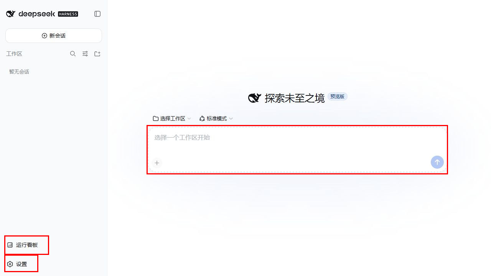
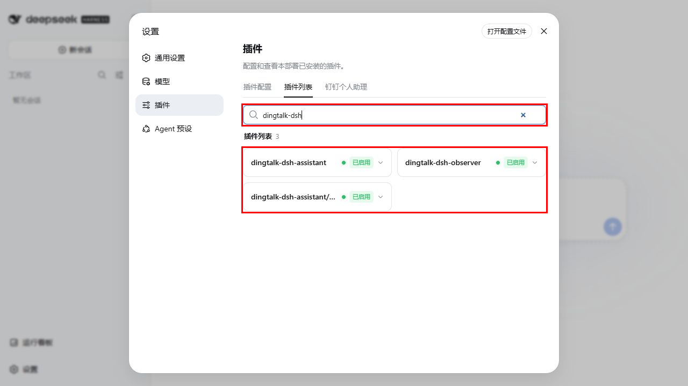
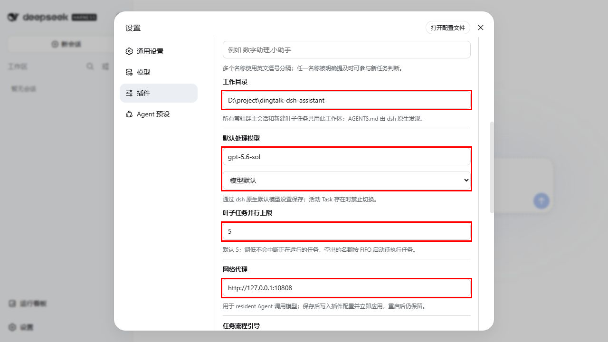
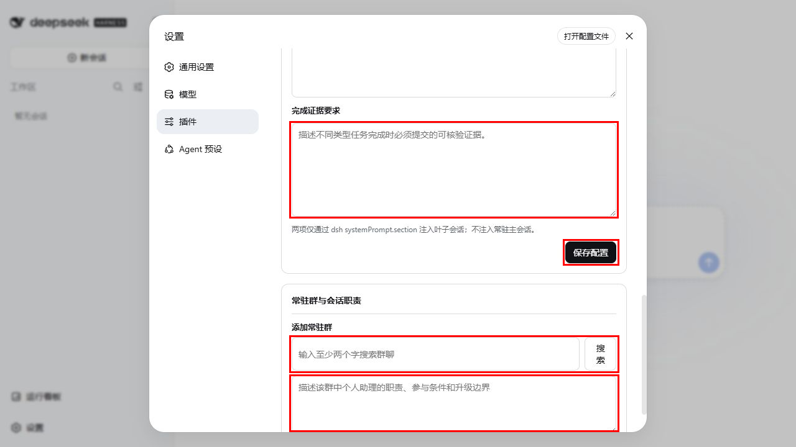

# 安装插件并在 DSH Web 中完成配置

本文面向 Windows 11 与 PowerShell 7，说明如何把当前仓库中的钉钉个人助理插件安装到本机 DSH `web` profile，并在 DSH Web 页面完成首次配置。

插件由两个包组成，安装时缺一不可：

- `@zzusp/dingtalk-dsh-assistant`：resident Runtime、钉钉接入和设置页。
- `@zzusp/dingtalk-dsh-observer`：群聊会话、任务、授权和告警看板。

推荐让 Web、resident Runtime 和看板运行在同一个 `dsh web` 进程中，避免多个进程同时写 Session 和插件状态。

## 一、准备环境

需要提前安装：

- Node.js 24 或更高版本。
- pnpm。
- DSH，并确保 `dsh web` 可以启动。
- 已安装并配置所选模型对应的 DSH provider。只有使用 ChatGPT/Codex 订阅调用模型时，才需要安装 `dsh-codex-connect`。
- DWS，并已登录当前需要监听群聊的钉钉账号。

先检查本机命令：

```powershell
node --version
pnpm --version
dsh --version
dws --version
```

Node.js 必须为 `v24` 或更高版本。仅能执行 `dsh --help` 不代表 Web Runtime 可用，安装完成后仍需实际启动并检查页面和健康接口。

## 二、获取并验证插件源码

```powershell
git clone https://github.com/HiQ-AI/dingtalk-dsh-assistant.git
Set-Location .\dingtalk-dsh-assistant
pnpm install
pnpm test
```

如果仓库已经存在，直接进入仓库目录，更新代码后重新执行 `pnpm install` 和 `pnpm test`。

后续示例假设仓库绝对路径为：

```text
D:/project/dingtalk-dsh-assistant
```

请替换成自己的真实路径。JSON 中推荐使用 `/`，避免额外转义 Windows 反斜杠。

## 三、把插件加入 DSH Web profile

默认 profile 文件位于：

```text
%USERPROFILE%\.dsh\profiles\web\package.json
```

编辑该文件，在现有内容中合并两个本地依赖和两个 bundle。不要覆盖原有的 DSH 依赖、模型 provider 或 bundle。

```json
{
  "dependencies": {
    "@zzusp/dingtalk-dsh-assistant": "file:D:/project/dingtalk-dsh-assistant/packages/dingtalk-dsh-assistant",
    "@zzusp/dingtalk-dsh-observer": "file:D:/project/dingtalk-dsh-assistant/packages/dingtalk-dsh-observer",
    "@deepseek-ai/dsh-storage": "0.1.1-rc.2",
    "@deepseek-ai/dsh-storage-domain": "0.1.1-rc.2",
    "@deepseek-ai/dsh-storage-json": "0.1.1-rc.2"
  },
  "dsh": {
    "profile": {
      "bundles": [
        "@deepseek-ai/dsh-base",
        "@deepseek-ai/dsh-web-app",
        "@zzusp/dingtalk-dsh-assistant",
        "@zzusp/dingtalk-dsh-observer"
      ]
    }
  }
}
```

如果使用 ChatGPT/Codex 订阅，再额外加入：

```json
{
  "dependencies": {
    "dsh-codex-connect": "当前兼容版本"
  },
  "dsh": {
    "profile": {
      "bundles": [
        "dsh-codex-connect"
      ]
    }
  }
}
```

使用其他模型来源时不要安装 `dsh-codex-connect`，改为保留对应 provider 的依赖、bundle 和认证配置。

启动 DSH Web 后，首页左下角可进入“运行看板”和“设置”；开始会话前还需要在中间区域选择实际工作区。红框为需要关注的入口：



进入“设置 → 插件 → 插件列表”，搜索 `dingtalk-dsh`，确认 `dingtalk-dsh-assistant`、`dingtalk-dsh-observer` 和 resident 子插件均为“已启用”：



然后切回“插件配置”。红框只标出“钉钉个人助理”配置页入口：


然后安装该 profile 的依赖：

```powershell
Set-Location "$env:USERPROFILE\.dsh\profiles\web"
pnpm install
```

每次更新插件仓库代码后，都应在这里重新执行一次 `pnpm install`，确保 profile 使用当前本地包。

## 四、装配 resident Runtime

打开仓库中的 `.dsh/profiles/resident/cordis.patch.yml`，把其中配置合并到实际使用的：

```text
%USERPROFILE%\.dsh\profiles\web\cordis.patch.yml
```

必须保留实际 Web profile 已有的 patch。DSH Web 基础 bundle 已经提供 storage、storage-json 和 storage-domain，不能再次 `insert` 同名项；这里只覆盖 storage-json 数据目录并插入 resident 插件。如果已有同名 `id`，应合并配置，不能重复插入：

```yaml
- id: storage-json
  config:
    root: !!js dshHomePath('storages/dingtalk-dsh-assistant')

- insert:
    - id: dingtalk-dsh-assistant
      name: '@zzusp/dingtalk-dsh-assistant/resident'
      config:
        host: 127.0.0.1
        port: 18998
        fakeModel: false
        resumeTimeoutMs: 10000
        maxConcurrentTasks: 5
        maxGoalRounds: 24
        groups: []
        dws:
          enabled: false
          writesAuthorized: false
```

默认模型通过实际安装的 provider 配置。例如仅在使用 Codex 订阅时配置：

```yaml
- id: agent-default-model
  config:
    provider: openai-codex
    model: gpt-5.6-sol
```

仓库模板还包含 Session 持久化、指令发现和 telemetry 等当前参考配置。以仓库文件为准整体审阅后再合并，不要只复制上面的核心片段覆盖现有 profile。

两个 DWS 开关的含义：

- `enabled: false`：不启动真实群消息监听。
- `enabled: true`、`writesAuthorized: false`：接收和处理真实消息，但禁止自动发群消息，适合首次联调。
- `enabled: true`、`writesAuthorized: true`：允许接收、处理和自动回复，只有只读链路验证通过后再开启。

如需指定非默认 DWS profile，可在 `dws` 下增加：

```yaml
profile: your-profile-name
```

不要把个人群 ID、账号信息、工作目录或代理地址提交到仓库模板。

## 五、启动并确认插件已加载

从插件仓库启动：

```powershell
Set-Location D:\project\dingtalk-dsh-assistant
pwsh -NoProfile -File .\scripts\start-web.ps1
```

脚本默认使用 `%USERPROFILE%\.dsh` 作为 `DSH_HOME`，并设置本机地址不经过代理。如果模型访问需要代理，可显式传入：

```powershell
pwsh -NoProfile -File .\scripts\start-web.ps1 -ProxyUrl 'http://127.0.0.1:10808'
```

启动后用独立只读请求确认 resident Runtime：

```powershell
Invoke-RestMethod -Uri 'http://127.0.0.1:18998/health' | ConvertTo-Json -Depth 10
```

预期至少能看到 `status`。如果端口无法访问，先查看 DSH 启动日志，不要继续配置页面。

## 六、在 DSH Web 页面配置

打开 DSH Web，进入“设置 → 插件 → 钉钉个人助理”。页面分为运行状态、环境检查、Agent 配置和常驻群配置。

### 1. 检查运行与 DWS 环境

先确认：

- “运行状态”不是连接失败。
- “处理模型”为“真实模型”。
- 环境检查中的 `dws` 为“已安装”。
- 登录状态为“已登录”，并显示预期钉钉账号。

“群消息接收与处理”和“自动回复群聊”分别对应 `enabled` 和 `writesAuthorized`。这两个开关当前不在页面中修改，需要编辑 `cordis.patch.yml` 并重启 DSH Web。

### 2. 填写 Agent 配置

按页面从上到下填写：

- **Agent 名称 / 别名**：多个名称用英文逗号分隔。群消息明确提到任一名称时，Runtime 才会参与新任务判断。
- **工作目录（你的 Agent 目录）**：填写现有工作区的绝对路径。所有常驻主 Session 和叶子任务共用该目录，DSH 会从这里原生发现 `AGENTS.md`。
- **默认处理模型**：填写 DSH 当前可用的模型名，例如 `gpt-5.6-sol`。
- **推理深度**：可选“模型默认、轻度、中度、高度、极高”。存在执行中或等待中的 Task 时不能切换模型。
- **叶子任务并行上限**：范围为 1–50，默认 5。调低不会中断已经运行的任务。
- **网络代理**：仅在 resident Agent 调用模型需要代理时填写，例如 `http://127.0.0.1:10808`；留空表示不使用。保存后立即应用并持久化。
- **任务流程引导**：说明不同任务类型的推进方式。
- **完成证据要求**：说明任务完成时必须提交的可核验证据。

“任务流程引导”和“完成证据要求”只注入叶子 Session，不会注入群常驻主 Session。填写完成后点击“保存配置”，再刷新页面确认字段仍为刚保存的值。

任务流程引导

```text
需求开发/Bug修复：签出开发分支--开发/修复--本地e2e验证通过--提交PR到UAT分支--合并PR--woodpecker自动构建并重启UAT的Pod--检查UAT的Pod重启后运行正常且镜像sha正确--群聊通知--任务进入完成桶--等待群聊发版上线通知--唤起完成任务--提交合并到main分支的PR--合并PR--等所有上线的任务都合并到main分支--走生产发版runbook（打tag推送，等woodpecker自动构建）
```

完成证据要求

```text
需求开发/Bug修复开发完成证据：
1. 开发分支
2. 本地e2e通过
3. 合并到UAT分支的PR且已合并
4. woodpecker自动构建完成
5. UAT的Pod重启后运行正常且镜像sha正确
6. 通知常驻主会话
```

红框依次标出工作目录、模型与推理深度、并行上限和网络代理：



### 3. 添加常驻群

在“常驻群与会话职责 → 添加常驻群”中：

1. 输入至少两个字的群名称并点击“搜索”。
2. 从结果中选择目标群，核对群名、成员数和群 ID。
3. 填写该群的会话职责，包括职责范围、参与条件和需要升级给真人的边界。
4. 点击“添加并开始常驻”。

红框标出完成证据、保存按钮、群搜索和会话职责。群搜索结果属于真实钉钉数据，因此示例图停留在输入前：



会话职责配置（按实际场景修改对应内容）

```text
负责 xxx 项目及其直接关联项目的问答、方案、评审、排查和开发协作，包括 a项目、b项目、c项目，以及相关数据库、服务器、k3s、Git issue/PR 等事项。

作为本群常驻主会话，持续理解群聊上下文并负责判断、沟通和协调。沟通可以按职责和介入条件主动发生；但创建或续接任务必须同时满足：消息明确指名或提及“你的 Agent 名称，如：小小鹏/孙鹏”，事项属于上述职责范围，并且形成了可验证的执行或持续跟踪目标。职责相关但未明确指名时，可以补充事实、纠错、提示风险或解除讨论阻塞，但不得创建任务。符合任务准入条件时交由 dsh Runtime 创建或续接独立叶子任务，主会话不替叶子执行；叶子负责独立推进并提交可核验结果，结果或阻塞返回后由主会话结合群聊上下文组织回复和后续协调。

默认保持安静；只有能补充新的事实或结论、纠正明确错误或风险、解除讨论阻塞，或者事项明确由自己负责、被明确要求处理时才介入。已有充分回答、明确负责人正在处理且无新增风险、闲聊或普通状态同步时不回复，也不创建任务。

群内结论必须基于自己取得的当前代码、数据、日志、运行状态或权威文档；他人的描述只作为待核线索，不直接当作已确认事实。身份、项目规则、授权边界和对外发声要求最终以 “Agent的AGENTS.md的路径：D:\xxxx\AGENTS.md” 为准。
```

添加后会为该群建立唯一的 resident Session。已有群的职责可单独编辑并点击“保存职责”。删除常驻群会移除插件中的群配置；存在活动 Task 时删除会被拒绝。

## 七、按“先收后发”启用真实群聊

首次上线不要直接开放自动回复。

### 阶段 1：只开启接收

修改实际 Web profile：

```yaml
dws:
  enabled: true
  writesAuthorized: false
```

重启 DSH Web 后确认页面显示：

- 群消息接收与处理：已启用。
- 自动回复群聊：未启用。

在已添加的测试群发送一条消息，然后从左侧插件看板打开“群聊会话”，确认消息进入该群固定的 resident Session。不要用启动成功或健康接口代替这一步真实消息验证。

任务进入 Runtime 后，可在“运行看板 → 任务看板”按待执行、执行中、等待中和已完成四列检查状态。红框标出任务看板入口和完整任务区域：


### 阶段 2：开放回复

只读链路通过后再修改为：

```yaml
dws:
  enabled: true
  writesAuthorized: true
```

重启后确认页面“自动回复群聊”为“已启用”。在测试群发起一条明确提到 Agent 名称、且符合群职责的最小任务，最终应同时确认：

- 群消息进入原 resident Session。
- 任务看板出现独立叶子 Task。
- Task 完成后，原群收到引用回复并正确 @任务提出人。
- 回读到钉钉真实消息后，投递状态才显示完成。

## 八、常见问题

### 设置页没有“钉钉个人助理”

检查两个本地依赖是否已经写入 `web/package.json`，两个 bundle 是否都存在，并在 profile 目录重新运行 `pnpm install`。随后完全重启 `dsh web`。

### 页面提示无法连接 resident 插件

检查 DSH 日志中是否加载了 `@zzusp/dingtalk-dsh-assistant/resident`，并确认 `127.0.0.1:18998` 未被其他进程占用：

```powershell
Get-NetTCPConnection -LocalPort 18998 -ErrorAction SilentlyContinue
```

### DWS 已安装但显示未登录

在同一 Windows 用户和同一 DWS profile 下重新完成登录，再点击设置页“刷新”。不要复制或保存 OAuth 回调地址、授权码或 token 到文档和仓库。

### 群搜索失败

确认 DWS 登录有效，搜索词不少于两个字；如果配置了 `dws.profile`，确认登录的是同一个 profile。

### 模型请求失败

先确认当前所选模型 provider 的认证有效，再检查页面中的模型名和代理。只有使用 Codex 订阅时才检查 `dsh-codex-connect` 登录。代理环境下应确保 `localhost`、`127.0.0.1` 不走代理；仓库启动脚本已经设置该规则。

## 九、安装完成判定

只有以下各层都通过，才算完成：

1. `pnpm test` 通过。
2. DSH Web profile 依赖安装成功，两个插件 bundle 均被加载。
3. `GET http://127.0.0.1:18998/health` 可读。
4. 设置页能读回 Agent 配置，DWS 环境检查正确。
5. 目标群成功绑定唯一 resident Session。
6. 真实群消息进入该 Session。
7. 开放写入后，最小任务完成回复并经钉钉回读确认。

前一层的成功不能替代后一层的验证。
