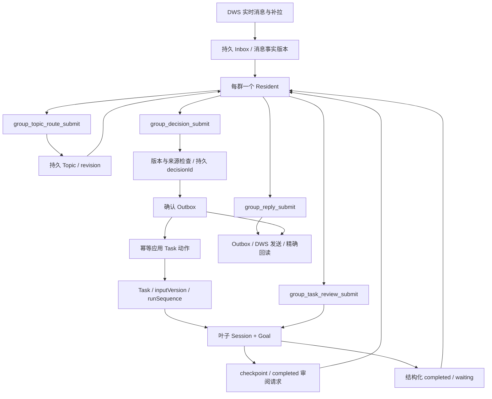

# 常驻会话、Topic 与叶子 Task 的实现审计和改进方案

日期：2026-09-07。源码基线：本地 `main`，`9cf0687c69ff2332a0e778b8b72f59c1131d4bde`，package version `0.5.13`。开始时已有未跟踪 `docs/tmp/`，本次未使用或改动其中内容。未 fetch，因此此处不代表远端最新 HEAD；未读取生产消息或运行真实模型，不代表已安装 profile 的行为。

本文件是改造前的实现审计和方案快照。只新增审计文档与隔离探针，没有修改业务代码、迁移数据、部署、发送消息或提交 Git。已有 Topic 设计文档是历史方案，本次结论以当前源码和本次复现为准。

## 1. 结论与证据边界

建议保留“每群一个 Resident、持久 Topic、每 Task 一个叶子 Session + Goal”的主体结构。Topic 作为持久业务上下文而非新 Agent 是合理的；消息原文统一存储、固定版本引用、持久动作身份、Outbox 回读等机制应保留。

当前主要问题是：正确性协议尚有缺口；Resident 承担过多阻塞式审阅；任务授权与工具权限没有形成相同的硬边界；动态上下文缺乏总预算。只删提示词，或继续增加禁止条款，都不足以解决。

- 既有 `pnpm test`：236/236 PASS，Node `v24.19.0`。
- 本次隔离探针：10/10 PASS。这里 PASS 表示成功复现所描述的现状或完成量化，**不表示缺陷已修复**。
- 探针复用真实 Runtime、Store、Zod/domain schema，以及仓库已有 Agent/Goal 替身；没有验证真实模型是否会产生这些错误决策、真实 DSH 的权限隔离、生产吞吐或业务操作是否重复执行。
- 证据位于 [round-1](../acceptance/resident-topic-leaf-audit/round-1.md)、[matrix.csv](../acceptance/resident-topic-leaf-audit/matrix.csv)、[原始输出](../acceptance/resident-topic-leaf-audit/round-1-output.txt)、[探针脚本](../acceptance/resident-topic-leaf-audit/scripts/probe.mjs)。

## 2. 当前实现：三方不是三个同级 Agent

| 对象 | 职责与权威状态 | 当前实现 |
| --- | --- | --- |
| Resident | 每群长期 Session；理解上下文、归类、选路、检查点/完成审阅、组织群回复 | `runtime.js:74,140,156,516`；常驻协议 `179–228` |
| Topic | 跨 turn 的话题聚合；引用原始消息事实版本，保存摘要、未决问题、决策意图及进度 | `topic-model.js:6–15`；`store.js:337–435`。没有独立 Topic Agent/Goal |
| Task | 被接纳的目标、验收约定、执行轮次和 Topic 引用；业务状态权威 | `store.js:75–90`；`runtime.js:1076–1134` |
| 叶子 Session + Goal | Task 的执行载体，读取原文、调用工具、提交 checkpoint/result；Goal 管持续执行 | `runtime.js:734–888`。reopen 通常继续原 Session，异常恢复可以换 Session，因此不是严格的一生一 Task 一 Session |
| Runtime/Store | 原子版本门禁、动作幂等、调度、恢复、渠道发送和回读 | `topic-runtime.js:300–327`；`store.js:390–435,636–659` |

关键语义：

1. 入站 `accepted` 只表示可靠接收；一次归类冻结最多 50 条消息，允许多 Topic 归属，Topic 索引默认携带最后 100 项。`topic-runtime.js:129–165`。
2. 消息保存 `messageVersion`；Topic 用 entries 的 add/remove 还原某一 revision 的原文；纠正归属不抹去历史。`topic-model.js:20–44`。
3. 一次 Topic 决策须绑定 requestId/topicId/revision、增量 basis 和相关 Task 版本；同群未归类输入会阻止接受，已归类无关话题不会使候选失效。`topic-runtime.js:221–249,300–327`；`store.js:403–424`。
4. 已接受 decision 持久保存固定 Task/operation/Outbox ID。非取消动作先写可靠确认 Outbox，再应用 Task 动作，全部应用后推进 processedRevision；Outbox 是否真正送达另算。`topic-runtime.js:174–217`。
5. Task 引用一个或多个固定 Topic revision；`inputVersion` 表示接纳输入，`runSequence` 表示执行轮次。运行中补充不重开，完成后 reopen 才开启新轮次。`runtime.js:1076–1119`。
6. 叶子输入用稳定 message ID，通过原生 steer 进入下一 step；检查 pending inbox 与历史 user/message，区分 dispatchedInputVersion、acknowledgedInputVersion。`runtime.js:1065–1074`。
7. 叶子必须先提交至少两个检查点的 plan，再逐项 stage-completed；每次都等 Resident 结构化审阅。completed 还需独立完成审阅，通过后 Runtime 才完成 Task/Goal，再请求 Resident 写通知。`runtime.js:578–663`。
8. information waiting 走原群询问信息；human-intervention 走人工介入记录和授权回复。人工回复、目标变化、结果驳回均用 steer。`runtime.js:534–574,702–729`。
9. 默认最多 5 个 running/waiting Task，Goal 默认 24 轮，Supervisor 每 5 秒巡检；这些默认值不等于本机 profile 实际配置。`resident.js:56–63`；`runtime.js:97,1004`。

## 3. 确定性问题与针对方案

### F1 高风险：提示词的授权边界没有被工具能力封住

证据：`runtime.js:112–118` 将 Resident/叶子设置为 `danger-full-access`；Resident 在 `158` 只 deny 三个 Goal 工具。叶子不得向来源群发消息、诊断任务不得改代码等主要是 `762,792` 的文字规则。`topic-runtime.js:247–248` 检查“明确指向别人”，却没有完整的正向授权门禁。

A01 以“先不要做任何事情”的原消息和空群职责，向 Host 提交模型生成的 new-task，仍得到 accepted 并创建 Task。这证明 Host 不能兜住此类错误输出；**不证明真实模型已经越权，也不是一次攻击复现**。

方案：Resident 使用只读上下文能力及结构化协调工具；引用/附件恢复通过限定 group/profile 的读取接口，不依赖全权限 shell。叶子的受控操作必须在工具执行边界绑定真实授权对象、操作范围和资源，群通知工具仅由 Runtime 持有。保留 shell 时必须明确其能力边界；仅加 deny 工具名不能阻止 shell 发网络请求或直接写文件。自然语言是否为授权仍需语义判断，但已解析的授权证据、来源身份、生命周期和实际操作对象必须由 Host 校验，不能只相信 objective 文本。

验收：普通讨论、明确禁止、点名他人、伪造 Web 来源、诊断任务请求业务写操作分别拒绝；合法明确授权可执行。跨群读写与绕过渠道出口用无副作用替身验证，之后再验证真实 DSH 权限配置。

### F2 P1：人工批准跨轮次与风险变化复用

`runtime.js:76–79,550–560` 的 fingerprint 只有 category 和规范化 requestedAction；查找历史批准时没有 runSequence、资源、版本、风险或有效期约束。A06 在第 1 轮批准“发布当前版本”，取消并重开第 2 轮，保持这段措辞而改变风险，旧 requestId 仍被复用，Task 直接回到 running。

方案：批准关联一个不可变的受控操作请求，明确 taskId、runSequence、操作、目标资源/环境与有效范围；同一阻塞的网络重试可复用同一授权 ID，新轮次或对象/风险边界变化必须重新批准。不要简单把每条信息补充都当成重新审批，也不要只把 risk 文本加入 hash 就宣称实现了权限。

反证：当前并非所有批准都无条件复用，category/requestedAction 变化会生成新记录；缺口是同样措辞不等于同一个获批操作。

### F3 P1：检查点先持久化、审阅只在内存中，失败恢复不闭合

`runtime.js:648–652` 先保存 checkpoint，再等待 Resident。`topic-runtime.js:394–403` 的 reviewRequest 只保存在 Map；未提交在 `91–109` 被删除/拒绝。下一次 stage-completed 在 `runtime.js:641` 要求上一检查点已审阅。

A03：plan 审阅完成 → stage 持久化 → Resident 未提交审阅而超时 → 重试同一 stage 返回 `task_checkpoint_review_pending`；`recoverInterruptedDecisions` 没有重建该审阅。并非整个系统必然永久死锁，模型可能通过重提 plan 绕开，但这不是原事件的可靠恢复，且增加重新规划和重复核验成本。

方案：checkpoint 使用稳定提交 ID，保存 pending-review/reviewed 状态与审阅回执；同一 ID 同内容返回/继续原审阅，不再次追加。启动及巡检扫描未完成审阅，按 task/run/input/checkpoint 版本恢复；上下文失效则明确 superseded。普通阶段进展可先通过确定性结构校验，只有需要决策、冲突或最终验收再调用 Resident，减少此类失败窗口。

### F4 P1：追加 Topic 引用会覆盖旧执行依据

`runtime.js:1104` 直接赋值 `topicRefs`，`topic-runtime.js:234` 只要求包含当前 Topic，不要求保留此前引用。A04 给现有任务追加新 Topic B，仅传 B，旧 A 从当前 Task 引用中消失；叶子的 `group_topic_context_get(A)` 被 `runtime.js:809` 拒绝。

原消息和旧 Topic 并未物理删除，但原有输入不再是当前 Task 可读取的证据入口，也可能丢失完成通知的原始参与人。普通补充且 objective 未变时，objectiveHistory 也不会自动保存此前完整引用。

方案：普通 task-context 由 Host 按 topicId 合并已有引用，只推进明确接纳的新版本；移除引用或缩小范围使用明确的结构化变更及原因，不能靠“未传字段”隐式移除。每次执行输入修订记录前后版本引用，不复制正文。验收 A→B 补充后两者都可追溯，明确范围删除则按新约定生效。

### F5 P1：快速取消仍被全局 Task 队列阻挡

`runtime.js:909–994` 将整个 Supervisor 巡检放进 serializeTasks，并在其内部 await Session 恢复、替换和 dispose。Web 取消经过 `1156` 的同一队列；Resident 的取消决策也先经过 `topic-runtime.js:314`，随后到 `181` 才发取消信号。

A09 阻塞任务一的 Session 恢复，取消仍在运行的任务二：在队列释放前没有 agent.cancel 信号。这与 README 所述“等待全局 Task 串行队列前同步取消”不一致。

方案：队列只覆盖短状态检查/持久接受；恢复、模型、Session dispose 在锁外。按 Task 串行维护输入和状态，共享 Topic/Task 的提交锁顺序固定。经真实性和版本检查的取消意图持久接受后立即中止对应叶子，不再等待无关 Task 的生命周期操作。必须保留取消前的授权、身份校验，不能按文本关键词直接停任务。

另一个边界：尚未归类的消息会阻止取消意图接受，这是现有安全门禁，不应为快而全局删除；可为已解析到唯一 Task 的合法取消设计独立、受校验的优先通道。

### F6 P2：历史附件故障扩大成整 Topic 的任务禁入

`topic-runtime.js:304` 对整个 Topic 的 messages 聚合 mediaUnavailable；`decision.js:237–241` 只要非空就替换 new/context/reopen 决策，没有判断本次任务实际依赖哪项资源。

A07：旧图片失败已结束讨论，新的文字明确“不需要旧图片，只核验版本”，仍然不能创建任务，还被改写成要求重发旧图片。

方案：把读取状态绑定 messageVersion/resourceId；动作声明必要输入，由 Host 检查这些输入的可用性。不相关的历史资源可以不成为依赖，但必须保留判断依据。资源补齐生成新事实版本；不能简单删除全部失败标记或关闭附件门禁。

### F7 P2：普通事实补充也强制废弃所有有效检查点

A05：objective/acceptanceCriteria 不变，只补充执行用 IP，`runtime.js:1104–1107` 仍清空 checkpoints，将旧计划整个归档。`runtime.js:758` 要求新版输入重提计划，每次重新经过 Resident。

方案：inputVersion 继续前进以拒绝旧结果；已完成且未受新输入影响的证据可以保留引用，经影响判断重新确认，不自动当成新版完成证据。只有目标/验收变化或证据失效才重建对应检查点。计划调整是显式事件，不是每条上下文消息的固定副作用。

反证：当前重置确实阻止拿旧完成结果覆盖新范围，应保留这一正确性目标。优化不能简单去掉版本检查和清空逻辑。

### F8 P2 设计取舍：等待任务耗尽全局执行名额

`runtime.js:1004,1034` 同时计入 running/waiting。A02 容量为 1，任务一等待人工，后续任务二/三即使重新触发 pump 也仍 queued。默认容量 5 时，五个长时间等待就可以阻挡全部新任务。

方案：区分实际执行槽与持久等待状态。waiting 释放执行槽，恢复待执行时重新排队获取名额；人工批准不能直接绕过上限恢复为 running。若保留会话/内存另有成本，应单独限制驻留资源，而非将人为等待当成占用模型执行槽。

这可以是有意的资源上限设计，并非数据正确性 bug；但与“其他可执行任务继续推进”的目标冲突，需要产品明确语义。

### F9 P2：消息看板仍消费旧投递状态

消息初始 `agentDeliveryStatus=pending`（`store.js:314`）；Topic 归类和决策完成没有更新该字段。A10 已证明消息 routed、Topic processedRevision=revision 时它仍为 pending。Observer `web-client.js:259,264–278` 仍据它过滤、显示“投递中”。

方案：显示可靠接收、归类进度、相关 Topic 决策/动作进度和 Outbox 投递四种不同事实；由新权威状态生成消息的只读投影。不能将 Topic 处理完直接写成 DWS 已送达，也不宜继续人工批量改旧字段掩盖问题。

## 4. 提示词、上下文与串行成本

### 4.1 实测，不把字符数冒充 tokens

| 测量对象 | 字符数 | UTF-8 字节 | 条件 |
| --- | ---: | ---: | --- |
| Resident 稳定决策协议 | 5,685 | 13,233 | fixture Agent 名称为“助理”，空 DWS profile/登录人 |
| 叶子执行规则 | 3,669 | 7,827 | 一个短任务，未配置额外引导 |
| 10 Task 关联索引 | 3,761 | 6,641 | 合成相同长度标题、目标和单 Topic 引用 |
| 100 Task 关联索引 | 37,601 | 66,401 | 同上 |
| 1,000 Task 关联索引 | 376,001 | 664,001 | 同上；是压力构造，不是生产任务数 |
| 单条 12,000 字原文的归类信封 | 12,606 | 未单独报告 | 原文全部进入 route |
| 同一原文的决策信封 | 12,942 | 未单独报告 | 随后再次进入 decision |

未包含 DSH 基础系统提示、工具 schema、工作区 AGENTS、Skill 描述、历史 Session、配置引导或图像成本。不能据此宣称线上 token 消耗、压缩频率或 p95 延迟已知。

### 4.2 真正无界的入口

- `runtime.js:173–174` 每次系统提示展开本群全部 Task，包括 completed/archived；`group_task_list` 在 `374–376` 一次返回全部详情，`group_task_context_get` 虽限 8 个，单 Task objectiveHistory 仍可持续增长。
- `topic-runtime.js:124–125` 决策反复插入 Topic 最后 50 条原文与图片；50 是数量上限，单条文本/图片体积没有总预算。当前并未只发送 processedRevision 之后的必要增量。
- `topic-runtime.js:418` Task 结果通知直接带所有相关 Topic 原文，没有 50 条限制。
- `runtime.js:1220–1221` 历史导入展开全部 Topic 索引；话题数量和 summary 总体积无界。
- `topic-runtime.js:159–164` 一次 wake 为所有待处理 Topic 创建请求；独立提交不等于独立模型算力，同群仍争用同一个 Resident。旧 revision 的 request Map 被删后，其已进入 Inbox 的信封没有在此处一并删除。
- `monitor` 以全 Agent whenIdle 为未提交判定点，没有请求级处理期限；高流量下一直不 idle 时，待处理/失效请求的停留和重试需真实流量测量。

### 4.3 固定规则的重复与冲突

1. Task 关联“不能靠关键词/标题”的同一要求分别出现在索引提示与协议多段（`runtime.js:174,202,204`）；确认简短、不得复述在 `188,218,220,226` 重复。
2. 输入先归类、再读取、再回复审阅、再决策的步骤同时写在系统提示、请求信封、工具描述中。模型每次支付上下文成本，却仍需 Host 兜住结构错误。
3. `runtime.js:800` 告诉叶子 Goal 轮数耗尽由 Host 续接、不得 waiting；实际 `932–938` 会在耗尽时转人工介入。两种说法不能同时作为执行规则。
4. “至少两个检查点”是对所有任务的固定要求（`637,758`），而默认 stageTasks 只有一个“完成并验证当前轮目标”（`store.js:632`）；计划检查点与业务阶段双套列表增加映射、重规划和汇报成本。
5. 冷路径的引用恢复命令、完整故障规则、标题迁移也长期占据常驻认知负担。标题迁移适合一次性受控维护，不应长期与紧急业务竞争调度优先级。

### 4.4 建议的减负方案

稳定系统提示只保留身份职责、授权/不可信输入边界、语义路由原则、状态语义和输出质量要求。字段、枚举、JSON 示例、异常码与重试动作由工具 schema/结构化响应承载；引用恢复、人工审批等冷路径在触发时给专用说明。

Resident 的动态入口改为待归类增量、当前 Topic 增量、少量强关联 Task/回复候选与查询指针。历史 Task 不删除：按明确 ID/Topic/引用优先召回，再提供可分页检索的历史入口。不要以最近 N 条代替所有历史关联，也不要只在提示词中说“少读一点”。

在组装边界实施总预算：系统静态段、工具定义、动态索引、正文与图像、历史和输出预留分开计量；重要当前输入不能字符截断后继续执行。超过预算时分批、分页读取，所有响应明确 total/hasMore/固定 revision。最终使用所选模型 tokenizer 或 DSH 实际计量核验；字符预算只适合离线粗筛。

同一正文在 route→decision→review→notification 间尽量使用稳定引用。上下文压缩后仍能通过工具补齐，不能为了省 token 把“模型可能记得”当作事实来源。图像按实际需要读取，避免每次重复注入 50 张历史图像。

检查点方面：简单 Task 不强制凑两个阶段；普通 progress 由 Host 校验顺序和证据结构，发生 scope-conflict/evidence-gap/risk-changed、needsCoordinatorDecision 或最终验收才进入 Resident。保留拒绝批量跳过阶段、旧输入完成和缺少证据的门禁。

无异常、两个检查点的 Task，当前至少涉及 **7 类 Resident 工作项**：归类、话题决策、计划审阅、两次阶段审阅、完成验收、结果通知。这里不是精确的 7 次 API 请求：DSH 可以在一个模型 step 批量提交多个工具，每项也可能多次推理。优化目标是减少必须等待主会话的业务往返，并测量实际请求数。

## 5. 恢复、状态与存储的后续风险

| 风险 | 证据与限制 | 方案 |
| --- | --- | --- |
| 接受后错误无限固定间隔重试 | `topic-runtime.js:205–217` 默认约每秒恢复所有类型错误；确定性状态冲突可能长期持有 reservation。尚未证明生产发生 | 瞬态存储/网络错有退避；版本/授权/确定性校验冲突进入显式需重审状态。固定 decisionId 与已应用回执不能被丢弃 |
| 全量群记录持续增长 | `store.js:58–61` 同一 group 保存全部 messages/outbox/topics/decisions/routeHistory；每次修改 group 需经完整记录持久化 | 先基准测量记录字节、序列化耗时和写延迟。达到阈值后按 Message、Topic、Decision/Outbox 分表并保留原子提交边界；不能盲拆表破坏事务 |
| 话题解析反复线性查找 | `topic-model.js:23–30` 每次先扫描 entries，再为消息逐项 group.messages.find；ownership 再遍历历史 Topic 决策（`topic-runtime.js:52–68`） | 在同一次快照计算中建 messageId/version 索引并复用解析结果；确认热点后再做持久存储改造 |
| 异常换叶子可能缺执行证据 | `runtime.js:890–906` 创建空 Session，再发 Task 输入；没有把旧工具操作和检查点证据作为专门恢复信封传入 | 换 Session 前建立受限的恢复上下文：已验证结果、外部动作 ID、未完成阶段、风险/批准状态和证据指针；恢复先读回外部状态。当前只证明业务动作幂等，不证明外部 shell/部署恰好一次 |
| 共享事实的唯一 owner 过粗 | `topic-runtime.js:48–75,229–231` 按消息事实确定唯一 Topic，并把已用于 Task 动作/确认的 basis 消费 | 同一消息要求两个不同 Task 时，当前 owner 可以一次提交全部动作，因此不能笼统称其“不支持多任务”；若需两 Topic 独立落地，应把去重范围定义到事实+目标动作，并持久引用既有回执，避免只因数组顺序决定所有业务效果 |
| 历史错误累积影响健康状态 | `runtime.js:1181` 向 recoveryIssues 追加错误，`http.js:98–103` 按其是否为空判健康 | 区分事件历史与当前未恢复故障，按稳定问题身份记录 first/last/resolved；不要因为一次已恢复错误长期报 degraded |
| 旧辅助函数与状态并存 | `mergeReplyReviewCandidates`、`taskNotificationMessages` 在 packages/test 中只有定义；旧 agentDeliveryStatus 已发生实际展示错配 | 先修正状态投影，再删已确认无调用的包装和旧分支；迁移审计数据与仍被 DWS/API 使用的字段不能直接删除 |

特别保留：processedRevision 不是“话题永久完成”；completed 与 canceled 当前通过 `state=completed` 加 completion/archived 区分（`runtime.js:475–480`），后续查询/统计要明确取消不是业务成功。是否扩展终止原因字段应随生命周期改造一次完成，避免又新增另一套互相竞争的状态机。

## 6. 方案取舍与实施顺序

比较三种方案：

| 候选 | 优点 | 排除/选择理由 |
| --- | --- | --- |
| 仅缩短提示词和调低候选数 | 改动小，短期减少一些输入 | 不能修复授权复用、丢引用、审阅恢复、取消排队，不足以作为主方案 |
| 保留三方主体，修协议并把确定性工作交回 Host | 复用 DSH、Topic 固定事实、Task/Outbox 回执；能逐步验收 | **推荐**。先修正确性，再对 Resident 工作量和上下文设边界 |
| 每个 Topic 再建独立 Agent/Session | 可能隔离语义推理和长话题历史 | 目前缺少生产吞吐证据支持其收益；增加路由、身份、消息恢复、共享 Task 冲突和成本。只在前两步后实测 Resident 仍是瓶颈，或 Topic 有独立权限/生命周期需求时重评 |

实施批次建议：

1. **正确性和权限边界**：F2 批准作用域、F3 checkpoint 幂等恢复、F4 Topic 引用合并、F5 取消临界区优先；F1 的能力审计与执行边界同批设计。必须跑合法授权与非法授权反例。
2. **状态一致性和可用性**：F6 资源依赖限定、F9 新旧状态投影、F8 等待释放执行槽及重新入队；统一 Goal 耗尽策略与提示词，恢复失败按错误类型处理。
3. **减少模型往返**：F7 输入影响分类；确定性 checkpoint 自动接受、必要节点审阅；受控调度分类优先，给已归类可提交决策和取消留公平处理机会。
4. **上下文预算与热点优化**：分页/按需引用、完整 envelope 计量、动态索引移出常驻系统提示；用真实匿名化分布回放，再决定是否拆 Store。

每批独立 PR/验收，不把提示词、权限、存储迁移一次重写。风险性改动需隔离工作区和干净 fixture；不得重放真实历史任务或群消息来“测通”。

验收指标与场景：

- 正确性：同群 A/B 交错、共享消息多 Task、跨 Topic 补充/移除、旧输入结果、重复提交、晚到取消、审批跨轮次、失败附件恢复。
- 崩溃窗口：decision accepted 后、Outbox 写前/后、Task 应用后、checkpoint 写后审阅前/后、steer 入队前/后、Session 恢复期间。
- 调度：若干 waiting 不阻挡独立 runnable；恢复任务重新获取执行槽；紧急取消不等待无关 Session 网络/磁盘操作。
- 质量：减少审阅后，诊断不扩为修复、重复 Task 率和误通知率不退化；真实模型回放要有人工判定样本，fixture 不能代替语义质量。
- 成本：每消息/Task 的实际输入 tokens、Resident 请求数、route/decision/review 排队时间、p50/p95、stale/retry 次数、压缩次数、最大 Inbox 字节和持久记录写延迟。

尚未收敛：生产消息长度与速率分布、真实请求 token 明细、长期重试发生率、所装 DSH preset 的最终工具全集、工作区指令与 Skill 的总负担。没有这些数据，不给出“提速几倍”“节省多少 token”或“绝不会串话/越权”的承诺。
