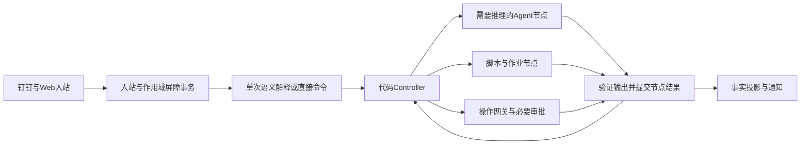

# DSH 代码流程执行架构：统一修订方案

日期：2026-09-23。版本：proposal-v2。状态：设计修订，尚未实现或部署。

本文件是下一轮实现的唯一设计入口，整体替代`runtime-execution-redesign.md`中的执行方案。旧稿保持498行被审快照，其现场事实仍见`../acceptance/runtime-redesign/round-1.md`；11项挑战见`adversarial-review.md`。本版重新组织统一契约，不使用“后文覆盖前文”的补丁式规范。

## 1. 目标、边界与固定决策

目标是让消息及时得到有用答复、任务在等待时不花模型轮次、执行过程可恢复、同一授权不反复索取、固定流程由代码推进。现有多层模型协调、Goal耗尽后扩额复活、逐文件登记、叶子自报进度不再作为执行主路径。

| 对象 | 唯一职责 | 生命周期 |
| --- | --- | --- |
| Task | 用户事项、当前目标/验收、历次执行索引 | 长期业务身份 |
| WorkflowRun | 一次执行的固定定义、目标版本与节点状态 | 一次明确执行；跟进需求可开新run |
| NodeRun | 一个节点、一次输入快照及尝试的执行账 | started到结果/等待/失败 |
| Agent/Session | 执行需要推理的节点；Session保存该执行上下文 | 节点范围，满足复用条件才续用 |
| Job | 本地长进程或外部作业的观察、日志和退出结果 | 与Agent句柄分离 |
| Operation | 一次受控效果、授权、发送状态和独立回执 | 可长于节点、Task或进程 |
| Notification | 向用户传达特定执行事实及送达证据 | 与业务结果分离 |

固定决策：

1. Host中的**一个代码Controller**拥有状态推进权；同一Task至多一个可写工程节点，共享资源跨Task排他。
2. 每条普通消息由一个短Message Processor处理归属和意图；已明确的状态/审批/控制命令直接走代码。Topic仅保留查询索引。
3. 首版工作流是随插件发布的有限状态定义，仅顺序、条件分支、有上限修复。节点内部可以探索，节点顺序及完成条件不交给模型改写。
4. 控制账选用**单机本地SQLite事务存储**，由专用Node worker持有；不采用原生JSON per-record保存执行权威值。DSH原生Session、工具事件及计量继续复用。
5. 第一版按**完整agent节点**失效，保留明确独立且有效的已验证产物；不实现任意字段依赖推导、动态fan-out或聊天依赖追踪器。
6. 第一条完整交付链为开发→验证→受控提交/PR；通过后接数据变更→审批→执行→回查，再迁移其他模板。
7. 一次真实业务授权在范围内持续有效；系统故障、重启、报告换文案不产生新的业务审批。预算独立管理。

以下属于设计保证，只有第12节原生验证通过后才能称为实现能力。既有当天统计是基线，不是本版性能证明。

## 2. 控制账、事务和故障边界（AR01、AR06、AR11）

### 2.1 选型理由与接入

| 候选 | 判断 |
| --- | --- |
| 改造原生JSON per-record并补严格读取、完整清单及其原子更新 | 需要改原生依赖和持久格式；清单与多文件一致性会增加自制恢复协议，不选作首版底座 |
| 插件启动时额外扫描JSON、维护第二份清单 | 两套解析与两份持久权威，仍有读写竞态，排除 |
| Node内置SQLite、插件专用控制服务 | **采用**；利用同库事务、约束和现成恢复机制，插件只实现业务状态转换 |

本机Node v24.19.0已成功加载`node:sqlite.DatabaseSync`，读出SQLite 3.53.3。这仅证明终端当前Node接口可用；M0必须核对实际DSH Host及worker的execPath、versions与接口。该API为同步接口，因此数据库放专用worker，不在群消息主事件循环直接执行；worker隔离调度阻塞，不是权限沙箱。支持的Node版本/平台须写入包的实际兼容范围并纳入安装自检。[Node官方接口](https://github.com/nodejs/node/blob/main/doc/api/sqlite.md)

本选择调整了第3轮审查中“优先补原生strict”的初步建议：该后端无现成严格模式，完整清单也必须原子持久化；本轮核对可用的标准库后，采用事务存储以减少自制恢复协议。不会在运行中自动回退JSON。

这是插件新增的`ControlStore`服务，不宣称现有DSH Domain已有事务API，也不将同一Task同时权威写入JSON和SQLite。现有配置、原生日志及非权威投影可继续用DSH；Web/钉钉的Task读写统一接入ControlStore。当前仓库使用JS，首版沿用JS、JSDoc及现有Zod验证，避免引入与本任务无关的构建迁移。

### 2.2 最小持久模型

逻辑关系与权威值如下；具体DDL在底座批次固定，身份/唯一约束不可省略。

| 表/集合 | 核心内容与约束 |
| --- | --- |
| control_meta | instanceId、schemaVersion、当前safetyEpoch；安装绑定的唯一实例身份 |
| tasks / runs | Task目标revision/验收、run定义digest、状态、预算、当前节点；taskId/runId唯一 |
| nodes | nodeRunId、generation、attempt、输入包digest、能力digest、leaseEpoch、候选/作业/会话引用、状态；同run/node/generation/attempt唯一 |
| inbox / commands | 渠道来源去重键、认证actor、可靠关联范围、seq、解析/应用状态；commandId及payloadDigest、结果receipt；同身份不同payload报冲突 |
| operations | task/run/node、稳定operationId/revision、精确效果与资源、授权需求、状态、回执；权威操作记录，不从聊天推断 |
| approvals | requestId绑定operation revision、允许决策者、首个终态decision及来源、Grant/revoke；操作外键与决策唯一性 |
| fences / resource_holds | scope、原因、来源seq/安全版本、解除条件；资源规范化键及持有操作/作业；排他占用唯一约束 |
| notifications | intentId、task/run/generation、causeSeq、factRevision、类型、投递状态、外部消息ID/替换关系 |
| events / artifact_refs | 与状态转换同事务的最小因果审计；不可变工件manifest引用、校验/归属；大文件和stdout在库外 |

当前状态只保留必要恢复信息，历史通过append审计行与外部工件引用存储，不把全部NodeRun/日志反复塞回Task JSON。计量批量写独立投影，不阻塞控制事务；计量故障单列缺失计数。

### 2.3 原子边界

所有控制写经有界队列进入同一DB worker；事务内不等待模型、网络、shell或用户。唯一写者只降低竞争，不替代数据库约束。

| 提交 | 一个短事务必须包含 |
| --- | --- |
| 入站接纳 | inbox去重、来源/主体、可靠关联范围、seq与必要未解析屏障 |
| 命令应用 | 先查原receipt，再查expectedRevision；任务变更、命令receipt、节点/通知意图 |
| 节点提交 | 输入/generation/lease检查、有效输出/证据引用、node终态、下游ready意图 |
| 审批/撤销 | 同request决策唯一性、Grant/revoke、对应唤醒或fence |
| 全局撤权 | safetyEpoch递增及主体/资源scope fence；不等待逐Task投影 |
| 开始效果 | 健康状态、Task/输入/lease/安全版本/Grant/资源检查、resource hold、operation.executing |
| 完成 | 当前验收、已接纳相关变更处理完成、节点/操作账一致、Task终态、completion intent |

多事项消息的每个命令可以独立applied/conflict，用户得到逐项结果；不自动赋予跨任务全有或全无业务语义。能力上同库有事务，也不能悄悄改变该产品契约。

DB提交结果丢失时先凭commandId/submissionId读回；数据库服务不可达时禁止派生新效果，不把超时当未提交。内部事件允许重投；正常重复不创建新业务run。对DSH Inbox投递仍是跨系统意图→投递→receipt，崩溃可能重复计算，不能因此重复业务效果。

渠道/native消息日志到控制库不是同一事务：sourceEventId及接收游标用于重投去重，只有inbox及屏障COMMIT后才返回插件durable接纳回执、推进消费游标。启动先追平已知恢复水位，再开放依赖其控制消息的操作。渠道原文已经记录不等于插件控制意图已经生效；未进入插件/迟到推送不承诺提前阻断。

### 2.4 启动、健康、备份和迁移

1. 取得profile对应OS独占实例锁；多进程误启动直接失败，端口检查不代替锁。
2. 普通启动必须打开已登记的instanceId及已存在的数据库；**不隐式创建空库**。安装初始化与迁移是独立命令，先`--check`。启动发现文件缺失、身份不匹配或未知schema即停止执行准入。
3. 本地磁盘启用WAL、`synchronous=FULL`、foreign keys；设置后逐项回读，禁止忽略设置失败。网络共享目录不作为支持存储。WAL同步及备份按SQLite契约处理，不将主.db单独复制当完整运行态备份。[SQLite WAL](https://sqlite.org/wal.html)
4. 开放执行前运行完整性及外键检查、业务schema/不变式检查；`integrity_check`不替代`foreign_key_check`。校验未决操作、Grant、资源占用、来源/工件引用和预期定义均可解释。[SQLite PRAGMA](https://sqlite.org/pragma.html)
5. 恢复全局安全屏障、未解析/未应用输入、stop/revoke、executing/unknown占用，再重建作业观察与调度；不把进程消失等同于外部操作未发生。
6. 介质损坏、disk-full、IO失败或无法确认事务状态：暂停新执行/写入，保留故障说明与可验证只读状态；禁止跳过坏记录、自动建空库、悄悄恢复旧备份。
7. 备份使用SQLite一致性备份机制，另保存所引用不可变工件清单和实例/迁移信息；备份恢复不自动恢复发送资格。先对账恢复点之后可能发生的外部效果，再启用执行。

FULL不是对任意硬件/人为删文件的绝对不丢失承诺。正常服务没有删除未结控制账的通用接口；终态清理由引用/保留规则控制。人为使用另一SQLite客户端删逻辑行或替换为同UUID的自洽旧备份，可能通过结构校验；首版不宣称能检测绕过恢复流程的任意历史回退，也不私加第二本防回滚账。所有受支持备份恢复一律进入恢复隔离和外部效果核对。M0验证进程强杀/worker失联/磁盘错误，真实断电未测须明确列出。

## 3. Host执行链与状态职责



Task业务状态为queued/running/waiting/verifying/succeeded/failed/cancelling/cancelled。waiting必带approval(requestId)、input(questionId)、external(jobId)、retry(nextAt)、recovery(incidentId)之一及允许唤醒事件。Worker是否存活、Task业务结果和通知状态分别记录。

代码Controller按提交事件决定ready节点；节点成功→下一节点，无常规父模型审批。消息、控制、工程执行、通知、维护队列各有有界并发；已认证取消/撤权优先，普通输入公平调度。控制服务不持数据库事务等外部调用。

租约绑定task/run/node/generation/epoch，工具入口和结果提交均校验。取消先持久stop/fence，再请求终止本地工具/作业；确认停止后才显示cancelled。超时未证实停止进入cancelling/recovery，不启动共享工作区替身。job身份包含主机启动标识、创建时间及内部nonce，不能只凭PID恢复。

等待释放模型槽；外部作业/未知操作的资源占用保留至对账。资源键由适配器规范化，成组申请，禁止拿一半再等另一半。**仅待审批的prepared意图不长期占用执行锁**；开始效果时重新检查资源和远端前置条件。已运行/未知效果不能因超时自动释放锁。

## 4. 节点契约、校验、效果和重试（AR03）

### 4.1 定义与输入输出

以下是插件拟议契约，非DSH现成API：

```text
NodeDefinition:
  nodeId, nodeVersion, executor(code|agent|wait|operation)
  inputSchema, outputSchema, inputMapperId, completionCheckerIds
  allowedEffects[], jobPolicy?, capabilityProfileDigest, recoveryHandlerId
  timeoutPolicy, retryPolicy, maxVisits, allowedTransitions

NodeInput:
  taskId, runId, nodeRunId, generation, leaseEpoch       # Host绑定
  workflowDigest, objectiveRevision, inputWatermark
  requirementSnapshot, criteria, applicableRulesDigest
  dependencyRefs, candidateRef?, operationRefs?, data
  inputDigest                                        # 已接纳业务输入的固定摘要，不含运行信封
  observedRefs / checkpointRef                        # 该节点已观察材料与连续工作状态

NodeResult:
  submissionId, nodeRunId, generation, leaseEpoch, inputDigest, observedManifestDigest
  succeeded(output, evidenceRefs) |
  waiting(condition, checkpointRef) |
  failed(code, evidenceRefs, recoveryDisposition)
```

节点只接收经schema验证的NodeInput和能力接口；身份不由模型手填。`inputDigest`包含已接纳的需求/规则/能力/定义、起始候选及固定来源快照；排除leaseEpoch、投递ID、观测时间和后来正常工具结果。后者由Host追加到`observedRefs/evidenceManifest`，最终输出及checkpoint另绑定其摘要。下游inputMapper只从有效NodeOutput及明确版本引用取值，不解析上一节点聊天全文。缺失/类型/引用错误一次返回；业务完成由对应checker证明，SHA只证明内容身份。

定义加载检查节点身份/版本、schema、已注册mapper/checker/recovery handler、可达终态、分支和循环上限。修复为显式有界转换，不能同时声称图完全无环；每个visit及整个run共享预算，输入换generation不清零已花费预算。

提交先回读同submissionId/digest回执，再核对租约、输入、generation、stop及相关操作。旧纯计算输出只有显式重验后可作新输入；旧外部回执总要登记，不能因stale丢弃实际效果。第一版不自动证明任意旧agent输出无依赖。

### 4.2 效果分类

| 效果/生命周期 | 执行前必须持久化 | 崩溃恢复 | 自动重试条件 |
| --- | --- | --- | --- |
| pure/read | 输入与来源快照；读取声明无写能力 | 输入仍有效则重算/重读 | 单一重试层、共享deadline和次数 |
| workspace-write | generation基线、独占workspace lease、候选路径 | 保存残留、核对改动归属；从可证明基线继续 | 不把追加/删除动作当幂等；未确认残留先核对 |
| durable-job | 稳定jobId、候选、启动意图、可观察身份 | 找原job；启动结果未知则查身份 | 只有证明没启动或job本身支持幂等启动才再发 |
| external-operation | 精确Operation、授权依据、资源、发送意图 | executing转unknown并reconcile | 有原生幂等或未执行证明才重发 |
| wait | waitCondition与wake身份 | 重新订阅/定时读回 | 不调用LLM等待 |

`allowedEffects`声明实际的纯计算/读取/工作区变更/外部操作，可显式组合；durable-job是叠加的生命周期契约，不能取代作业本身的效果声明。wait是等待执行方式，期间没有模型效果。一个节点可使用哪些效果由定义固定；executor=code不代表只读，executor=agent也不能自己申请任意效果。构建脚本、Git hooks、依赖安装等间接动作受到同样能力约束。读取动作若实际上会改状态，必须按真实效果分类。

原生进程取消是否覆盖子进程树、作业是否能脱离Host继续运行、Windows权限/网络边界在M0验证；不能证明的能力不对该节点开放。凭据由连接器持有，工程Agent不可读生产凭据。通用shell能够绕过时，不得声称网关已兜住外部写。

### 4.3 错误唯一归属

临时读/429由对应调用适配器有界重试；schema/权限/身份错误立即返回；无新事实模型结束停止当前attempt；证据缺少先读取已有材料；业务缺口按gapId+候选版本进入有预算修复。不可逆前置违例记实际产物及process_nonconformance，不能补造历史。通知失败只进投递队列。

运行预算含总token、活跃时间、连续无进展及恢复次数；不得用审批扩大预算。新进展必须是新有效证据、产物、业务结果或状态，不是改写“继续等待”。超限给具体系统恢复原因，不能周期性向用户发“批准继续”。

## 5. Agent和会话边界（AR02）

Session仅在同一个`taskId/runId/nodeInstanceId`下，`generation + inputDigest + rulesDigest + capabilityProfileDigest + workflowDigest`一致、旧句柄停稳/无未决写入、checkpoint与有效观察核对通过时复用。重建句柄增加leaseEpoch而不改变inputDigest；同节点内普通工具循环连续执行。修复节点读取固定失败材料和候选，使用自己的Session，不偷继承前节点完整聊天。

跨节点、关键输入变化、规则/能力变化、上下文整理形成新包时创建新Session，只装载有效包。Task身份及工程工件继续保留，不因换Session另建Task。原生preset产出后固定，因此不同能力节点使用显式组合的新会话，不依赖中途切换preset。

节点内允许工具按能力读取包外必要材料，但Host必须把来源/digest/完整性追加到observedRefs；首次读文件、正常工具结果、同一job的完成回执不构成ChangeSet，不强制换Session。上游已观察来源发生相关版本漂移或新的用户要求生效时，首版整节点失效。节点自身按授权编辑产生的工作树版本演进记为effects和候选，不误判成上游规则变化。无法确认相关外部材料边界时保守重新评估；上下游传参仍只用NodeOutput。不得将已生效的新业务输入偷偷追加到旧inputDigest会话。

没有Goal自动续轮或常驻父模型；持有执行槽才创建Agent。等待时释放模型槽，终态并确认在途工具退出后dispose；Session日志独立保留。嵌套Agent默认关闭；有明确独立输出/资源才由Controller显式分配共享预算的子工作项。

状态、耗时、当前工具、作业和节点完成来自原生事件及NodeRun投影。Agent不必调用进度报告工具，也不用中断工作回答“到哪了”。无可信完成百分比时显示活动和已完成节点，不用回合数伪造百分比。

上下文使用必要项目规则、真实目标、当前证据和引用，不fork群历史；日志/SQL/浏览器快照按引用分页读取。初始实验预算：消息输入P95≤12k、agent新包≤24k、工作上下文≤64k token，包含工具schema与引用信封。必需材料不能截断假装完整；超限按工作集分解，并单独核算重新建包及压缩成本。

## 6. 候选、工作目录与验证快照（AR04）

### 6.1 固定产物身份

Candidate = candidateId、generation、baseSnapshotRef、完整文件manifest/digest、要求/规则版本、创建节点。manifest包含进入交付或验证的新增/修改/删除/未跟踪文件；忽略文件中会影响测试的环境/依赖只存安全身份与版本，不将凭据写入产物。

内容哈希与位置分开，适配器读的是已冻结字节。Git tree对象或独立文件快照可标识候选，**不创建临时commit绕过提交前验证**。候选工件先完整写入并校验，再事务登记引用；崩溃遗留未引用工件是可回收孤儿，数据库不能先引用尚未完整的产物。

### 6.2 generation切换与用户改动

1. 每个generation开始前保存本轮可证明基线；工作目录由一个节点持有写lease。不同Task默认独立目录，同一目录复用须资源锁。
2. 需求变更先停止/排空旧写工具，保存残留快照和diff。旧输出被失效时，旧文件改动不会自动变成新候选。
3. 新generation从有效基线准备新的受管候选目录；旧目录保全。可保留的旧改动形成带来源的候选patch，显式按新要求重新审定和测试后采纳；失效删除/旧需求改动不自动带入。
4. 用户或其他进程的改动单列为外部变化，不自动reset/覆盖。无法证明归属时保持旧目录，进入定向冲突处理，不做猜测性合并。第一版不提供通用跨代三方合并引擎。
5. 改动范围收缩时，范围检查要验证最终候选完整diff；只测试新增B不能证明失效A删除已消除。

### 6.3 验证与提交顺序

验证器在固定候选快照执行；首版同一候选的实现/修复/验证串行。Job存活期间相关输入不可被写者改动；测试输出写独立目录，必须生成源码时作为新的候选步骤重新冻结。M0用两次读取间改树再恢复的ABA反例核实真实隔离，入口/出口hash相同不够。

实跑回执绑定candidateDigest、检查命令/环境/工具版本、exitCode及原始日志；第一版候选改变就重跑该流程要求的完整检查，不推测只测受影响文件。适用规则要求的commit、push、PR创建各自有动作前置检查；本项目路径固定为**候选→真实验证→commit→push→PR→远端回读**。会改内容的hook必须在冻结/验证之前作为受控步骤运行；正式提交前后tree必须相符，无法在提交前保证hook不会改变tree的项目不准入该自动提交适配器，不能先commit再补测，也不擅自跳过项目hook。用户已授权的正常提交动作使用原授权，不增加逐步骤确认。

已失效候选、旧验证和外部结果保持历史可读。schema通过不代表行为测试通过；缺少可机检谓词的业务判断由固定独立review节点承担，一次返回完整问题，不能增设原目标之外的验收要求。

## 7. 操作、授权与外部基线（AR05、AR06）

### 7.1 操作身份与授权复用

Operation包含`operationId/revision, adapterVersion, normalizedTarget, canonicalArgs, artifactDigests, effectScope, resourceKeys, expectedRemoteState, idempotencyKey, status`。参数规范化和工件由Host绑定，展示文案不影响操作身份。

授权依据分为任务范围内已明确授权、规则要求的精确操作批准、外部平台自身审批。只有存在真实授权缺口时创建请求；OAuth登录、工具失效和运行预算单独管理。同requestId的认证Web和钉钉入口平级，首个有效终态生效；模型无权重新解释为“Web不算”。用户后续撤销生成独立revoke。

Grant绑定允许的动作、主体、目标/范围及必要工件版本。重启、节点恢复、相同操作重投不索取新批准；修改SQL/目标等使**被批准的效果**变化才使对应Grant失效。协议修复或报告措辞变化不构成效果变化。

### 7.2 执行的唯一线性化点

开始效果事务同时检查Task/run/generation/lease、相关输入水位与fence、当前安全策略、Grant、资源及操作状态，写executing后才允许连接器发送。安全策略的scope撤权在同库持久提交即生效；旧Task的展示投影更新可以滞后，执行守卫不能读该旧投影。

在开始事务之前已持久提交的有效stop/撤权/输入屏障必须阻止发送资格；开始事务之后才提交的调整按在途动作处理，代码可在真正发送前再次发现取消并停止，但不承诺倒转已经取得发送资格的操作。连接器开始前发生进程故障，即使可能未发送也先unknown并查询，不盲目重发。

### 7.3 远端条件必须在实际写入处成立

不同动作的具体策略在adapter定义中固定：

- 修改既有数据：批准的主键集合/目标范围冻结为实际参数，并绑定预期行版本或相关值。必须验证目标集、值变化及允许影响量，不能仅比较行数；事务中的断言失败应整体回滚，不能先提交再查数量。
- 增加数据：固定业务唯一键和幂等标识，验证插入与已存在记录是否符合该操作语义；禁止把未知结果重新当全新插入。
- 文件/版本/部署：条件更新精确远端revision或已冻结构件；不能让“latest”在批准后指向别的构件。
- 外部API：使用其真实条件写/幂等/可查询身份。只有前置GET没有条件写时，明确该动作不具备原子基线约束；依赖此约束的自动写不准入该adapter。

SQL应在隔离演练中证明范围断言、事务及失败无部分写；通过Bytebase等平台时核对实际Sheet/plan/task的冻结身份及执行机制，不假设平台会替插件补上数据库条件。独立回查仍必需，但不能代替事前防扩大。

超时、网络断开及异常回执产生unknown；重试由operation层独占。原生幂等键、任务ID或未执行证明决定能否重发。用户改目标不能抹掉旧效果，修正/回滚作为新明确操作及对应授权。

## 8. 执行中新输入（AR07、AR08）

### 8.1 入站屏障覆盖到哪里

可靠关联由服务器Task绑定、真实引用消息→Task映射、显式合法taskId及主体控制权限确定；附件/引用正文是数据，不能伪造认证actor或控制命令。

| 输入 | 入站时代码行为 | 解除条件 |
| --- | --- | --- |
| 明确审批/取消/撤权控件或命令 | 直接持久应用控制转换；优先队列 | 对应receipt；不是等模型回复 |
| 已认证有控制权且可靠关联Task的未分类输入 | inbox与该Task外部写屏障同事务，记录unresolved seq | 持久解析为纯查询/无关，或转换为待应用ChangeSet屏障 |
| 确定性状态查询 | 读取NodeRun投影，不加输入版本、不唤醒工程Agent | 完成查询 |
| 无权主体/无关事项 | 不建立目标控制屏障；照正常业务规则处理 | 无权输入不得扩大权限或冻结资源 |
| 无可靠关联的自然语言 | 优先关联解析，必要时一次定向澄清 | 只保证明确接纳控制后的阻断，不承诺解析前已冻结未知对象 |

无法同时承诺“所有无引用自然语言在理解前都阻断潜在目标”和“绝不扩大为全群屏障”。首版选择精确作用域；UI控制/回复引用提供确定关联，不能用关键词冻结整群。未解析屏障仅影响相关外部写及当前完成判定，本地分析/无关节点照常推进。超过解析时限保留屏障并产生可见系统故障，不按超时假定无影响。

### 8.2 接收、接纳与应用

Inbox状态为durable→classified→commandsAccepted→applied/conflict/ignored。ChangeSet状态为pending→applying→applied/conflict/superseded；每条原消息都有结果关联，合并不删除来源。

- `received`仅表示已持久收到；`accepted`表示补充/控制意图已接纳；`applied`才表示新要求已进入有效节点输入。回复用代码模板区分三者。
- 对有可靠关联的输入，解析到ChangeSet接纳在同事务转移屏障，不能先删unresolved再异步建change fence留下空窗。
- 前后baseRevision冲突用字段/操作语义确认；不能最后写入静默覆盖。普通日志追加可合并，多条互相矛盾的要求定向澄清。

### 8.3 有界批量应用

每次启动节点绑定输入水位W；普通补充先持久积累，代码查询不唤醒工作Agent。初始实验参数为：普通补充静默窗口2秒、最长合并窗口10秒、每次最多100条或64KiB正文摘要，正文/附件超量用持久引用；参数由固定场景校准后发布，不能被Agent修改。

这组2秒/10秒参数用于节点安全点的普通补充合并，不延迟入站风险解析。有可信关联的未分类输入预留Processor容量，按250ms收集、首条后最迟1秒封批，P95解析目标≤15秒、单批deadline 30秒；超时进入control-blocked并保存作用域屏障。明确控制命令直接接纳。解析证明不影响操作依赖的材料只登记证据后解除临时屏障；受影响变更转为持久change fence。

达到普通合并窗口后固定批次水位H，后来的普通补充进入下一批，不反复扩大同一批。影响判断复用消息解析的结构化结果、优先代码化；确需语义时仅对批次做一次受限判断，必须计入整体模型调用预算，不能成为每节点必跑的第二条模型链。大积压由持久分页处理，内存不能装下全部历史；取消/撤权/高风险目标变化跳过合并窗口。

一个正在执行的普通本地节点不因每条补充中途重启；到节点工具安全点/节点结束评估批次。受影响节点整个generation失效，新包包含已应用到H的有效输入；依赖不变的节点输出保留。仍有相关未应用变更时，不允许提交最终完成或新外部效果。

连续变更耗费共享run预算，自动因输入变化重算初始上限3次，其中最后1次预留给输入静默10秒后的稳定批次：前2次用完就保存候选、进入`waiting:input`（reasonCode=input_stabilization、明确水位及quiet截止），通知一次，停止模型重算。静默且预算充足时一次性消耗预留机会；计数不因新generation清零。最后一次又失效或token/时间预算耗尽则结束当前attempt，留下最新待处理输入及具体恢复条件，不自动再续。相关无关性已证明的读工作可继续，输入仍持久接纳和展示。

持续改变目标时不承诺完成；承诺无静默丢输入、控制事件优先、消耗有界、无关任务不被拖停。有限100条补充/20秒节点基准场景，目标为输入停止后≤60秒完成最新节点、变更重算≤3次，此值是待验证实验验收，超限即调整设计或参数并重跑完整场景。

### 8.4 安全点提交及迟到结果

固定顺序：接纳来源与屏障→形成批次→影响/冲突判断→停止或排空受影响写者→保全旧候选→准备新输入/候选→同事务提交目标revision、generation、有效证据/Grant、新调度和已应用receipt→按剩余未决输入维护屏障。

旧Agent结果不能推进新generation；已发生的operation/job结果无论多晚都登记并对账。任务完成先提交后再收到新要求时，新要求建立新的run并引用可复用结果，不改写旧run完成事实。

## 9. 通知、进度与审计（AR09）

NodeRun、job及operation事件形成同一事实投影；Web、直接命令和群状态回复共用。进度事件可合并/节流，状态转换与效果回执不能丢。每条显示最近事实更新时间，不能把lastHeartbeat当有效业务进展。

Notification包含`intentId, taskId, runId, generation, notifySeq, causeSeq, factRevision, observedAt, kind(current-state|historical-result|approval-request), payloadRef, status`。notifySeq在Task控制提交时单调分配，不按projector到达顺序编号；任务终态和intent同事务，投递故障不重开业务。

物化及领取发送资格时检查因果顺序、当前run和适用性；未发送的过期current-state置superseded，历史结果保留明确轮次/时间。旧执行结果通知始终注明对应run及范围，不能裸写“整个任务已完成”；新一轮启动后可显示为“上一轮已完成，新调整处理中”。

同Task外发串行领取，先从权威intent账检查未物化前序，再持久sending并调用渠道。领取后到达的新事件不能保证撤回已在途消息；新通知按因果顺序跟随，晚到回执照常登记。渠道结果unknown先按连接器deadline对账；仍无结论时保留unknown，允许后续明确轮次/截至时间的最新事实通知，原过期current-state禁止再次重试发送，只可补登记迟到回执。物理送达顺序依渠道回读，不将本地领取顺序宣称为物理到达顺序。已发送消息的替换/撤回使用真实渠道能力和回执，禁止只改本地状态冒充撤回。

Delivery的业务身份复用现有Outbox去重/替换/unknown语义，新的权威intent只有一处；投影重建允许重复，发送不因重复物化另造身份。

## 10. 两条固定业务流程与插件接入

### 10.1 开发到PR

| 节点 | 执行者 | 主要输入 | 持久输出/完成条件 |
| --- | --- | --- | --- |
| resolve-input | code，必要时短语义提取 | 来源、项目规则、目标/验收 | 冻结需求/范围/criterion/引用；缺信息只问具体缺口 |
| prepare-workspace | code/job | 精确repo/base、已有关联分支/PR | 受管工作目录、基线快照、依赖准备结果 |
| analyze | agent | 冻结输入、相关源文件 | 原因/方案/影响与验收映射；未知项明确 |
| implement | agent，workspace-write | 已选方案、基线、能力边界 | 候选diff/文件manifest；本项目不可提前commit |
| verify | code/job，必要独立语义review | 固定候选与规则要求 | 真实检查回执、覆盖与缺口；失败进入有界repair |
| repair | agent，workspace-write | gapId、固定失败日志和候选 | 新候选，回到verify；复用已有有效独立产物 |
| commit/push/pr | operation | 同一候选、有效验证、适用授权 | 各动作receipt、远端SHA/PR状态独立回读 |
| finalize | code | 当前criterion、操作/待变更状态 | 业务结果与通知意图，结束run |

UAT/生产发布只有明确任务范围要求才接相应已注册流程，不能让所有开发任务等待未交办部署或他人合并。任务标题、范围和完成条件对齐。

### 10.2 数据变更

`材料/环境与只读基线 → 生成冻结SQL及目标断言(agent) → 隔离演练(code/job) → 工单提交(operation) → 必要精确批准(wait) → 执行(operation) → 独立只读回查(code) → 完成`。

演练必须覆盖正确业务结果、目标集合/值条件、越界拒绝、断言失败无部分提交及回读方式。工单提交和生产执行采用各自适用授权；平台工单自动DONE不代表生产SQL执行，也不扩大已有Grant。Task/TaskRun/Sheet身份、实际状态及回执由连接器读取，等待不靠Agent轮询。

### 10.3 代码与命令落点

复用当前宿主装配、DWS接入、原生Agent/job事件、已有Task身份/工件所有权和Outbox适配；`runtime.js`收缩为装配，抽出`workflow/controller.js`、`workflow/contracts.js`、已审核`workflow/definitions/`、`control-store.js`及worker；`task-actions.js`接真实效果适配器；`task-progress.js`读取新投影。新增文件分别承担持久事务、编排与定义的单一职责。

`ctx.commands.register()`注册`/task start|status|pause|resume|cancel|amend`，与Web/钉钉调用同一服务。入口不要求群用户记命令，也不能绕认证/授权。`resume`检查实际唤醒条件，不能强制覆盖取消、授权或预算。

本机尚未证明`.agents/plugins`自动发现；需要显式Cordis Host注册。生产定义随版本化插件包加载；用户可维护的`.agents/plugins/xxx.ts`只是受控源码入口，需要明确编译/注册。首版使用现有JS发布链，不允许执行Agent修改插件、热加载或切版本绕过约束。

脚本优先承担：仓库/基线定位、输入完整性、manifest/hash、受控命令、日志收集、测试/范围校验、工单/CI轮询、审批去重、进度投影、结果模板和引用检查。模型保留需求解释、根因探索、实现和无法机检的语义判断。

## 11. 实施顺序、版本与迁移（AR11）

| 批次 | 交付内容 | 必须先有 | 准入范围/退出条件 |
| --- | --- | --- | --- |
| M0 原型 | 实际DSH无Goal节点、会话边界/取消、SQLite worker事务/重启/错误、工作树快照、权限越权反例 | 本版契约 | 隔离profile和合成外部端点；不能宣称业务部署完成 |
| M1 控制底座 | 正式ControlStore、实例锁、Inbox/命令屏障、node效果/租约/恢复、即时安全策略、操作网关基础 | M0关键能力通过 | 无生产写；AR01/02/03恢复/06/07/08的底座反例验证，具体交付/远端反例按M2/M3验收 |
| M2 第一条业务 | 开发→冻结候选→真实验证→受控commit/push/PR、最小ChangeSet、事实进度/通知 | M1及Git/PR适配器回读 | 测试仓库后少量已授权真实新开发任务；完整完成/取消/变更闭环 |
| M3 数据业务 | 条件SQL/目标冻结、工单/审批、执行与独立回查 | M2开发链退出、M1底座、具体DB/平台能力与隔离演练 | 先一次性测试库；满足原有业务授权后才接真实任务 |
| M4 消息与全链性能 | 单Processor替换常规Topic模型链、来源/多事项/质量留出集、控制及节点边SLO | M2/M3结果可投影、旧新路由明确 | 影子只产生决策供比对，不派发/发送；通过后新任务准入 |
| M5 扩展与切换 | 迁移其余适用短模板、长跑、归档、旧路径退役 | 正确性与性能门槛 | 不保留永久双写；未支持任务类型明确显示能力范围 |

从M1开始底座就是最终存储，不后置存储迁移再返工Controller。底座子用例PASS不关闭整个AR：M1退出时实际Git/候选交付及数据条件写用例仍可为NOT_RUN，分别由M2/M3完整关闭。最小直达入口从M1已有；M4才移除整个群消息旧链。每个task只绑定一个engine；新旧并行阶段，入口按task归属单路派发，同一事件不能两个引擎都执行。

定义固定workflow/node/schema/prompt/model/tool/rules digest。第一版部署优先排空已有run；无法排空时保留旧精确包与依赖的可执行制品及恢复入口，做不到则不升级该执行实例。首版不做通用旧checkpoint转换器。安全撤权即时生效，不受工作流版本固定限制。

存储升级显式schema migration，先`--check`，备份、离线迁移、唯一/外键/业务约束及操作授权通知对账；未知版本不当空库。存量Task优先排空，必要接管必须确认旧执行者停止、unknown已核对、保全材料并增加leaseEpoch。新旧运行账不得互相覆盖。

回滚先停止新准入并保全已发生效果及通知账，不恢复旧snapshot抹去新事实；需展示旧版本可用只读投影。发生未知效果时先对账再决定执行路径。维护先dry-run，未结操作、有效checkpoint或审计引用存在时不删关联Session/工件。

首版明确延后：通用DAG/BPMN编辑器、模型生成流程图执行、任意插件热替换、细字段增量计算、动态子任务fan-out、跨版本通用迁移、后台父模型监工。延后项不出现在首版验收依赖中。

## 12. 逐项关闭条件与性能验收（AR10）

### 12.1 审查问题到执行用例

| AR | 本版决策 | 必须实跑的关闭用例 | 最早批次 |
| --- | --- | --- | --- |
| AR01 | SQLite唯一控制账、严格启动 | 库缺失/损坏/未知schema/IO/磁盘满/提交回执丢失；不空库启动、不漏unknown锁 | M0/M1 |
| AR02 | 节点Session边界 | 读新文件仍同Session、仅增lease可恢复；唯一旧规则标记不进入新代请求；实际工具权限收窄 | M0/M1 |
| AR03 | 效果分类与动作前置 | 效果成功、node提交前强杀；job不重复启动；本项目验证前commit拒绝 | M0/M2 |
| AR04 | 新代候选与冻结验证 | 失效A删除不进入B交付且用户改动保全；ABA改树拒绝；同路径换SQL不换发送字节 | M0/M2 |
| AR05 | 远端条件写 | 外部修改目标集/同数量替换/行版本漂移，实际未批准写入0且失败无部分提交 | M3 |
| AR06 | 同事务全局安全视图 | 延迟Task投影后旧run仍拒绝；重启屏障先于execute | M1 |
| AR07 | 入站与范围屏障事务 | Processor停30秒、引用调整已durable后旧操作0次；无权/无关不能锁别的Task | M1 |
| AR08 | 水位、批次与预算 | 100条突发输入、稳定收敛、重算有界；取消越过批次；重复消息不增加generation | M1/M2 |
| AR09 | 通知因果及轮次 | E1延迟、E2先运行、重启后旧通知不冒充当前完成；unknown发送可对账 | M2 |
| AR10 | 节点边及全量分母 | 每节点注入300秒空等必FAIL；失败/超时/未完成样本不能从分母移除 | M4 |
| AR11 | 底座先行与单路准入 | 每批实际路径完整、任务仅一engine、旧路径退役范围可核对 | M1—M5 |

### 12.2 正确性硬线

零未授权写、零已确认效果重放、零正常重复事件额外执行尝试、零等待LLM调用、零取消/撤权线性化后新增发送资格、零通知故障重跑业务；unknown不得变成成功。崩溃窗口允许重复无副作用计算，计入成本并独立统计。运行探针的通过只说明该层行为，不替代业务闭环。

### 12.3 耗时和成本

记录`received/durable/classified/accepted/applied`、每节点`readyDurable/leaseAcquired/firstUsefulActivity/finished`、每次effect`prepared/executing/observed`与notification`eligible/sending/delivered`。心跳、排队、模型、工具、人工等待、系统空等和渠道送达分别计量；所有run同时报告端到端墙钟时间。

| 指标 | 初始验收目标 |
| --- | --- |
| 入站durable | P95≤1秒 |
| 明确状态查询准备答复 | P95≤5秒；送达另计 |
| 普通消息有用决策/入队 | P50≤15秒、P95≤45秒；ack不顶替有用回复 |
| 首次启动及**每个节点交接** | 资源可用时ready→有效活动P95≤5秒；lease等待与调度空等分开 |
| 普通控制提交 | P95≤300ms，包含自身队列和持久提交，不含业务API |
| 审批恢复、已知取消 | P95≤5秒恢复资格；P95≤2秒撤销新动作资格，真实在途终止另报 |
| 系统额外开销 | 固定基准无争用时，单任务非业务系统等待≤30秒；外部/人工等待不转成系统等待 |
| 成本 | 同业务产出，总输入下降≥60%、未缓存输入下降≥30%；协调调用下降≥60% |
| 等待/资源 | 等待0模型续轮；终态句柄回归基线，活跃worker不超并发 |

上述为待实测目标，不是保证已经达成；每次报告样本数、分位数算法、截止时间、超时/失败/未完成数量。完成率单列，未完成任务仍计成本；不能只比较成功样本。短样本P95仅观察。

历史82条消息用于故障回归及人工标注，另建至少100条未用于提示调参的留出集，覆盖图片、引用、多事项、无须回复、取消/补充及错误归属。24小时等待/恢复长跑，至少3个不同复杂度真实任务完成结果与送达回读，才能给新架构发布验收结论。若实现依赖能力缺失，明确相应任务不准入，不以延长轮数或提示词绕过。

## 13. 当前证据与未实施边界

已知证据：旧架构现场审计与第3轮原生per-record遗漏反例；本轮本机node:sqlite可加载的轻量核查。原生commands、preset和workflow的能力边界沿用已读安装源码，工作流持久化仍需插件实现。

本版将11项意见落为单一设计、事务/节点/输入/效果契约和对应验收。状态是**设计回应已明确，运行关闭待验证**；没有新增生产Controller、没有部署数据库迁移、没有执行生产SQL，也不能声称时延/token已经改善。
