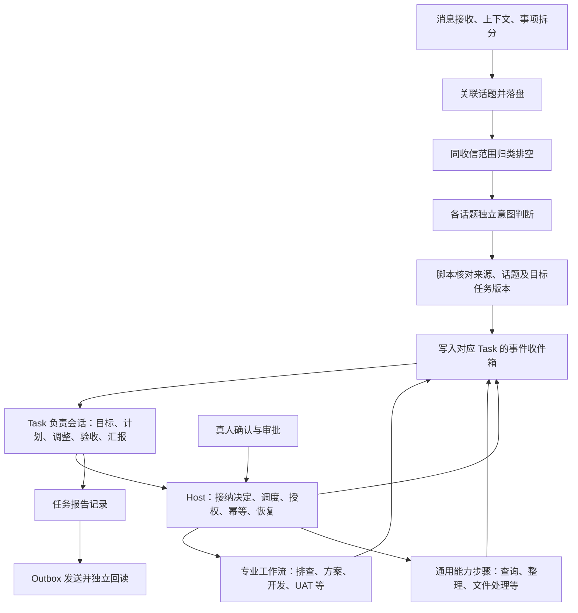

# 任务负责会话与多流程协作方案

日期：2026-09-25。源码基线：`0744d687be4a74517153b38e8d9b8b2a92b96c0d`（本轮 fetch 后的 origin/main）。

状态：实施前设计。本轮只核对源码、既有审查记录并编写方案，没有修改业务代码、执行真实任务或部署。下文新增字段、工具、接口及验收项均为拟实施合同，不能视为已上线能力。

本文承接用户确认的方向：每个业务任务有一个持续负责的执行会话，管理与监控任务流，组合多个任务流实现目标，并统一汇报。它修订 `topic-intent-task-composition.md` 中以顺序阶段推进为主的任务管理方式；既有 spec 保留原时点。新建本文是因为新增了明确的任务负责人，其生命周期与节点会话不同，需要独立描述端到端合同。

## 1. 目标、选择与边界

可验收目标：同一业务任务从排查、方案确认、开发到 UAT 部署始终有同一负责人；补充信息进入原任务，保留可复用成果；任务取消确实阻止后续执行；每次结果汇报有当前目标和真实证据支持；重启不会漏接意图、重复执行或重复回复。

| 候选 | 判断及理由 |
| --- | --- |
| 继续扩展固定阶段机，由话题判断生成完整流程计划 | 不选。复杂分支、新信息影响判断与目标验收没有持续负责人，业务规则会继续堆入 service |
| 一个长期群/话题会话同时判意图、执行全部任务 | 不选。一个话题可能有多个独立任务，权限、运行时间、取消范围及上下文相互牵连 |
| 每个 Task 一个负责会话，复用现有工作流执行器及可靠 Host | 采用。负责人做语义决策，流程承担专业执行，Host 持久化并执行确定性约束 |

反证与代价：任务会话会增加推理成本，也可能误判目标或重复规划；因此不在每个节点或每次心跳唤醒它，不把会话文字当状态，不允许它绕开执行、授权和证据检查。任务会话没有消除模型错误，只提供完整上下文与明确责任；需要针对真实场景评估误判率。

本期默认同一 Task 串行推进业务步骤，不建设通用 DAG 平台。不同 Task 可以并行。负责人可插入、替换、追加步骤并调整顺序，已启动工作流的内部并发仍由原工作流管理。跨任务依赖和同任务多个并行写流程不在本期。

## 2. 分层与职责



| 层 | 负责 | 不负责 |
| --- | --- | --- |
| Message | 保留原文、发送者、引用、版本；补全上下文和拆分事项 | 决定某工作流已经成功 |
| Topic / IntentRun | 聚合同话题消息；判断新目标、补充、控制、查询；选择目标 Task | 生成完整执行计划、指挥流程节点或宣布任务完成 |
| Task 负责会话（Task Owner） | 维护完整目标和验收；选择与组合流程；吸收新要求；处理异常；汇报阶段和最终结果 | 自行批准生产操作、直接改执行账或把自述当证据 |
| Workflow / Capability | 在明确输入与授权下执行局部工作，产生结构化结果及证据 | 自行扩大任务目标、另建同目标任务或直接向群发送业务结果 |
| Host | 单写入事务、事件调度、会话租约、执行权限、审批门禁、幂等、事实校验、Outbox | 从自然语言猜业务目标、仅凭流程结束就判整个任务完成 |

三种身份分开：`topicId` 是讨论范围；`taskId` 是业务责任与目标；`runId` 是一次专业流程执行。一个 Topic 可以有多个 Task，一个 Task 可以引用多个明确授权的 Topic；首次实施不自动跨群合并任务。

不同 Topic 的意图判断使用独立上下文和 IntentRun 身份，不共用一个模型会话。Task Owner 使用 DSH 原生持久会话，每个 Task 独立。专业流程已有的节点会话继续存在；它们不是任务负责人。

## 3. 当前实现与修改依据

下列行号对应本文基线，路径相对 `packages/dingtalk-dsh-assistant/`。

| 已核对事实 | 证据 | 本次调整 |
| --- | --- | --- |
| 原生会话身份绑定 task/run/node/generation；节点提交后结束本轮 | `execution-session.js:5-6`、`:98-110`、`:167-187` | 另建 Task Owner 会话边界，复用原生 create/resume、guard、flush 能力 |
| 话题判断后直接生成动作命令 | `message-workflow.js:352-363` | 改为向明确的 Task 交接目标与变更，不由 I 编排执行细节 |
| create 接收 workflowPlan，service 自动拼后继输入 | `workflow-service.js:350-406` | 计划由 Owner 接纳；用每类流程的显式输入适配合同交接 |
| Task 状态只有 active/waiting_confirmation/succeeded/blocked | `execution-task-plan.js:44-57` | 补任务级暂停、取消、恢复和会话状态，不能只控制某个 Run |
| revise 直接改 Run，Controller 使用全部节点重新应用输入 | `workflow-service.js:571-575`；`execution-controller.js:124-142` | Owner 做影响分析，Host 校验可复用前缀与受影响后缀 |
| 通知遍历原消息命令指向的 Run | `workflow-notifications.js:104-113` | 改以 Task 报告和业务事件为通知来源 |
| 默认通用能力含读消息；完成检查只核对来源覆盖 | `workflow-service.js:73-99` | 区分来源读取与业务完成，补真实能力接入及验收合同 |
| 真实工程定义为动态 ID，来源检查要求固定 ID | `workflow-engineering.js:25`、`:219`；`workflow-service.js:393` | 稳定 workflowKind 与受信定义身份分开 |
| 当前执行控制库是 SQLite schema 2 | `execution-store-worker.js:12`、`:95-129` | 针对当前控制库设计迁移，不套用旧 JSON v8→v9 脚本 |

前次审查的 A–I 反例是设计输入，不代表本轮重新运行或已修复。实现验收需要保留其业务断言，调整到新任务入口复跑。

## 4. 消息与意图交接

### 4.1 保留两个代码检查点

1. 第 4 步关联完成后，检查同一接入账号/profile、群/会话、处理引擎内，是否还有已入箱而未完成归类的新消息。有则继续归类，不启动新的普通 I。
2. 全部归类后，为各待处理 Topic 创建独立 I，读取完整有效要求、未覆盖事项及相关任务摘要。
3. I 提交时，在单写入事务核对当前待归类数、topic.inputRevision、来源版本及本次选择任务所依赖的 requirement/control 版本。
4. 有尚未归类消息则保存候选等待。新消息最终属于别的话题，本候选可继续校验；属于同话题，合并最新集合重判该 Topic。日志和进度时间戳不导致重判。
5. 校验通过才原子写入意图处置与 Task 事件。若采用待派发命令桥接，也必须在命令领取时再次核对，未投递的旧动作不能穿过新输入屏障。

严格排空的限制如实保留：持续收信或某条归类受阻可能延迟普通 I；不得静默改成定时放行。页面显示具体阻塞项和时长。已明确目标且已认证的控制、审批、引用澄清答复走独立通道；自然语言控制有歧义时做窄范围解释，不按关键词直接执行。

### 4.2 意图输出变薄

建议的业务输出为 `create_task / update_task / continue_task / pause_task / cancel_task / resume_task / query_task / clarify / no_action`。每项包含稳定 actionId、明确 taskId（新建时由 Host 分配）、相关 unit/source 引用、业务含义、目标或变化、权限来源及 replyContext。

I 可以保留用户明确指定的流程要求，例如“只部署 UAT”，但不再生成细到节点的 workflowPlan。选择流程和处理流程失败属于 Owner。不能因为 R 曾匹配某个历史 runId，就把后续动作直接打到那个 Run。任务候选按来源引用、话题关系和任务目标检索，支持分页；不能只看最近固定数量的命令而遗漏仍在继续的任务。

没有执行动作的致谢等不建任务。需要调查、处理或产出答案的实质性请求进入 Task；已有 Task 的追问仍进入原任务。话题归属澄清由消息层处理，任务执行中的材料澄清由 Owner 处理，两者使用各自 requestId。

### 4.3 覆盖、权限与纠正

- 逐 action 记录 `pending / delivered / applied / superseded / rejected / unknown` 及取代者，逐 unit 保留所有 action 的处置关系。部分动作已执行时，剩余动作仍是待履行事项，不能因 unit 已 accepted 而消失。
- `create_task` 重判保留原逻辑动作与任务 reservation；重试复用业务幂等键，不用新的 IntentRun attempt 制造第二个 Task。
- TopicIntent 和 Task 事件同库提交；幂等键冲突时 payloadDigest 必须一致，不一致明确报冲突。
- 来源事实保留 sourceVersion、有效状态与 replaces 关系。编辑、撤回、更正使旧派生约束失效；对已经发生的执行效果只生成变更事件，不改写历史为“未执行”。
- 来源人员逐条保留。提供复现信息不等于授予生产发布权限；业务动作按对应授权记录校验。不能用本次发言人的权限去否定此前另一位有权人员已接纳的任务。
- 默认只重做失效的 I 或 Owner 判断，保留仍有效的上下文准备、S/R 和工作成果。

## 5. 一个任务负责会话怎样运行

### 5.1 稳定身份与可恢复上下文

Task 创建时原子预留 ownerSessionId 和启动事件。会话第一次唤醒才创建；后续目标补充、阶段完成、确认答复与故障都回到同一会话。流程更换和节点重试不更换 Owner。

复用 `ctx.agents.create/resume`、原生持久化、工具 guard 和 turn 结束机制；不另造模型调用运行时。Owner 的身份为 taskId + ownerSessionId + ownerEpoch，节点会话仍是 run/node 身份。每次激活另有 turnId、租约与输入水位，同一 Task 最多一个有效 Owner turn。

长期负责不等于始终占着模型连接。等待流程、审批或用户输入时，会话持久休眠；Host 由事件唤醒。监控、计时、平台状态轮询由脚本做，只有达到里程碑、失败、超时或需要选择时才唤醒模型。

Owner 每轮获得：完整有效目标与验收项、授权边界、已接纳计划、当前流程快照、未处理事件清单、成果索引、未决事项及报告投递摘要。原始来源与详细日志按引用读取；不能只给最新消息，也不能只靠模型自己记忆。上下文压缩不替代控制库状态。

### 5.2 事件与一次完整处理

事件类型至少包括：task.created、intent.received、source.corrected、control.changed、workflow.checkpoint/succeeded/failed、capability.completed、approval.resolved、deadline.exceeded、effect.reconciled。普通节点日志不逐条唤醒 Owner。

```text
外部事实/新意图持久入账，生成有序 TaskEvent
  → 调度器领取本 Task 的唯一租约，冻结事件水位 H
  → 构建任务快照和增量，恢复原生 Owner 会话
  → Owner 读材料、作决定，提交结构化候选并结束该轮
  → Host 原子验证版本、权限、覆盖关系和动作条件
  → 接纳计划/需求变更、报告意图及执行命令，返回持久回执
  → 执行器启动流程或能力步骤，结果回到 TaskEvent
```

Owner 处理期间的新事件继续落盘，不强行把未经接纳的文字塞进正在运行的工具栈。新要求、控制、授权变化使旧候选的相关版本失效，合并后只重判 Owner；普通进度日志留给下一轮，不无差别废弃当前判断。

事件处理水位只能推进到每个事件都有处置的连续位置；需要等待的事件可记为已转成持久 pending change/request，不能丢掉它所持有的执行屏障。每个有效 Owner turn 最多有一个待补跑标记，十条补充不排十轮相同判断。

### 5.3 Owner 的工具边界

| 拟新增工具 | 合同 |
| --- | --- |
| task_read_state | 读取当前 Task、计划、流程快照及事件水位 |
| task_read_material | 按允许的 source/artifact 引用分页读取，保留版本及摘要 |
| task_list_capabilities | 查看真实可用流程/工具、输入输出、授权要求和不可用原因 |
| task_submit_decision | 一次提交需求/计划调整、步骤动作、等待请求、验收判断和报告候选；结束本轮，Host 异步接纳 |

taskId、sessionId、lease 等身份由 Host 绑定，不接受模型指定其他任务。Owner 不直接调用钉钉发送或生产写入工具，也不改数据库状态。日常工具操作通过结构化 capability step 交给 Host 执行，完成后带真实回执返回；简单任务无需额外创建一个“通用工作流 Agent”。

候选只接受固定操作：保留/修改需求、追加/替换计划后缀、启动步骤、登记等待、提交验收或报告。不能提交任意脚本作为编排程序，不能从模型输出里动态注册平台适配器。工具先持久保存 candidateRef，再返回 received；原生工具栈排空后才接纳决定。received、accepted、applied 分别表示收到候选、决定已提交和动作已应用，不混用为执行成功。

### 5.4 决策接纳与失效处理

Owner 候选必须携带其读到的 requirementRevision、planRevision、controlRevision、authorizationRevision、inputFenceRevision、事件水位 H，以及动作实际依赖的步骤版本。原子接纳先检查会话租约和上述前置条件，再写决定、事件处置、执行命令与报告记录。

任务候选过期只使未执行计划过期，不删除已经产生的事实。一个已运行流程的迟到结果可以作为历史执行事实保存；是否仍满足当前需求，由版本绑定及 Owner 验收确定。旧模型不能用过期租约继续启动新操作。

命令领取和外部效果发起前还要检查最新任务控制、变更屏障、授权与精确输入。事务锁不跨网络调用。一次操作若已被允许并发往平台，随后收到的取消只能阻止后续步骤并对账当前效果，不能声称已抹去正在发生的动作。

## 6. 数据与状态合同

继续使用现有 SQLite 单写入控制库、工件存储、原生命令回执及效果账。以下是最小扩展，不建立第二套任务真相。

| 对象 | 核心字段与规则 |
| --- | --- |
| business_tasks（扩展） | taskId、ownerSessionId/ownerEpoch、requirementRevision、planRevision、controlRevision、authorizationRevision、inputFenceRevision、requirementRef、acceptanceRef、authorizationRef、status、waitReason；最新状态由已接纳事实决定 |
| task_owner_turns（新增） | turnId、taskId、leaseEpoch、eventWatermark、snapshotRef、candidateRef、receiptRef、status；区分候选已生成与决定已提交，支持崩溃恢复 |
| task_events（新增） | taskId + 单调 eventSeq、eventKey 唯一、eventType、payloadRef、来源/因果引用、处置结果；处理 cursor 放任务控制记录 |
| task_plan_stages（扩展复用） | 稳定 stepId、kind=workflow/capability、position、合同身份、inputRef/inputDigest、dependsOnEvidenceRefs、门禁、attempt、runId/operationId、状态及输出；编号位置不充当稳定身份 |
| task_reports（新增） | reportId、eventKey、taskId、触发事件、任务/需求版本、类型、结构化事实及 evidenceRefs、内容摘要、replyContext、outboxId；通道投递状态仍以 Outbox 为准 |
| 现有事实/审批/效果账（扩展） | 来源有效性及替代关系；审批绑定目标和摘要；效果记录关联 Task step，避免 workflow 与 capability 两条路径各做一套幂等 |

事件正文和大型材料用工件引用，事件表存索引及版本。不把访问令牌、密码放进会话、报告或工件。

任务业务状态采用 `active / waiting_user / waiting_approval / blocked / pausing / paused / cancelling / cancelled / succeeded`。当前模型是否 running、某个流程是否 failed 单独显示，不能把会话 idle 当任务完成。暂时失败允许 Owner 调整，无法推进则 blocked；取消后继续必须显式 reopen，保留旧结果并接纳新授权范围，普通 resume 不能复活取消任务。

Task succeeded 需要当前验收全部满足、无待应用的相关意图、无未结步骤/未知外部效果，并通过最终接纳。报告尚未回读则显示“执行完成，结果待送达”；不因此重执行任务。原目标仅要求方案时，方案交付可完成当前目标；之后“继续实现”在同 taskId 下形成新的 requirementRevision 和执行轮次，旧完成记录保留。

## 7. 新意图到达执行中任务

| 输入 | Owner 的处理 | Host 的执行约束 |
| --- | --- | --- |
| 查询进度/结果 | 读取最新任务快照；事实查询可使用 Owner 已确定的报告模板，省去模型轮次 | 不改变需求版本，不中断流程；复用报告通道 |
| 重复事实/感谢 | 记录覆盖关系，不改计划 | 不启动第二个流程，不重复承接 |
| 补复现条件/材料 | 对照当前目标判断受影响步骤 | 新输入入账后先限制相关后续效果；不立即重启所有节点 |
| 报告改为中文 | 修改输出要求，只重做报告/必要核验 | 保留独立于语言的排查、代码、测试证据 |
| 新增独立要求/后续 UAT | 更新验收，追加步骤或拆成独立 Task（确为不同目标时） | 不把尚未做的工作算入历史完成结果 |
| 改环境、版本、SQL 或方案 | 标记影响范围，重建受影响后缀 | 旧输入对应的审批失效；重新核对目标与权限 |
| 暂停/取消 | 解释并汇报已停止范围、正在排空及已发生效果 | 先持久任务级控制屏障，撤销未来启动资格，再处理所有当前执行句柄 |
| 继续/确认方案 | 匹配正在等待的 requestId 与方案摘要，明确继续范围 | 版本匹配后解除对应等待；不等价于生产审批 |

每次重判输入是“有效完整需求 + 全部待处理增量 + 已发生事实”，不是最新一句话覆盖全部目标。发送者冲突按来源和授权判断；确实无法确定才产生具体澄清问题。

新输入已能关联到 Task 或其 Topic 时，入账/R 绑定事务同步建立 `inputFenceRevision` 和待判断标记。在 I/Owner 尚未完成影响判断期间，禁止该 Task 发起新的有副作用步骤、完成验收或发送可能过期的结果；独立只读工作和已经开始的可收集结果可继续。I 判无影响或分派到另一 Task 后，由相应回执解除屏障；不能先删标记再异步建 TaskUpdate。

尚无法定位到任何任务的普通消息不冻结全系统；本方案对“已可靠入箱且已建立关联”的输入提供确定性约束，无法预知尚未到达或仍无法关联的补充。明确任务控制有优先通路以缩短这一窗口。

复用依据必须明确：目标、输入依赖、资源/代码基线、执行合同和相关验收条件未变，且证据仍有效。只凭“上一步成功”不能复用。首先复用流程级成果；流程内重做通过已有 Controller 后缀重建能力实现。不能证明节点级复用时重跑受影响流程，仍保留此前其他有效流程。

已发生或结果未知的外部效果不能被 superseded 抹去。未知效果先只读对账；确认已发生则采用原回执，确认未发生且条件仍有效才允许原逻辑动作重试。取消/暂停期间允许必要只读对账，但禁止借恢复名义发起新写入。

## 8. 专业流程组合与交接

### 8.1 每类流程登记一份合同

至少登记：稳定 workflowKind、受信 definitionId/version/digest、输入 schema、输出 schema、真实能力/效果类别、产物类型、完成验证规则、恢复和取消方式。Owner 按能力选择，Host 按注册记录校验，不按显示名或字符串前缀信任。

工程动态定义继续有自己的 ID；以受信注册记录证明它属于 engineering，并核对 taskId、runId、输入和产物身份。UAT 来源验证使用该记录，不再要求 ID 字面等于 task-engineering。

流程输出使用统一外壳：runId/stepId、workflowKind、inputDigest、outcome（succeeded/blocked/failed）、summary、artifactRefs、evidenceRefs、limitations、externalEffects。专业数据在各流程的 typed payload 内。将输出转为下一流程输入的是显式适配器；不能给严格 schema 随意塞 predecessor 字段，也不能在所有流程之间拼接同一段文本充当交接。

Owner 对每个计划步骤明确：目的、所满足验收项、输入引用、执行方式、开始条件、预期产物、完成核验、是否需要回到 Owner 决策。Host 可推进 Owner 已接纳、条件确定的连续步骤，不必每个节点都再找模型；遇新意图、门禁、异常或需要解释结果时返回 Owner。

### 8.2 排查 → 方案 → 开发 → UAT

| 步骤 | 输入/产物 | 推进条件 |
| --- | --- | --- |
| 排查 | 原始问题、复现条件、允许访问环境 → 调查记录、根因候选、已核验/未核验项 | 必须有实际可用调查能力；仅阅读群消息不能声称现场排查完成 |
| 方案 | 调查证据、目标、约束 → 方案、改动范围、验收项、后续流程建议 | Owner 检查是否回答当前目标；需要用户确认则登记绑定摘要的 request |
| 开发 | 已确认方案、仓库/基线、完整约束 → 提交/PR、功能测试、源码身份 | 保留人工确认；按原授权边界执行，PR 创建与合并分别有证据 |
| UAT 部署 | 已满足部署准入的目标与精确 SHA/制品 → 流水线、镜像、运行版本和入口回读 | PR 尚未合入则等待有权集成；不把创建 PR 自动当作已合入 |
| 提测/回归（仅目标要求时） | 部署结果、测试范围 → 提测内容/测试记录或业务验收 | 与“UAT 已部署”分开记录，缺发送/测试能力如实等待 |

用户只说“先给方案”时，当前授权到方案为止；用户确认“按方案实现并部署 UAT”后，同一 Owner 接纳扩展目标并继续。若最初已明确授权后续自动 UAT，条件满足后自动推进，不反复询问。只有“继续实现”而没有 UAT 授权时，不能自行扩张为生产或其他环境发布。

UAT 保持独立部署流程，可单独发起；不要求必须来自一个工程 Run。部署结果只证明技术版本，不能自动标为业务验收通过。本期目标继续限定既有登记的 dataset/dataset-web；不扩大服务或环境开放范围。

### 8.3 失败后的组合

开发测试失败可回到局部修复；UAT 构建失败可选择已登记的同提交重建；部署后发现代码问题则回到开发形成新提交。Owner 必须区别“同 SHA 重建”和“修改代码后新 SHA 部署”，分别绑定独立操作身份。未知构建结果先查询，不并发再建一次。

执行错误、模型判断错误与平台未确认效果分别记录。Host 只自动重试合同明确允许的暂时性失败；换方案、扩大范围或替换目标交给 Owner，超过授权的请求进入具体等待。相同输入重复失败实行有界尝试并 blocked，不无限重新规划。

## 9. 日常杂活的默认路径

默认路径就是 Task Owner 的“理解目标 → 选已有能力 → 执行一步/一批明确步骤 → 核对结果 → 汇报”。不要求先固化一个完整模板，也不为每个小任务额外创建工作流 Agent。

能力接入复用现有原生工具和平台适配器，逐项登记输入、作用域、效果类别、execute/verify/reconcile 规则。已有 task-general 中可用的执行/核验逻辑可复用，但移除第二个负责全局规划和最终完成的 Agent；只有 Task Owner 负责整体目标。底层将一次 capability step 映射为受信注册的单代码节点 ExecutionRun，继续满足效果账的 run/node 外键、租约和恢复合同；这是执行载体，不要求用户选择专门模板，也不新增一个规划会话。

优先接入与日常工作直接相关且能核验的能力：批准范围内的文件读取/搜索与产出、仓库检查与受管修改/测试、已有平台只读查询、文档/文本整理。现有仅 read-topic-sources 的配置不能宣称覆盖这些能力；需逐项接入并验证。没有真实工具时返回具体能力缺口，不把模型生成的“已处理”当执行。

例如“把几条排查结论整理成 Markdown”：Owner 读取来源，调用受管写文件能力，再读回文件验证内容及来源覆盖，最后报告路径。整个任务无需排查→开发→UAT。若要求“查询账号创建时间为空的原因”，必须有相应仓库/日志/数据库查询证据；只有聊天内容时只能给材料总结或明确阻塞，不能交付已查明结论。

Owner 可直接生成纯文本候选，Host 保存后也作为产物核验。真实副作用全部复用效果账；不为了通用性开放能够绕过审批的任意 shell、任意 URL 写入或直连生产写库。具体工具权限沿用已批准的工作区与目标配置。

## 10. 人工节点与既有平台边界

“方案确认”决定继续做什么；“受控操作审批”决定某个精确副作用是否可以执行。两者分开，不把一句泛泛的“继续”解析成全部批准，也不让 Owner 自行调用批准接口。

| 场景 | 固定门禁 |
| --- | --- |
| 方案确认后实现 | 等待真人答复，绑定 taskId、requestId、方案/范围摘要；确认内容不清楚时只澄清差异 |
| 生产发布 | 冻结服务、环境、版本/制品和影响说明后，在生产动作前等待真人审批 |
| 数据变更 | 本地 UAT PostgreSQL 审查及事务回滚演练 → Bytebase 工单创建成功并回读 → Assistant 任务页真人审批 → Bytebase 生产执行及回读 |
| UAT 部署/同提交重建 | 依照已有任务授权、精确目标及版本执行；不能借同提交重建发布另一个 SHA |

数据变更继续遵循已经确认的路径：UAT SQL 审查与事务演练通过本地 UAT 数据库连接；生产结构元数据通过本地连接天翼云只读库取得；生产写入通过 Bytebase。Bytebase approvalStatus=SKIPPED 不替代 Assistant 真人审批。项目仍为 flbn，目标库按已登记的 hiq_editor / hiq_background_db / hiq_admin 选择，凭据仅使用现有 Host 配置引用。

审批记录绑定 stepId、目标资源、输入/SQL/制品摘要、相关授权及需求版本、审批人身份和有效条件。涉及这些内容的变更使原审批失效；仅修改报告语言不要求重复批准相同操作。批准后到真正发起动作前再验证绑定，防止先审批 A 后执行 B。

UAT 演练是受控动作，不能把 UAT 当任意可污染的沙箱。继续使用既有事务回滚、目标精确限定、事务外副作用拒绝及前置条件核验合同，不在本方案削弱其条件。

## 11. 目标验收与统一汇报

### 11.1 验收不是“最后一个流程成功”

Owner 首轮将目标拆为稳定 acceptanceItemId，每项说明需要的产物、验证方式及证据；用户变更目标时显式修订。检查分两层：

1. Host 检查可确定的事实：证据真实引用、来自允许的能力/流程、版本和目标匹配、核验通过、没有漏项或未结效果。
2. Owner 判断证据是否回答目标。开放式分析允许给出有依据的结论及局限；缺关键事实则 blocked 或阶段交付，不能声称完成未验证工作。需要真人认定的验收项必须等待真人。

Host 不宣称能够通用地用脚本理解所有自然语言目标。技术结果用具体验收器，例如目标 SHA 与 Pod 镜像、SQL 后置条件、文件读回、测试断言；主观方案质量用明确验收清单及必要的人工确认。读取请求原文只证明读过来源，不能满足“查明原因”。

最终候选要列出每个验收项的 satisfied/unsatisfied/needs_human 与 evidenceRefs。Host 提交 succeeded 前再次检查需求、控制、输入屏障及未结工作；过期的“完成”只能留下历史判断，不能成为当前任务状态。

### 11.2 Task 统一拥有报告

报告类型为承接、进度、等待输入、等待审批、阶段结果、阻塞、最终结果、纠正。Owner 生成或预先确定内容规则，Host 基于当前事实落盘及投递；Workflow 只提交内部结果，不再自行按原 create 命令生成对外终态消息。

每条报告保存 taskId、触发事件、需求/结果版本、声明的事实、证据引用、来源消息及授权披露范围。幂等键由 Task 和业务事件生成，模型重试不能变出第二条报告。快速完成可直接发送结果并在同一条内说明已处理；确有等待才发送独立承接或阶段进度。发送节奏沿用明确通知策略，不靠每轮模型自行决定刷屏。

保存原始请求、最新相关补充及具体等待请求的 replyContext；确认/澄清优先引用对应请求，最终结果引用当前任务关联的业务消息，不凭“群里最新一条”选择上下文。一个目标只答一次，但不同阶段的有效结果可以分别汇报。

同一事务接纳任务事实与报告意图，Outbox 持久负责发送、ACK、回读和未知状态对账。新增报告准备入口直接引用 taskReportId，复用现有通道能力，不伪造 create 消息命令作为自动后续阶段的通知来源。发送失败不重新执行工作流；任务会话重启不重发已回读报告。

发送前检查报告的事实是否仍有效：已被当前结果明确取代的 pending 候选可以标记 superseded；仍真实的阶段结果不因来了新消息而被视为错误。投递资格检查与领取原子完成；已经提交到外部渠道的报告遇并发变更，可能需要后续纠正，不能声称分布式发送绝无时间窗口。

### 11.3 防止再次误撤回

- 重跑消息、换会话、权限重新判断都不自动证明历史承接或结果是错误的。
- 正确的承接由当时任务接纳回执证明；正确的阶段结果由当时对应执行/验收证据证明。后来追加目标只说明工作延续，不否定此前事实。
- 发现具体错误时创建 correction，逐条列出被更正 reportId、错误事实、真实事实和证据，禁止按同一 sourceMessageId 批量撤回全部回复。
- 已发送消息撤回继续经过既有受控通知操作及当前授权规则；仅在精确识别目标后执行并回读。未发送的失效澄清可以直接终止投递。
- unknown 发送先对账，不能未经确认一边重发一边撤回，或把未确认当未发送。

针对原两条账号问题消息，新设计期望：第二句补充归回原 Topic/Task，Owner 能看到完整账号问题与已经发生的执行结果；如果原任务确已做过，解释现有结果和剩余调查，不再询问“查哪个问题”，也不重新生成承接。不能预先假定原结果正确，必须由当时任务与外部证据核验。

## 12. 重启、丢会话与异常恢复

| 崩溃/异常位置 | 恢复规则 |
| --- | --- |
| Task 已创建，Owner 会话尚未创建 | 使用已预留 sessionId 创建一次，原事件重放到相同任务 |
| 原生会话已保存，绑定回执未提交 | inspect 原生历史中的 Task 身份与创建租约，收养相同会话，不能再创第二个 |
| 候选已生成，决定尚未接纳 | 重新校验候选；条件未变可接纳，过期重新判断，不重复执行 |
| 决定已接纳，执行命令未领取 | 从持久命令恢复；幂等回执复用已有 step/run/operation |
| 平台已执行，本地回执不明确 | 效果为 unknown；只读对账后再推进，不默认重试 |
| 结果已入账，Owner 尚未处理 | 根据 task_events 游标唤醒；不靠进程内回调保证通知 |
| 报告已发出，回读未完成 | Outbox 对账原消息，不重生成业务结果 |
| 模型超时/会话存储损坏 | 有界重试后 blocked，显示原因；已批准的监控和对账仍由 Host 运行 |

租约到期不等于原进程已消失。接管前必须使旧执行句柄停止并确认排空；所有工具在副作用发起前检查 epoch，过期 Owner 不能写入。没有活跃句柄且原生 inspect 明确返回 SessionPersistenceNotFoundError 时，才允许建立替代 Owner 会话并增加 ownerEpoch；保留旧身份、重建原因和工件上下文。I/O 故障、解析损坏等不等价于“会话不存在”。外部平台不支持幂等或无法精确对账时，未知效果保持阻塞并交人工核实，不承诺跨平台 exactly-once。

重建会话恢复的是责任和上下文，不是重新创建 Task 或重跑已经接纳的操作。已取消/完成 Task 不因启动恢复被唤醒执行；收到有效 reopen/续办事件才产生新轮次。

## 13. 代码落点与实施顺序

### 13.1 复用和新增

| 文件/模块（相对核心 package） | 改动职责 |
| --- | --- |
| message-workflow.js / message-ledger.js / message-topics.js / message-context.js | Topic-only R、显式 Task 意图、动作覆盖、来源有效性、归类屏障及交接版本核验 |
| execution-task-plan.js / execution-store-worker.js | 扩展 Task 语义与步骤账；保证 Owner 接纳、任务控制、步骤/报告意图同事务 |
| execution-controller.js / execution-effects.js | 任务控制先于 Run 控制；效果启动门禁；受影响节点后缀复用；通用步骤接入既有效果账 |
| task-owner-session.js（新） | 原生 Task Owner 会话的创建/恢复、提示词、受限工具、身份和租约；新建原因是生命周期不同于 execution-session 节点会话 |
| task-owner-controller.js（新） | Task 事件调度、快照、候选接纳和补跑；从 workflow-service 抽离语义调度，避免继续膨胀 |
| task-owner-store.js（新） | Owner turn/event/report 的 schema 与 reducer；沿用主 worker 单写入事务，不开新数据库或写入器 |
| workflow-service.js / resident.js | 装配上述模块、真实通用能力及入口；移除从消息直接推完整流程/按最近 Run 控制任务的主路径 |
| workflow-engineering.js / 各 task-*-workflow(s).js / 平台适配模块 | 稳定 kind 与定义身份、类型化交接、真实能力和完成证据；保留已有业务平台边界 |
| task-general-workflow.js | 复用可用能力执行/验证逻辑，消除与 Task Owner 重叠的全局规划与完成职责 |
| workflow-notifications.js / 通知操作与任务详情投影 | 消费 Task 报告；保留发送回读/受控撤回；展示 Owner、流程、执行与投递的独立状态 |
| README.md / docs/ops 对应 runbook | 同步任务责任、控制语义、审批位置及当前控制库迁移部署流程 |

Owner 模块新增是为了分开任务生命周期与节点生命周期；工具、平台执行、状态存储和恢复设施优先复用。实施时若现有拆分足以承载同一职责可缩减文件，不为目录美观另建框架。

### 13.2 五个可验收子目标

| 顺序 | 交付 | 完成条件 |
| --- | --- | --- |
| S1 任务负责人闭环 | Task 原生会话、事件收件箱、单飞租约、结构化决定、同一任务跨两流程 | 创建→阶段完成→唤醒原 Owner→后续流程→Owner 验收全过程；崩溃恢复身份不变 |
| S2 消息与任务变更 | Topic/Task 解耦、版本核验、动作覆盖、补充合并、暂停取消和精确重做 | 连续补充不建重复任务；部分动作不丢；等待确认时取消后不能启动下一阶段 |
| S3 流程与通用能力 | 类型化交接、工程到 UAT、同提交重建、日常工具步骤、目标验收 | 真实动态工程定义可衔接；材料读取不能冒充调查完成；小任务无需专用模板 |
| S4 人工节点与报告 | 方案确认、生产/数据审批绑定、Task 唯一汇报、纠正与回读 | 后继阶段有结果报告；无重复/过期澄清；不误撤有效承接或结果 |
| S5 迁移与本地验证 | 当前库迁移自检、精确包部署、恢复、真实链路观察 | 数据/任务/效果/通知可对账；定向测试与真实业务证据分开列明 |

开始实施时在 `docs/acceptance/task-owner-orchestration/goal.md` 建唯一 sub goal matrix；matrix.csv 记录用例×round，round-N.md 保存实际证据。本文是前置快照，不回填实施状态；不预先生成全绿 report.md。

## 14. 迁移和部署

这是当前执行控制库 schema 2 的升级，实施时分配新 schema 版本并实现专用迁移；旧 JSON workflow v8→v9 runbook 不能直接运行于此库。

1. `--check` 只读枚举任务、阶段、执行句柄、未知效果、待发/未知通知、定义/工件及来源关联，输出可迁移项与具体阻塞项，不创建目标或发起业务动作。
2. 切换窗口先停止新意图派发和新效果发起，持续可靠入箱到旧持久账；排空正在进行的本地处理，核对平台中已发起的操作。备份时短暂停止写入，使用一致的 SQLite 备份机制，不能仅复制活跃 .db 而遗漏 WAL。记录渠道游标以便恢复补收。
3. 在独立目标目录迁移。保留 taskId、runId、效果幂等键、源消息、版本、审批与 Outbox 原身份；为 Task 分配独立 Owner，不能把某个节点 sessionId 冒充 Owner。
4. 已完成任务保留结果历史，不自动补发；活动任务导入当前计划、授权、证据、待处理输入和未结效果，先处于恢复等待，核验完成后才启用 Owner。不能从历史一句“已完成”构造满足验收的证据。
5. 历史结构无法可靠映射时列出具体任务阻塞，由本任务的恢复步骤处理，不能为了迁移成功把它自动归零、重做或宣布完成。不得常驻双调度器维护两套任务真相。
6. 先在复制库验证单写入与恢复；真实实例切换后核对精确安装包、定义 digest、会话绑定、效果/消息数量和健康状态，再开放派发。恢复入站用原去重身份补收，不能漏消息。
7. 尚无新业务写入/外部效果时可恢复原完整库与包；开始处理后不能直接还原旧快照，须保留新事实对账或前向修复，避免漏收和重复执行。

部署门禁须覆盖已知定义摘要稳定性问题：当前 `execution-controller.js:43-44` 将函数 toString 纳入摘要，同一源码在 Windows 换行/重新打包后不能意外被识别成业务定义漂移。旧 Run 继续绑定原受信 definition；若升级定义，显式登记版本及迁移条件，不能通过跳过 digest 验证启动。本轮不声称该问题已修复或最新源码已成功部署。

部署不靠重处理真实消息来完成基本验证。先用隔离夹具和记录重放验证，再在已授权的真实任务范围内观察/续办。涉及真实发消息、UAT 发布或生产动作时沿用原操作授权，不凭“验证方案”创建无关副作用。

## 15. 定向功能验收清单

以下全部是待实施后的验收项，本轮未执行。默认只跑这些功能相关测试及受影响的现有测试，不主动全量测试；实跑命令与实际结果写到对应 round。

| ID | 场景 | 必须观察到的结果 |
| --- | --- | --- |
| T01 | 同话题连续三条补充、I 期间再来一条 | 全量当前输入覆盖；旧候选不派发；有效 S/R 不重做 |
| T02 | 不同 Topic 同时判意图 | 独立上下文/身份，可分别推进；不串会话 |
| T03 | 一个 Topic 两个 Task，短句追问其中一个 | 根据引用与任务目标命中正确 Task；不默认最近 Run |
| T04 | 一个事项 c1 已执行、c2 未执行时来新消息（原 A） | c2 有明确继续/取代处置，已执行 c1 不重复 |
| T05 | 源消息编辑/撤回（原 B） | 当前要求移除失效约束；已发生效果保留，生成影响判断 |
| T06 | 排查→方案→真人确认→开发→UAT | 同一 taskId/Owner，全流程产物可追溯；确认前不实施 |
| T07 | 相同目标同时收到重复 create/continue | 只有一个 Task/同一逻辑步骤；幂等键与 payload 一致 |
| T08 | 第一流程成功，第二流程等待确认时取消（原 C） | Task cancelled/排空可见；随后旧确认不能启动后续步骤 |
| T09 | 无关消息归类受阻时准确暂停/审批答复（原 E） | 有权限且有明确对象的控制通路及时执行；普通业务仍等归类 |
| T10 | 只改报告语言（原 F） | 排查/开发/测试执行次数不增加，只更新相关报告步骤 |
| T11 | 改环境或 SQL，已有批准 | 旧批准失效；无新审批不得发起变更后的操作 |
| T12 | 普通进度与新约束分别在 Owner 提交时到达 | 普通日志不反复重判；新约束阻止旧副作用/完成候选 |
| T13 | 能力仅有读取聊天，目标是调查数据库（原 G） | 不接受“已查明原因”；报告明确缺少的实际证据/能力 |
| T14 | 日常文件整理和只读平台查询 | 使用真实工具并独立核验，无需专用完整工作流 |
| T15 | 前序成果交给通用步骤（原 H） | 输入 schema 严格通过，成果引用和正文可读取 |
| T16 | 真实 registry 创建的动态工程定义→UAT（原 I） | 以受信 kind/identity 接纳；伪造前缀和错任务来源拒绝 |
| T17 | 独立 UAT 部署、同 SHA 失败构建重建 | 不要求先有工程 Run；精确目标/SHA；未知构建不重复触发 |
| T18 | 两阶段自动完成（原 D） | 每个应汇报里程碑有 Task 报告，最后阶段结果不遗漏 |
| T19 | 原两条问题消息夹具重放 | 短句补充保留上下文；已有任务/回复不重复；正确历史回复不被撤回 |
| T20 | 承接、真实结果、错误澄清混合存在 | 仅明确错误 reportId 进入纠正，精确撤回/回读；不按来源批量撤回 |
| T21 | 发送成功但 ACK/回读丢失，随后重启 | 原 Outbox 对账，零重复外发；任务不重执行 |
| T22 | Owner 候选提交/事务接纳/命令领取各点崩溃 | 同一决定最多接纳一次，事件与命令不丢；旧租约被拒绝 |
| T23 | Owner 会话确实缺失 vs 存储 I/O 错误 | 仅前者可受控重建；Task/已接纳效果不重建重放 |
| T24 | 平台已执行而回执未知，期间取消 | 停止后续效果，允许只读对账；不把取消当外部操作未发生 |
| T25 | 生产发布和数据变更审批 | 必须真人、精确摘要及版本；Bytebase SKIPPED 不能自动批准 |
| T26 | 目标已完成但结果待送达；或任务有后续未满足项 | 执行与投递状态分开；阶段成功不冒充整体完成 |
| T27 | 当前控制库迁移与源/目标对账 | --check 无副作用；task/run/effect/outbox 身份不变；源备份不变 |
| T28 | 长话题、大量事件与持续收信 | 不静默截断；清单全部有处置；无忙轮询；归类等待原因可见 |
| T29 | 无权人员追问既有有权任务、伪造审批 | 可按披露范围查询；不能扩大权限，也不追溯否定原合法任务 |
| T30 | 同一合并源码打包、重启和恢复 | 定义身份可验证、旧 Run 无伪漂移；安装包/运行态有独立证据 |

除 PASS/FAIL，还记录每个场景的 I 次数、Owner 轮次、流程重跑数、外部操作数、对外消息数、等待时长和 token 使用，以证明重复成本是否下降。先从固定场景建立基线，不在没有运行数据时承诺延迟或成本百分比。

## 16. 未收敛项与实施约束

- 原生 create/resume 与工具 guard 已由当前节点会话使用；长期 Owner 的暂停、压缩、重复唤醒和异常排空仍需 S1 实跑，不能把原生 API 存在当作该场景已验证。
- 本文定义通用能力接入方式，尚未逐项证明真实环境全部可用；S3 需以运行配置、调用及回读结果确定可用清单。缺能力的目标保持可见阻塞。
- 同 Task 同时运行多个写流程不在本期，因此不承诺这类并行带来的效率；串行步骤组合已覆盖本次提出的典型流程。
- 模型理解“继续”“这个问题”等短句的正确率仍需真实夹具和反例检验。版本、身份、幂等与证据门禁能拒绝过期/越权/无依据操作，不能从理论上保证语义永不误判。
- 自动合并 PR、自动提测发送等按现有明确授权和能力执行；“开发完成”或“UAT 已部署”本身不授予新的外部动作权限。
