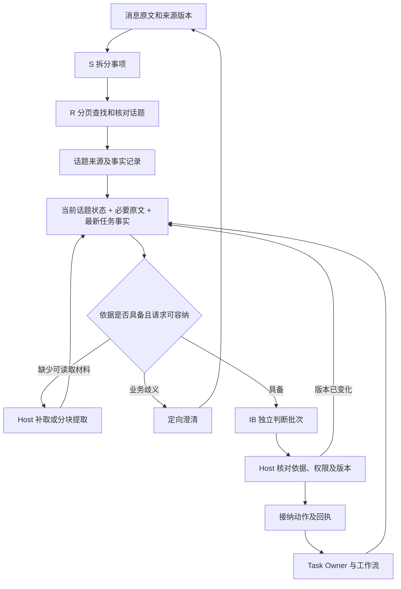

# 话题上下文完整性与处理轨迹方案

日期：2026-09-26。代码基线：`2641086ac8e61e1d5273a091ee1863f37f28b0b3`。

状态：实施方案。本次交付设计文档；文中的新字段、接口、迁移和验收项均为拟实施内容，不代表已经上线。

## 1. 目标与决策

保留 S（事项拆分）→ R（关联话题）→ IB（话题批量意图判断）的独立模型调用，以及每个任务独立的 Task Owner。采用“原始记录完整保存、当前话题状态可重建、判断依据按需读取”的上下文路径。

要解决三个具体问题：

1. 长期讨论仍能找到旧话题、完整约束和任务最新进展，不能因窗口或摘要遗漏而把续办当新任务。
2. 每次请求有明确容量边界，长话题不再依靠堆积全部 facts/sources 维持理解，也不靠删掉关键条件勉强发出请求。
3. 从一条消息可以追到拆分、关联、意图、接纳动作、任务负责人和执行会话；能区分未提供、已提供、明确引用、被替代及缺失的依据。

三种候选与选择：

| 方案 | 判断 |
| --- | --- |
| 原样运行或统一提高限额 | 不采用。只能推迟超限，无法补回丢失材料或候选 |
| 每个话题改成长期 DSH Session | 暂不采用。可改善对话连续性，但仍要解决关联前的遗漏、材料裁剪、实时状态和长历史；当前无对照证据证明收益超过复杂度 |
| 保留独立判断，建立版本化上下文与补取记录 | 采用。复用当前调度、存储、模型及任务边界，问题定位与恢复路径明确 |

本文承接 `message-context-budget-review.md` 的证据完整性要求、`topic-intent-task-composition.md` 的话题批次，以及 `task-owner-session-orchestration.md` 的任务职责。既有 spec 保留其时点；新建本文是因为要把长期上下文管理与跨消息/话题/任务的展示合同统一成一份可实施方案。本文不沿用早期 spec 中“逐条 I”的旧调度描述。

## 2. 当前事实与缺口

以下引用均相对 `packages/dingtalk-dsh-assistant/`，行号对应上述基线。

| 事实 | 证据 | 需要改变的行为 |
| --- | --- | --- |
| 关联时保存事项原文；IB 重新装入话题事实和来源 | `workflow-service.js:1226-1237,1260-1270` | 保留原文，避免在每个 unit 内重复整份话题上下文 |
| 同话题待处理事项一次 IB；单飞并检查输入版本 | `message-workflow.js:291-321,389-429` | 继续使用；增加上下文与任务事实版本校验 |
| 群历史最多 30 条，S 背景预算 1800 字节，R 最近背景最多 3 条 | `workflow-service.js:1115-1138`；`message-workflow.js:168` | 窗口只用于首次投影，提供旧来源定位和分页补读 |
| 任务/话题初查有 200 条上限，候选只取前 8 个 | `workflow-service.js:1147-1190` | 8 作为每页展示数；查询范围和遗漏必须可继续读取 |
| 长材料按限制性词语及首尾投影 | `message-context.js:16-40` | 投影仅作预览，不能直接充当完整执行依据 |
| 任务结果摘要前 700 字符、证据 32 项、限制 16 项；话题任务前 20 项 | `workflow-service.js:475-479,517-530` | 摘要与完整结果分开，返回总数、覆盖、稳定读取引用 |
| 话题事实总数限制 256；IB 默认输入 32000 字节 | `message-topics.js:60`；`message-workflow.js:6,93-98` | 历史分页保存；请求大小限制继续保留，超限有具体恢复路径 |
| Task Owner 已在任务视图返回；前端仅开放节点会话 | `workflow-service.js:1473-1475`；`../dingtalk-dsh-observer/web-client.js:535-567` | 提供 Owner、历史 Run 和消息判断轨迹入口 |

上一轮最小反例：5109 字节的合成材料，中间包含“本次处理对象是乙租户，验收日期为十一月十五日。”；调用 `projectMaterialText` 后仅剩首尾 42 字节，关键事实丢失，`complete=false` 且没有容量错误。该结果证明投影缺口；没有运行真实模型，不能由此推算线上误判率。

## 3. 一条统一处理路径



“具备依据”表示所声明的必要来源、版本和读取范围满足合同，不表示程序能证明模型语义理解零遗漏。所有判断仍保存完整的输入/输出和来源引用，便于复核。

## 4. 数据合同：原文、当前状态、判断快照

### 4.1 原始记录与事实

复用 `message_runs`、`message_topic_bindings`、`message_items` 和 `execution-artifacts.js`。消息版本、发送人、引用关系、已发生动作与回执继续持久保存。模型材料来自这些授权来源，不能接受任意文件路径或 URL 作为读取权限。

新增规范化表 `message_topic_facts`，将 `message_topics.body.facts` 的可增长数组移为按话题、状态、来源查询的事实记录；这是原事实表述的存储迁移，不建立另一套业务事实源。最少字段：

| 字段 | 含义 |
| --- | --- |
| factId / topicId / kind | 稳定事实身份；目标、对象、约束、决定、待确认事项等类别 |
| sourceRefs | 原来源键、版本、原文范围、内容摘要；引用文字必须与原文匹配 |
| text / scopeRefs | 原文摘录或有依据的结构化表达，适用的事项/任务范围 |
| status / supersededBy | 有效、明确被替代、源版本失效、尚未消歧 |
| provenance | 原消息事实、Host 执行事实或模型整理候选；区分事实与推断 |

不能按“最新一句”“超过条数”自动删除有效限制。候选替代关系必须指出修订来源、作用范围和被替代项，由 Host 校验身份、权限及版本；无法确定时保留冲突。事实可以历史化，原文和旧决定仍可回查。

256 条不再是整个话题生命周期上限；单条大小、写入批量、查询分页和传输大小仍受限。磁盘存储随历史增长，本方案不承诺无限存储，不新增自动删除历史政策。

### 4.2 当前话题状态

在话题元信息保留 `contextRevision`、`coveredSourceWatermark`、`contextViewRef`；内容用现有内容寻址工件保存。状态包括：

- 当前讨论目标和业务对象，均附原文来源。
- 仍有效的条件、约束、明确决定，以及未解决的分歧/问题。
- 关联任务索引；真实进展在准备判断时从任务账读取，不写死在摘要中。
- 已覆盖来源、未处理来源、无效来源和仍需读取的材料。

这是可重建的投影。普通消息优先用确定性增量更新已有事实；只有无法直接表达的长材料或复杂修订才请求独立的整理判断。整理节点只生成事实候选，不接纳任务、发消息或修改外部系统。普通消息不增加必经的总结模型调用。

### 4.3 每批判断的上下文清单

为每个 `intentRunId` 固定如下身份和字段，复用 `message_items` 的新记录类别及现有工件，不新建独立会话系统：

```text
topicId, topicInputRevision, contextRevision, sourceWatermark
policyVersion, projectionVersion, modelIdentity
units[]                         // 每条事项的原文、发送人、引用与权限事实
sharedContextRef                // 话题状态、共同约束、任务事实只提供一次
sourceManifest[]                // 来源版本/hash、required/optional、覆盖范围
candidateManifestRef            // 本次查询范围、页、遗漏数和候选版本
taskFactVersions[]              // 目标/计划/控制/授权/状态/产物版本或语义摘要
requestArtifactRef, inputHash, inputBytes
readEvidenceRefs[], omittedRefs[], gaps[]
```

将当前 `units[].input.facts.topic` 等重复大对象上提到 `sharedContext`；每个 unit 保留自身权限与来源，不能把同话题参与者合并成一个授权主体。共享上下文仍必须按本轮实际可见范围裁定。

读取记录区分“已准备”“已随成功判断请求提供”“输出明确引用”；不能把缓存命中、页面打开或请求准备成功显示为模型已理解。用量缺失显示未知，不能记零。

## 5. 历史和候选：窗口改为可补读的首页

1. **明确引用直接定位。** reply/source/task/topic ID 查询不经过最近 30 条、200 条或 Top 8 排序；先校验群/profile及访问范围，再加载对应来源。
2. **补取旧历史。** 最近窗口仍用于低成本首次判断；返回稳定游标、时间范围和来源索引。模糊指代通过现有 `needs_context` 请求前后文，Host 扩展冻结历史范围，不让模型猜任意 ID。
3. **分页候选。** 继续复用现有排序，8 改为一页而非全部。当前明确引用、已选目标和消歧所需对象必须进入保护集合；其余分页读取，不能因前 8 个不匹配就宣称不存在旧任务。
4. **可审计查询范围。** 返回 `catalogRevision/queryScope/cursor/hasMore/total`。旧话题可通过全范围索引查询，不受最新 200 条硬截断；分页仍按冻结目录版本读取，变化则刷新当前判断。
5. **新建依据。** R 输出关联证据和新建理由。明确引用未解析、必要候选未核对、存在目标歧义时拒绝创建型动作，继续补取；材料齐全仍无法消歧再问人。有限检索不能证明语义世界里绝无同类任务，禁止把 `hasMore=false` 当作该保证。

无需第一版引入向量库。先修复可定位却被窗口排除的情况、分页和遗漏可见性；只有固定样本证明现有排序持续漏召回且无法通过来源定位解决，再单独评估检索算法。

## 6. 长材料：预览与判断依据分开

`projectMaterialText` 可用于列表预览和检索提示，执行性判断不再把它当成完整材料。

- 每份材料固定 `resourceRef/version/hash/totalBytes`；代码按自然段/结构字段分页，返回精确原文范围和下一页游标。边界使用与当前字符串 span 一致的坐标单位，字节只用于容量计量。
- 小材料直接提供全文。大材料先确定阅读目的：对象消歧、限定条件、结果核验或一般背景；已知结构和精确来源范围优先确定性读取。
- 若仅读取部分材料足够，清单记录范围及排除其余内容的依据。涉及全文结论、全局规则，或无法确定限制位置时，对所有相关页分块提取对象、时间、数量、前置条件、否定、修订和未解决事项；不能只按限制关键词保留首尾。
- 每块输出带原文引用及页面覆盖记录。Host 检查引用存在、版本一致、必需页已处理；汇总处理跨页的条件与修订关系。模型提取仍有语义遗漏风险，覆盖记录不等于理解正确。
- 当前 source、明确引用、作用于本次动作的有效条件和冲突属于必要依据。必要页未覆盖、引用失效或候选冲突未解决时，创建/修改/取消/批准及肯定性结果回复不得提交；允许记录缺口和发起有据的澄清。
- R 补取形成共享证据；IB 按依赖读取同一份原文/提取结果，不能依赖 R 的一句理由转述所有限制。Task Owner 收到接纳动作时也携带这些约束与来源引用。

材料过长时可以分块形成候选事实，但最终决定仍要读取全部与该动作相关的有效条件。若其本身就超出可容纳范围，保持 `context_capacity_blocked`，标明超限组成与建议拆分范围；不能以已经分块为由执行部分目标或自动删去限制。

## 7. 长期增长、容量与恢复

### 7.1 输入整理顺序

1. 话题公共数据只传一次；短引用由 snapshot 内映射到真实身份。
2. 已完成来源的事实投影可复用；输入仅携带当前事项、适用话题状态、必要原文与本轮任务事实。
3. 旧目标、已撤销限制、历史结果保留索引，通过明确替代关系移出当前有效集合。
4. 次要背景和候选分页；必要材料走第 6 节。
5. 必要集合仍超限，明确阻塞。活跃且相关的信息本身无法无限压缩，不承诺任何规模都能一次判断。

### 7.2 计量

第一步保留已有字节硬限制作为防护，消除重复输入并记录最终 system/schema/messages 各部分字节。token 独立记录真实 usage；预估必须标计数器来源或估计方式，不把字节数称为 token，不因测试样本通过便上调生产阈值。

模型实际上下文限额、输出预留和来源累计预算分别检查。分块提取、重试与失败都计入来源/批次总成本；默认普通消息模型调用数不增加。改变 policy 门槛前须用冻结样本校准，记录 policyVersion。

### 7.3 失效与恢复

- 准备输入时冻结来源版本、话题输入/状态版本、相关任务语义事实和授权版本。
- IB 接纳及派发前重查依赖；目标、状态、产物、授权改变可使旧判断失效，心跳时间变化不触发重判。
- 相同证据和 policy 的确定性超限不循环重试。材料就绪或投影改变时恢复同一个 MessageRun 的受影响节点，保留全部尝试；节点执行身份另有 attempt。
- 已接纳动作继续用原 commandId/Task 身份；重启、补读、页面刷新不能重发。未知效果先按现有执行账对账。
- 待处理事项超过单次输入或 IB 输出条数能力时，可以分片提取候选事实，但同一冻结批次的决定要完成覆盖校验后统一接纳。后续输入照现有版本屏障使旧批次失效，不能暗中拆成独立执行目标。
- 若分页或材料处理使现有截止时间不足，保存未完成位置并进入明确等待状态；恢复额度和原因进入账本，不用每成功一页无限顺延总时钟。

## 8. 看板与查询接口

### 8.1 页面入口

| 页面 | 具体改动 |
| --- | --- |
| 群消息 | 原“群聊会话”改名；收信箱每条消息增加“处理过程”，保留原消息、版本、引用和原分页位置 |
| 消息处理详情 | 展示接收→拆分→关联→话题判断→接纳动作；每次尝试可展开输入、输出、依据、缺口、用量与时间 |
| 话题详情 | “当前上下文 / 判断记录 / 原始消息 / 关联任务”四个视图；判断批次显示本批全部来源，跨消息共享批次只计一次 |
| 任务详情 | 增加“任务负责人会话”；每个历史 Run 独立展开节点与会话，不只展示当前阶段 |

S/R/IB 显示为判断记录，不造假的 DSH Session 链接。Owner 或节点只在有真实绑定的 sessionId 时开放入口；仅预留未创建、丢失、不可访问各有明确文案。历史记录没有上下文清单时显示“历史未记录”，不能标成完整。

“已提供依据”“仍缺材料”“版本已变化”“执行受阻”与业务完成状态分开。详情显示模型输出中的结构化理由和引用，不声称恢复未记录的内部推理。

### 8.2 接口合同（拟新增/扩展）

- 扩展现有 `GET /state/workflows?runId=...`：返回摘要、关联 `intentRunIds`、轨迹版本、缺口计数及分页链接。mailboxes 同步提供稳定 runId/sourceVersion。
- `GET /state/workflows/<runId>/trace?cursor=...`：按来源范围返回节点尝试、共享 IB 批次及 Host 回执；每页有 stable ID、revision、nextCursor。
- `GET /state/workflows/topics/<topicId>/context?revision=...&cursor=...`：有效状态、来源覆盖及历史上下文版本。
- `GET /state/workflows/<runId>/evidence/<ref>?cursor=...`：仅读取 Host 已绑定的来源/工件；返回完整性与版本信息，禁止任意路径读取。
- `GET /state/tasks/<taskId>/runs?cursor=...`：任务 Owner 状态及历史 Run/节点索引，点击后延迟加载相应会话身份。

同批 IB 可能记在另一条消息上，因此 trace 必须按 `intentRunId` 反查所有关联单位，不能仅过滤当前 MessageRun 的 nodes。接口复用现有 Web 访问边界，并由 Host 核验 group/profile/关联资源可见范围；前端传来的 actorId 不能扩大读取权限。

### 8.3 交互合同

沿用 `dingtalk-dsh-observer/web-client.js` 的 DSH 主题变量、Button、SelectMenu、字号/间距及现有话题详情布局。功能重点是可追溯的时间线，不另起视觉体系。此轮仅记录方案，实施时按项目文档归档规则维护设计/交互上下文。

长列表后端分页；筛选、页码和选中项在往返时恢复。明文消息及敏感条件不写入 URL；若当前插件宿主不支持独立路由，用本次面板状态保存位置。切换对象取消旧请求或忽略旧响应，自动刷新不覆盖正在查看的冻结历史版本，也不抢滚动位置。

详情正文可展开且支持键盘，不能只靠 hover 查看。覆盖加载、空列表、无查询结果、部分失败、历史会话缺失和请求过期；移动到窄屏时顺序展开，不隐藏核心入口。使用状态文字与图标，颜色不承担唯一含义。此阶段以只读展示为主，复用既有恢复操作语义，不顺手新增一键批量重跑。

## 9. 修改范围与新增理由

| 文件 | 修改职责 |
| --- | --- |
| `message-context.js` | 清单与共享输入结构、完整性字段、预览/依据区分、去重和容量计算 |
| `message-model.js` | S/R/IB 的读取目的、来源引用与候选覆盖输出合同；保持无工程写工具 |
| `message-workflow.js` | 补读/分块流程、依赖准备、批次覆盖、原节点恢复与阶段失效 |
| `message-topics.js` | 规范化事实查询、上下文版本、明确替代和源版本失效 |
| `message-ledger.js` | 输入清单/读取记录/尝试、上下文版本接纳和轨迹查询 |
| `workflow-service.js` | 历史和候选分页、任务状态与结果完整读取、公共上下文及原始来源准入 |
| `execution-store-worker.js` | schema 与恢复校验；按实际未占用版本进行离线升级 |
| `http.js`、`../dingtalk-dsh-observer/web-client.js` | 只读查询和三个入口之间的关联、Owner/历史节点会话导航 |
| 现有相关测试、README、`docs/ops/execution-foundation-local.md` | 验收与运行合同同步 |

优先扩展上述文件。允许新建一个离线迁移脚本，原因是现有 v3→v4 脚本是已发布历史迁移，不能改写为新的事实存储升级。其余模块仅在独立实现阶段证明现有职责容纳不了时拆分，不预建检索框架、记忆服务或多套策略。

## 10. 实施顺序与交付门槛

| 批次 | 交付物 | 通过条件 |
| --- | --- | --- |
| P1 记录和直接缺口 | 统一完整性清单；公共上下文去重；长材料预览隔离；来源/候选分页；消息只读轨迹初版 | 关键事实不会因预览丢失后继续执行；旧来源和第 9 候选可定位；普通路径不新增总结调用 |
| P2 长期话题上下文 | 规范化事实、可重建当前状态、按需材料提取、语义事实版本和原节点恢复；离线迁移 | 超过 256 条历史可继续处理；必要集合过大明确阻塞；源修订、任务进展和重启不重复派发 |
| P3 完整展示与语义评估 | 话题上下文/批次详情、Owner 与历史 Run 入口；固定样本对照；操作文档 | 从消息可追到真实任务会话；实际覆盖/缺口如实显示；语义及成本验收达标 |

P1 可先基于现有存储交付只读字段；P2 切换事实存储后统一查询，避免永久维护两套事实写入路径。整个实现属于 schema/调度风险改动，应在独立 feature worktree 中走 PR。届时按 `docs/acceptance/topic-context-completeness/` 保存唯一 goal、用例 matrix、每轮证据和最终报告；本方案阶段不伪造 PASS。

## 11. 验收清单

| 编号 | 场景 | 必须观察到的结果 |
| --- | --- | --- |
| C01 | 一条消息多事项、同话题三条连续补充 | 批次来源完整，逐 unit 可追溯，无重复公共上下文或重复动作 |
| C02 | 明确引用超过最近 30 条或最新 200 条的消息/话题 | 按身份找到原版本；不能按窗口缺失改判为新任务 |
| C03 | 正确对象排在第 9 个候选，多个明确引用分布在不同页 | 分页补读成功，受保护候选不被挤掉，证据未齐不派发 |
| C04 | 关键租户、日期、数量分别位于长材料中段；限制位于末段 | 输出使用完整关键事实及来源；无法确认时可解释地阻塞 |
| C05 | 撤销条件、仅排查改为允许开发、多位发送者交叉发言 | 修订范围与权限独立核验；同话题不能借用他人授权 |
| C06 | 话题增长到 1000 条历史、有效信息保持相近 | 持久历史完整；当前请求不因无关历史线性重复增长；记录额外整理成本 |
| C07 | 仍有效的相关条件本身超过预算 | 报具体容量缺口；不自动删约束、不创建部分执行目标 |
| C08 | IB 期间任务完成、暂停、授权撤销或原消息被编辑 | 旧版本不得接纳；只恢复受影响判断，原任务与已执行命令不复制 |
| C09 | 分页/分块中断、重启、重发 ready 事件 | 覆盖和版本可恢复；相同材料不循环，既有副作用不重复 |
| C10 | 同一 IB 涉及三条不同 MessageRun | 三个入口看到同一批次，账务只计一次 |
| C11 | Owner 仅预留、历史节点会话丢失、历史缺清单 | 各自显示真实状态，不把预留或缺证当成功 |
| C12 | 读取其他群/profile的材料、伪造 ref/cursor、来源版本变化 | 访问/版本检查拒绝；跨页不能串入未授权来源 |
| C13 | 用量缺失、确定性分支、材料多次重试 | unknown 不记零；确定性分支不算模型调用；总成本包含所有尝试 |
| C14 | 输入显示、返回列表、换对象时旧响应到达 | 筛选和分页恢复，旧响应不覆盖新对象，长内容及键盘入口可用 |

语义评估使用固定的真实脱敏样本及独立标注的正确话题、动作、约束和任务身份，覆盖续办、状态查询、否定、修订和多目标讨论。测试模型返回合法 JSON 不等于正确理解。

隔离重放关闭派发与渠道效果。原路径和新路径使用同一输入集及模型配置，对比关联正确率、关键字段遗漏、重复建任务、澄清次数、端到端延迟与真实 input/output/cache usage；波动样本复跑并记录差异。上述确定性反例必须全部通过；语义结果逐例审阅，新增错误不能被平均分掩盖。没有基线前不承诺节约百分比或零语义遗漏。

## 12. 迁移、部署与回退

本方案不执行迁移或部署。实施时沿用 `docs/ops/execution-foundation-local.md`：

1. 迁移脚本先提供零写 `--check`，检查来源 schema、事实来源可解析性、未决效果、活动写者及足够的备份空间。
2. 停止实际控制库写者，独立备份 SQLite 与工件；核对数量和摘要。将旧事实按原身份/状态搬入规范化表，保留失效记录，不能替历史生成从未存在的“完整读取”回执。
3. 在事务内升级 schema 与索引，校验 topic/fact/source/task/run/command/notification 数量和摘要；历史上下文按需重建，标明重建版本，不自动重放已处理消息。
4. 在复制库验证恢复及上述反例，再安装精确构建并回读包、进程、schema、消息去重水位和业务状态。实际消息发送及回读另留证据。
5. 开放写入前失败，可恢复停机备份并回到对应旧程序；新版本已产生新业务写入后，禁止直接还原旧库丢弃新事实，先停机对账并采用向前修复或经核验的数据回迁。

## 13. 已知边界

- 来源齐全、分页完整和引用正确不能证明模型语义判断必然正确；保留可复核依据并通过场景标注评估。
- 既有历史从未捕获的原文/材料无法凭摘要恢复；显示明确缺口，不自动补造。
- 话题当前有效信息可能确实太大，系统只能请求合理拆分或保持阻塞，不能用“有摘要”宣称已解决所有容量问题。
- 查询/分块能力会增加实现和维护成本，因此复用当前 SQLite、工件及 Host 调度，不新增独立记忆服务。
- 当前方案选择有源码与反例依据；实际吞吐、语义收益和成本变化仍待实施后的固定样本测量。
