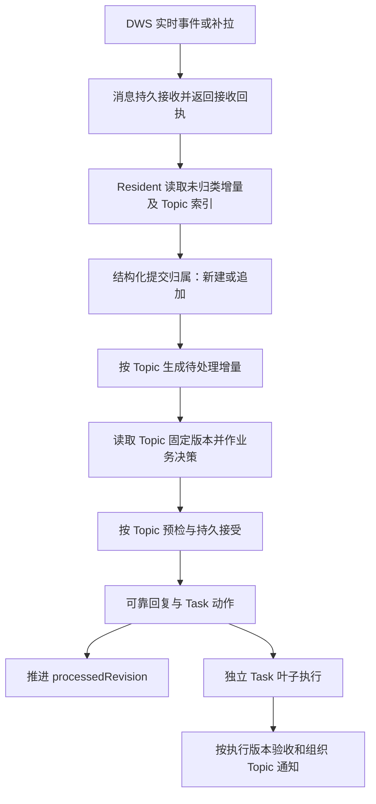

# Topic 驱动的消息处理与 Task 上下文方案

## 1. 目标、范围与结论

日期：2026-09-07。源码基线：`0925f0d4ed4f49072454f563477f433b10ebb61d`，本地 `main`。

本文件是实施前方案。本轮只分析、运行相关既有测试并编写本文；没有修改业务逻辑、迁移真实数据或部署。以下“拟议”“应当”均为目标行为，不是现有能力。

已确认的产品方向：

- 本轮新增消息先归入已有 Topic 或新建 Topic，再以 Topic 为单位理解、决策和返回。
- Topic 跨 turn 持续存在；完成的是 Topic 当前增量的处理，不是永久结束该话题。
- Task 引用相关 Topic，不再维护相关消息列表和逐条消息正文副本。
- 独立 Topic 可以分别返回；同一 Topic 的补充、纠正、取消应影响其后续处理。

本方案推荐：保留每群一个 DSH Resident、每 Task 一个叶子 Session；新增持久 Topic 和 Topic 处理协议；同时改造入站恢复、提交门禁、Task 上下文、结果通知和查询。首版不引入独立 Topic Agent、向量库或另一套工作流引擎。

可验证目标：

1. A/B 消息交错时归属正确，A 的有效提交不因已确认无关的 B 输入而失效。
2. A 新增纠正或取消时，基于旧 A 上下文生成的未提交结果不能直接生效。
3. 重启后可恢复归类、Topic 处理及已接受动作，不重复建 Task、重开 Task 或发送回复。
4. Task、Task 历史轮次不存消息正文或消息 ID 清单；仍能从 Topic 版本追溯执行依据和通知对象。
5. 引用真实性、参与人校验、原始授权范围、确认先于执行、快速取消、结果验收继续成立。

“更流畅”尚未有真实流量对比数据。应分别测量归类延迟、Topic 排队、模型处理、Task 执行和对外投递；不能把新增 Topic 等同于所有延迟问题已经解决。

## 2. 当前实现与具体缺口

下表位置均相对于仓库根，行号对应上述基线。

| 现有环节 | 当前证据 | 对新方案的约束 |
| --- | --- | --- |
| 消息持久化 | `store.js:9`、`:43`、`:359`：原始消息及投递状态保存在 `Group.messages` | 可复用消息事实来源；需要把渠道接收、归类、Topic 处理进度分开 |
| 同轮分组 | `runtime.js:188`、`:509`：一个 submission 可以覆盖多个 requestIds | 已支持临时分组与 step 提交；缺的是跨 turn 的持久话题和处理边界 |
| 回复门禁 | `runtime.js:614`、`:733`：观察集合必须覆盖全群普通 pending | 无关消息也会让旧回复返回 stale，Topic 独立性必须改变此契约 |
| 持久来源 | `store.js:47`、`:70`、`:488`：Task 保存 sourceMessageId、triggerHistory、messageHistory、relatedContexts | 删除消息历史前必须替换所有消费者与来源审计 |
| 动作准入 | `decision.js:4`、`runtime.js:573`、`:1940`：sourceMessageIds 校验同群、至少包含当前输入、定向给其他人的消息不能擅自接单 | 不能简单把字段改名为 topicIds 而丢失当前输入与授权证据 |
| 叶子上下文 | `runtime.js:1947`、`:1684`：来源信封被写入 relatedContexts，并 steer 到叶子 | 改成由 Topic 固定版本构造输入，Task 不再累积消息副本 |
| 结果通知 | `runtime.js:1018`、`:1049`、`:719`：Task 时间线决定引用及 @ 的允许集合 | 改由所引用 Topic 版本提供候选；必须保留身份真实性验证 |
| 回复去重与撤回 | `decision.js:84`、`runtime.js:274`、`:910`：由消息、Task 和 Outbox 推断同一事项 | Topic 是关联证据，但不能作为“同一条回复可被撤回”的充分条件 |
| 失败恢复 | `runtime.js:1738`、`:1849`：较早失败消息会阻挡后续同群消息 | 归类后的失败应隔离到 Topic；未归类输入仍有影响范围不明的问题 |
| DWS 补拉 | `dws-bridge.js:239`：逐条 await processMessage，后者 await runtime.ingest | 入站返回必须与业务处理结束解耦，否则补拉仍被慢话题卡住 |
| 完成验收 | `runtime.js:1205`：比较 runSequence、objective、最后 checkpoint | 还需覆盖 Topic 输入变化；仅检查目标文本变化不够 |
| 内部审阅 | `runtime.js:925`、`:1109`：完成验收与检查点审阅都等待 whenIdle，再解析 assistant 文本 | 需要独立的结构化审阅回执，避免继续依赖整轮结束 |
| 状态/API | `http.js:48`、`:52`：直接返回群、Task 记录 | 增加 Topic 查询并控制返回体积，不能把新内部提交记录整份暴露出去 |
| 历史上下文 | `runtime.js:1791`：历史消息整批注入 Resident；`runtime.js:30`：按需读取 Task 历史 | 历史恢复应读取 Topic 索引和详情，避免重新加载全群正文 |
| 存储约束 | `store.js:103`：domain version 6；本地 SDK `README.md:35` 明确无跨表事务 | 使用单记录原子更新与明确提交进度，不能假设多个 put 原子成功 |

表中简写文件均位于 `packages/dingtalk-dsh-assistant/`。本地 SDK 证据路径为 `node_modules/@deepseek-ai/dsh-storage-domain/README.md` 与 `lib/types/domain.d.ts`。

## 3. 候选方案与取舍

| 候选 | 优点 | 排除或采用理由 |
| --- | --- | --- |
| 仅在现有 submission 上加 topicId | 改动小 | 排除：没有持久话题历史，仍受全群 pending 和按群恢复阻塞 |
| 每个 turn 临时聚类 | 当轮聚合更自然 | 排除：跨 turn 延续、重启恢复、Task 来源及版本边界仍未解决 |
| 持久 Topic + 现有 Resident 分流与协调 | 复用现有 DSH 运行模型，可独立保存处理结果 | 采用：本次核心改造，先解决业务归属与提交耦合 |
| 每 Topic 独立 Agent/Session | 可获得独立模型执行资源 | 首版不采用：增加 Session 生命周期、路由交接、跨话题协调与模型成本；目前没有证据表明必须如此 |

保留单 Resident 意味着同群的模型生成仍共享执行资源。独立提交、独立重试不等于真正并行推理；Resident 不应在 Topic 中做长时间业务执行，该工作仍交给 Task 叶子。若实测主会话长 step 成为主要瓶颈，再单独评估 Session 拆分。

## 4. 领域模型与所有权

### 4.1 Message：唯一原始事实来源

继续使用 `Group.messages` 保存原始消息、发送人稳定 ID、时间、引用关系。Topic 保存引用，Task 不保存消息副本。

新增与归类有关的持久状态：未归类、已归类、归类失败及失败原因。`agentDeliveryStatus` 不再兼任业务完成状态；新契约分别表达渠道接收、模型输入投递、归类和处理。

重复事件以 `(groupId, messageId)` 幂等。发送人或引用信息补齐、附件恢复不应当被当成全新消息；如果补齐信息改变理解或通知依据，应产生该消息的新事实版本，并推进相关 Topic revision。历史事实版本统一保存在 Message 侧，不能分散复制到 Task。

图片附件引用和可读性也必须持久可恢复。当前 `inboundSchema` 不保存 `mediaUnavailable` 或 imageRefs，内存请求则保存附件引用；本次不能把只含文字的重启恢复当成完整 Topic 输入恢复。

### 4.2 Topic：跨 turn 的讨论上下文与增量处理单位

建议字段：

```text
Topic
  topicId, groupId, title
  revision                  当前已提交输入/归属版本
  processedRevision         已完成决策和动作落地的连续版本
  status                    active | waiting | closed
  summary, summaryRevision  摘要及其覆盖版本，不能替代原文
  openQuestions             未解决的问题
  entries[]                 输入引用及归属变更，按 Topic revision 组织
  decisions[]               每次已接受决策、依据和动作提交进度
  createdAt, updatedAt
```

`title` 是稳定、简短的话题名称，语义对齐 Task 名称：只概括可持续归类的共同讨论对象，优先使用“对象 + 事项”的短语，不复述动作清单、背景、进展、结论或消息原文。新建时最多 60 字；历史长标题继续可读，细节由 `summary` 承载。

- entries 引用消息及其事实版本，保留加入、移出等变更记录，保证历史版本可还原。
- 一个消息可属于多个 Topic，例如“上面两个问题都暂停”；正文只存一次。
- 归类后的闲聊或致谢也可以属于 Topic，处理结果是无需回复；不强制每个 Topic 创建 Task。
- 明确无可延续事项的噪声可有带原因的无 Topic 归类结果，避免产生大量“收到”话题；不能把它用作跳过业务消息的入口。
- closed 只是当前话题结束；后续延续消息可以重新激活，不能自动重开它关联的所有 Task。
- 错误归类通过追加关系修订纠正，不覆写历史。已有执行或已发回复不能随“改归属”被抹除，须显式评估订正或任务取消。
- 首版不提供全量自动合并、自动拆分整个历史话题的操作；可以新建 Topic 并显式修订后续归属。历史大范围重组需独立设计，避免改写 Task 执行依据。

### 4.3 Task：执行约定与 Topic 引用

建议只存一份关系字段 `topicRefs`，不同时持久化 topicIds 和另一份关系表：

```text
Task
  taskId, groupId
  topicRefs: [{ topicId, revision }]
  inputVersion              本 Task 执行输入版本
  objective, acceptanceCriteria, stageTasks
  state, runSequence, childSessionId
  checkpoints, result, runHistory, objectiveHistory
  humanBlocker, humanBlockerHistory
```

`topicRefs[].revision` 表示本任务最近一次接纳的 Topic 输入版本，不能查询时无条件替换成最新值。每次确实影响该 Task 的信息、目标或验收变更才增加 `inputVersion`。runHistory 和 objectiveHistory 记录对应 Topic 版本或 Topic decisionId，保持审计，不保存逐条消息列表。

Task 不再保存 `sourceMessageId`、`triggerHistory`、`messageHistory`，也不把群消息信封持续写进 `relatedContexts`。已有 relatedContexts 中的人工补充需要迁为有来源类别的 Topic 输入；纯内部执行指导可以继续保留为 Task 执行事件，不与群聊事实混为一谈。

任务责任人若有明确业务用途可以保留独立字段，但不能再由“最后触发者”隐式决定所有通知对象。API 如需 topicIds 或参与人摘要，可从 Topic 引用生成只读投影，不增加权威数据副本。

一项 Task 可引用多个 Topic。多个 Topic 同时影响同一 Task 时，通过同一个 Task inputVersion 比较并串行应用动作；首个变更完成后，其他旧版本动作必须重新判定。共享消息引起的相同 Task 动作必须在 Topic 决策中确定一个执行归属，其他 Topic 关联既有动作回执，不能各执行一次。

### 4.4 三种进度必须分开

| 进度 | 含义 | 不代表什么 |
| --- | --- | --- |
| 已归类 | 消息已进入相关 Topic，revision 已推进 | 不代表已做业务判断 |
| Topic 已处理 | 本次决策已记录，所需 Task 更新和 Outbox 已可靠落地 | 不代表 Task 执行完成，也不代表消息已送达钉钉 |
| Task 输入已下发/已确认 | 对应 inputVersion 已进入叶子，或叶子显式回报该版本 | steer 调用成功本身不代表叶子已阅读或完成 |

因此不沿用语义模糊的单一 `lastProcessedRevision`。Topic 的 processedRevision、Task 的 inputVersion、渠道的投递状态分别维护。

## 5. 消息归类与 Topic 处理协议



### 5.1 归类输入与判断依据

Resident 每次先处理当前已进入的未归类消息集合，结合近期、活跃以及引用命中的历史 Topic 索引；必要时按需读取完整 Topic 与关联 Task。当前 turn 可以多次归类和处理，不能等 turn/end。

引用消息、明确问题对象、讨论目标、参与过程、现有 Task 目标和时间关系共同作为判断依据。引用和关键词只提供候选，不自动决定归属。索引不足时必须支持同群历史 Topic 检索，不能因为不在最近候选中就新建重复话题。

不确定而且会影响执行范围时保留待归类输入及原因，优先读取原文或补齐附件；只有确实需要参与人提供的新信息才提问。多事项消息可以多归属，不按整条消息强制二选一。

### 5.2 新增工具及现有工具调整

| 工具 | 拟议职责 |
| --- | --- |
| `group_topic_route_submit`（新增） | 对一个冻结的消息批次提交全量归属；可以在同一批次创建多个 Topic，以本批 localKey 引用新 Topic，持久成功后返回正式 ID |
| `group_topic_context_get`（新增） | 按 topicId 和固定 revision 分页读取摘要、原始输入、未决问题、关联 Task 和历史回复；只读、同群校验 |
| `group_decision_submit`（改造） | 每次提交一个 Topic decision：topicId、基准 revision、decision 请求 ID、actions、reply 或无回复原因、replyReview |
| `group_reply_review_get`（复用改造） | 读取该 Topic 决策/结果通知绑定的历史回复候选及版本 |
| `group_reply_submit`（改造） | 结果通知按 Task runSequence/inputVersion 和相关 Topic 版本提交，不再传全群 observedRequestIds |
| `group_task_review_submit`（新增） | 按 reviewRequestId 提交检查点或完成审阅；请求绑定 taskId、runSequence、inputVersion 和审阅种类，内部结果不得直接发群 |
| `group_task_context_get`（改造） | 返回执行约定和 topicRefs；原始话题上下文由 Topic 读取接口获取 |
| Task 新建、续接、重开工具（改造） | 引用 Topic 及版本；Web 原始输入也必须先成为可追溯 Topic 输入 |

归类请求包含 Runtime 分配的 requestId、输入消息 ID/事实版本和 Topic 索引版本。提交必须完整覆盖该冻结批次；非法、重复、跨群、版本冲突时整批零副作用拒绝。新消息到达不使前一批归类结果失效，它们进入下一批；两个归类提交争用同一 Topic 索引版本时必须重新读取。

Topic decision 的 actions 使用 topicRefs 替代 sourceMessageIds。具体消息证据留在该 Topic decision 的依据字段，Task 只引用 decision/Topic 版本。Runtime 仍验证：依据属于本群、属于绑定的 Topic 快照、至少涉及本次增量，且定向给他人的请求未被擅自转为 Agent 授权。仅仅加入 Topic 不能产生授权。

首版每次提交一个 Topic，先完成即可先提交。这样一个 Topic stale 不会回滚其他 Topic 的已提交结果，也不再需要“批次任一无效就全部重算”的语义。

### 5.3 每个 Topic 的处理结果

一次处理可以：只更新讨论状态、回答、请求信息、提出任务建议、创建 Task、续接、重开或取消 Task。Topic 的待处理变化还要评估对已关联 Task 的影响：相关则更新执行输入，无影响则留下决策依据，不自动向所有 Task 广播全部新增消息。

保留现有回复节制与任务确认规则：纯讨论可以不回复；实际创建、续接、重开或取消 Task 时仍需要一条合适的确认。讨论 summary 更新本身不能强迫回复，Task 运行过程也不能每个 step 都群发。

## 6. 独立提交、竞态与失败恢复

### 6.1 提交门禁

提交时在短的群状态临界区完成四类检查：

1. **归类是否追上已接收输入**：检查截至本次提交时已持久接收的消息是否已归类。若仍有未知影响的输入，返回 `routing-required`，优先归类；保留候选，不直接判定旧回复错误。
2. **相关 Topic 版本**：归类后如果新增消息只属于 B，A 候选继续有效；如果属于 A 或其显式依赖，返回 `topic-stale` 并重新生成。
3. **相关 Task 版本**：动作和通知绑定 Task runSequence/inputVersion；同一 Task 被其他 Topic 或 Web 修改时必须重新审查。
4. **历史回复快照**：校验候选的版本与替换关系，不能因为 Topic 输入没变化就忽略新产生的通知或撤回。

全部检查通过后，持久保存不可变的决策意图，再释放临界区。后续进入的消息按照提交顺序处理；取消仍保留快速中断能力。没有回复的 Task 动作、关闭 Topic、改变待解决问题等操作也要经过版本检查。

门禁使用 Store 同一群记录的原子 update 作为落点，并在真正写入的转换函数内复核最新状态；不能在等待持久化前检查一次后假定版本不变。不得持有群级锁等待模型推理、whenIdle、DWS 网络调用、Task 完成或叶子 dispose。

已归类的无关 Topic 失败不阻挡 A；**尚未归类且无法判断影响的输入，无法无条件保证其他 Topic 安全提交**。这是正确性与延迟的真实边界，不承诺“所有消息永不互相等待”。持续高于模型归类能力的入站流量仍会堆积，必须测量并显示积压，不能丢弃输入伪造流畅。

### 6.2 最小持久提交记录

当前模型请求 ID 在内存中；重启会重新生成。新设计中 durable decisionId 才是业务幂等身份，模型 attempt/requestId 只是一次处理尝试。

每个已接受 Topic decision 保存：绑定版本、决策正文、预分配 Task/Outbox/action 标识、动作进度、错误和结果引用。Task 更新时在同一 Task 记录中保存已应用 operationId，重放先回读该回执；新建 Task 使用接受决策时固定的 Task ID，不按重试时新生成 UUID。

流程顺序：

1. 全量预检完成后，单次群记录更新保存已接受意图及固定标识。
2. 需要撤回时执行原有精确撤回及回读；进度写入决策记录。不可逆步骤不能靠删除意图“回滚”。
3. 将可投递确认放入 Outbox，重复恢复使用同一 outboundId；非取消 Task 动作只能在此步骤可靠完成后启动。
4. 幂等应用每个 Task 动作；下发上下文使用固定 inputVersion 和投递身份，恢复时核对 Session 输入或回执，不能重复 steer 后声称已幂等。
5. 动作全部应用后推进 Topic processedRevision；钉钉发送/回读失败继续由 Outbox 重试，不回退已接受决策。

快速取消保持现有“先发取消信号、再完成确认与持久状态”的语义；取消意图也要可恢复，迟到结果必须被拒绝。任一步骤失败都准确显示所在阶段；已发送、已撤回或已经开始的外部业务动作不能宣称可由存储事务撤销。

同一 Topic 中已经接受但未完成的动作按序恢复；其他 Topic 继续运行。涉及共享 Task 的 Topic 只能等待该 Task 的相关变更，不锁住整个群。需要撤回的同一 Outbox 也必须被占用检查，避免两话题重复替换它。

接受 Topic decision 时还要登记其涉及 Task 的待应用操作和预期 inputVersion，作为共享 Task 的顺序约束。动作实际应用时在 Task 原子更新内再次核验版本；发现冲突则进入明确的待复核状态，不能覆写新状态。Task 的 Web 变更和结果提交也遵守该约束：存在尚未应用的输入变更/取消意图时，不允许旧结果抢先完成。实施时统一采用“短 Task 提交队列 → 短群状态更新”的锁顺序，归类只使用群状态更新，不得出现反向嵌套或在队列内等待模型审阅。

### 6.3 入站与恢复

- `runtime.ingest` 在消息及待归类状态可靠写入后返回接收回执，不等待 Topic 决策。调用方不能再把返回成功视为业务完成。
- DWS 补拉完成表示该范围输入已接收完整；业务待归类/待处理数量独立展示。
- 模型未归类、已归类未处理、已接受未应用、Outbox 未回读分别恢复；不再用单条消息的 delivered 状态猜测全部进度。
- 同一消息多 Topic 时，原消息的整体处理状态从所有关联 Topic 的处理回执派生，不能被第一个 Topic 提前标记完成。
- Runtime 重启以持久状态重建请求，清理旧 attempt 信封；配置切换、关闭和退订等待已接受操作持久收口，不能遗留永久占用。
- 历史导入只构建可查询背景，不自动执行历史指令或重新发送历史回复。已有实时补拉和首次导入的语义必须区分。

## 7. Task 输入、验收与通知

### 7.1 叶子输入

创建叶子时构造 `[TASK_TOPIC_CONTEXT]`：当前执行目标、验收标准、runSequence、inputVersion、固定 topicRefs、摘要及本次必要原始输入。全量历史按需分页读取，不能重新把所有 Topic 消息塞入系统提示。

Task 关联多个 Topic 时输入按消息事实版本去重；按 Topic 展示讨论结论和待决问题。摘要只用于定位；目标变更、授权、取消、引用歧义必须能回读原始输入。

Topic 只读接口对 Resident 限制在所属群；对叶子还限制在当前 Task 的 topicRefs 和允许读取的版本范围。Topic ID 本身不是访问授权。原始附件/引用的外部读取继续遵循现有工具与工作区权限，不因新增 Topic 放宽。

运行中增量通过现有 steer 下发，投递记录与处理进度分开。叶子 checkpoint/result 必须回报本次使用的 inputVersion；Runtime 校验它属于当前 run 和有效输入，不能用 steer 回执代替叶子的版本确认。

### 7.2 完成门禁

完成验收增加 Task inputVersion 比较。开始验收前，对已归类且关联本 Task 的 Topic 未处理增量先完成影响判断；相关信息更新 Task 输入，无关信息不强迫重新执行。

验收通过后、完成状态写入前再次比较 runSequence、inputVersion、验收计划及检查点版本。结果正文必须保留 evidence、artifacts、delivery 和未验证边界。Task completed 与通知 sent 分开；通知失败不能重复执行已完成业务。

完成验收和检查点审阅改成绑定 Topic/Task 版本的内部审阅请求，由 Resident 在可执行 step 通过 `group_task_review_submit` 回报。完成审阅只允许 accepted/rejected 及原因；检查点审阅只允许 acknowledge/guidance 及原因。Runtime 根据请求种类校验，普通 assistant 文本和 turn/end 不能完成请求；相关请求可以在其他 Topic 尚未结束时提交。无需增加另一套审阅 Agent。

Task completed 后 Topic 新消息可以继续讨论。只有明确需要继续执行时才通过 task-reopen 推进 runSequence；普通致谢、查询进度、纯 Topic 更新不能触发重开。

### 7.3 通知与历史回复

Task 结果通知绑定实际执行版本，而不是读取 Topic 最新全文后把新要求混入旧结果。通知生成期间新增输入如果改变结果有效性，先做影响判断；如果只是无关讨论，可继续发送原结果。

引用消息与 @ 候选从本次通知所依赖 Topic 快照提取，模型根据任务目标和结果选择真正相关的人，Runtime 验证同群、真实稳定 ID、候选内引用。属于 Topic 不等于应该被 @，不自动通知所有参与人。

同一 Task 多 Topic 的结果优先形成一份通知并标注全部相关 Topic，选择最适合承接结果的真实消息；不能按关联 Topic 数量重复广播同一结果。共享消息的通用确认也需在归类/决策中确定回应归属，各 Topic 的实质独立结果可以分别返回。

Outbox 增加结构化 Topic/decision 关联和专门的业务幂等键，区分“回复什么话题”“引用哪条消息”“哪次提交只发一次”。不能用一个入站 messageId 作为该消息所有 Topic 回复的唯一键，否则第二个 Topic 回复会被去重掉。

Topic ID 只缩小历史回复审阅范围；同 Topic 的两项不同结论不应相互撤回。继续保留 confirmation/substantive/correction、语义同事项审查及 DWS 撤回回读。

## 8. 存储方案与历史迁移

### 8.1 首版物理组织

| 候选 | 判断 |
| --- | --- |
| Group 内增量保存 Topic、归类及提交记录 | 首版采用：复用当前群消息/Outbox 聚合，能用一次原子 update 处理多 Topic 归属与提交 |
| 独立 topics、关系、提交多张表 | 首版不采用：当前 SDK 无跨表事务，增加投影恢复和多写一致性负担 |
| 新数据库或新事务存储后端 | 不采用：超出本次必要范围，尚无容量实测支持 |

Group 内保存 Topic 不代表整群串行推理。只对短的状态更新串行；模型执行、Task 和渠道网络不占该锁。Task 继续使用现有 tasks 表，通过上一节的 operationId 回执实现跨记录恢复；不能把这称为跨表原子事务。

代价是群记录增长与整记录写放大。第一阶段必须用大群历史样本测量序列化耗时、写延迟和 API 体积；如果达不到预先记录的交互预算，应重新评估存储方案，不能在没有测量的情况下承诺无限规模。首版不自动清理仍被 Task/runHistory/Outbox 引用的消息或 Topic 历史。

### 8.2 Schema 迁移策略

本次移除必填来源字段并更改处理状态，属于不兼容模型变更，不能重复之前“可选 messageHistory 继续用 version 6”的做法。目标升级为新的 domain 版本；直接改 `version: 7` 会因旧介质版本不同而拒绝 open。

本地 SDK 没有可直接调用的 domain 自动迁移接口，正式实施前必须完成当前配置存储后端上的离线迁移原型。原型验证项包括：旧版本读取、独立目标写入、全量校验、可恢复切换和回退；不假设某个未验证的 JSON 路径或原子换目录能力。

迁移步骤：

1. 只读 `--check` 扫描并输出群/消息/Task/Outbox 数量、缺失来源、冲突来源、未完成提交及迁移映射；报告不得包含原始敏感聊天正文。
2. 在预先准备的停机窗口停止写入并保留完整旧存储与 Session 检查点，向独立目标生成新版本状态；迁移本身不调用 DWS、不执行 Task。
3. 每个旧 Task 先生成可追溯的迁移 Topic，保留明确已有的消息关联。不同 Task 的来源完全相同也不自动认定同话题；重叠消息允许共享。
4. 群消息为主要原文来源；只有旧 Task 快照存在的原文迁到 Message 事实来源并标明迁移来源。不同副本冲突要报告，不随意选择“最长文本”。
5. 旧 Web/内部补充保存为 Web/内部类型的 Topic 输入，不伪造钉钉 messageId、发送人或引用能力。身份无法证明的记录不能用于自动 @ 或扩大授权。
6. 旧 Task 的执行目标、状态、叶子 Session、检查点、结果、审批和轮次保留，来源字段转换为 Topic 引用。无法重建历史版本顺序时明确标记迁移基线，不能声称精确还原每轮已读输入。
7. 旧 Outbox 保留 deliveredMessageId/outboundId、渠道状态及旧幂等回执；由可靠证据补充 Topic 关联。已发消息不能因换模型重新发送。
8. 未处理输入进入新归类队列；已执行历史仅做背景恢复。`decision-commit-failed` 必须核对实际副作用后决定恢复动作，不能整体改为待执行。
9. 独立读回验证数量、引用完整性、无孤立 Task、无错误跨群关联、投递键连续性后切换；新 Runtime 只运行 Topic 路径，不长期双写旧 Task 消息历史。

回退必须连同相匹配的代码、存储和 Session 检查点考虑。新版本已经发送的消息或执行的业务动作不能靠恢复旧文件撤销；需要保存切换后回执并对账，避免旧版本重复执行。迁移能力未通过验证前，不进入本地真实 profile 或正式发布。

## 9. 改动点与影响范围

| 文件/区域 | 改动 | 影响等级 |
| --- | --- | --- |
| `packages/dingtalk-dsh-assistant/store.js` | Topic schema、消息事实版本/归类、单群原子归属、持久 decision 回执、Task 来源替换、Outbox 业务键、历史迁移入口 | 高：持久数据与恢复 |
| `packages/dingtalk-dsh-assistant/decision.js` | Topic 结构化协议、原文读取/叶子信封、Topic 回复候选、动作 Topic 引用与依据校验 | 高：模型契约 |
| `packages/dingtalk-dsh-assistant/runtime.js` | 归类工具、Topic 待处理队列、短提交门禁、Task 输入版本、全部入口的动作应用、恢复/生命周期、通知与验收 | 高：核心运行链路 |
| `packages/dingtalk-dsh-assistant/task-result.js` | checkpoint/result 增加执行输入版本契约；保留既有结果证据要求 | 高：叶子完成契约 |
| `packages/dingtalk-dsh-assistant/dws-bridge.js` | 入站接收与处理完成解耦、补拉完成含义、自己的消息回环过滤、Outbox 新旧回执识别 | 高：漏收/重复执行风险 |
| `packages/dingtalk-dsh-assistant/dws-adapter.js` | 原生发送/引用/@ 协议优先复用；核验新幂等来源、同文不同 Topic 的回读匹配，必要处精确修改 | 中：渠道实际送达 |
| `packages/dingtalk-dsh-assistant/resident.js` | 初始化顺序先完成迁移/恢复，区分历史背景导入与新增输入处理 | 中：启动行为 |
| `packages/dingtalk-dsh-assistant/http.js` | Topic 索引/版本详情/积压查询、Task Topic 投影、迁移旧管理端点契约；避免返回内部完整日志 | 中：API 破坏性变更 |
| `packages/dingtalk-dsh-observer/web-client.js` | 群内 Topic 索引、待处理状态、Task 关联跳转、Topic 消息/结果详情；不把传输与业务完成混成一个状态 | 中：用户理解与诊断 |
| Assistant `client.js` / `web-client.js` | 检查 overview 数据契约；只在 Topic 数量/积压展示或接口变化确有需要时改动 | 低到中：间接消费者 |
| `packages/dingtalk-dsh-assistant/fake-llm.js` | 假模型先归类再提交 Topic 决策，更新结构化结果版本，不能继续输出旧协议 | 中：本地集成验证 |
| `test/{store,decision,runtime,task-result,dws-bridge,dws-adapter,http,observer-client,fake-llm}.test.js` | 用行为断言替换旧消息级契约，新增交错、版本、恢复、迁移和通知验证 | 高：回归覆盖 |
| 新增迁移脚本、运维说明 | 新建有理由：当前无本次破坏性 domain 迁移工具；支持 --check、独立目标和真实读回 | 高：切换与回退 |
| README、安装手册、相关 API/运行说明 | 同步 Topic 模型、Task 来源、API、处理状态和迁移要求；历史 spec 保留为当时快照 | 中：运维与使用契约 |

已有代码文件可以承接大部分改动，不预先新建 Topic package 或 Session 框架。实施时若 runtime.js 中 Topic 状态机需要独立测试，可抽出职责完整的 Topic 模块，但必须只有一个状态所有者，不能留下新旧并行运行路径。

按当前调用链估计涉及约 10–13 个生产代码文件、9 个主要测试文件及迁移/说明文档，属于架构与 schema 重构，应走隔离 feature 分支及 PR。此数量是范围估算，不是实施后的实际 diff。

间接影响还包括：人工介入仍按 blocker/requestId 做精确授权，不从普通 Topic 中“同意”两字自动批准；订阅删除需要处理被 Task 引用的 Topic 留存；配置切换、后台补通知、Web 续接、恢复命令不能继续绕过 Topic 新路径。

## 10. 风险清单与处置

P0 表示可能导致错执行、重复外部动作或数据不可恢复；P1 表示可能明显损害正确交互或可用性；P2 表示规模与体验风险。

| 级别 | 风险/反例 | 处置与验证 |
| --- | --- | --- |
| P0 | Topic 归错把甲给乙的工作变成 Agent 授权 | 原始定向与转交证据继续校验；相似话题、同引用不同事项做反例集 |
| P0 | 新取消已进 Inbox，旧结果仍提交 | 归类水位 + Topic 版本门禁 + 快速取消；并发控制精确卡住提交点验证 |
| P0 | 确认已发后 Task 写入失败，重试再次创建 | durable decision/action/outbound 身份 + Task 回执，逐故障点重启验证 |
| P0 | 共享消息影响两个 Topic，某 Task 被重开/取消两次 | 共享动作指定单一执行归属、Task 版本检查、重放回执；不能只靠 topicId 幂等 |
| P0 | 旧叶子结果覆盖更新后输入 | checkpoint/result 携带 inputVersion，验收后再比较；纯上下文变更也覆盖 |
| P0 | migration 改 version 后旧数据打不开或回退重复执行 | 先离线原型、独立目标、--check、旧 Outbox 身份保留、切换后外部回执对账 |
| P0 | Task/topicRefs 暗中丢失授权和来源 | 决策依据保留在 Topic 固定版本；删除字段前验证全部来源消费者已切换 |
| P1 | 某话题失败，补拉/恢复仍把整个群堵住 | ingest 接收即返回、归类后 Topic 级恢复；故意让 A 失败验证 B 可完成 |
| P1 | 附件/引用只在内存里，重启后作出错误判断 | 持久保存可恢复附件引用和读取状态，缺失不伪装成完整上下文 |
| P1 | Topic 越来越宽，等价于“整个群一个话题” | 围绕具体可延续事项归类，不能按群/项目名粗分；回放评估过度合并和过度拆分 |
| P1 | 话题太碎，连续补充被多次确认/建 Task | 引用和上下文召回、历史候选读取、独立实质结果才回复 |
| P1 | 同 Topic 回复全部当成可撤回的同事项 | Topic 只作候选；保留正文语义审查、回复种类和精确撤回回读 |
| P1 | 同文不同 Topic 回复被 DWS 回读混淆 | 优先稳定渠道 ID/幂等标识，覆盖引用目标不同但正文相同的用例 |
| P1 | Web/历史导入/API 绕过归类写 Task | 统一输入适配；历史背景不能执行；内部控制与人类业务指令分类保存 |
| P1 | 持锁等待 Resident/网络形成死锁或话题饥饿 | 短提交临界区；whenIdle/模型/网络外置；复用配置切换和关闭并发回归 |
| P2 | Topic 聚合记录与历史增长导致写入变慢 | 大历史基准、分页读取、避免系统提示灌全文；容量门禁不过就重评存储选择 |
| P2 | 以为有 Topic 就实现模型并行 | 明确单 Resident 限制，分别记录排队和处理时间；不给未经验证的提速比例 |

## 11. 实施阶段与验收安排

以下是实施阶段，不是已完成工作。正式实施时创建 `docs/acceptance/topic-driven-processing/goal.md` 和唯一 sub goal matrix，逐阶段记录证据；当前方案文件保持开工前快照。

| 阶段 | 交付物 | 完成条件 |
| --- | --- | --- |
| S0 契约与迁移原型 | 固定 schema、冻结版本/幂等规则、当前后端迁移与回退实验 | 无跨表事务假设；历史/缺失/失败数据均有确定处理；无真实外部副作用 |
| S1 存储与归类 | Group Topic、归类提交、消息事实版本、Topic 查询 | 多消息多 Topic 全量预检、重试/重启不重复建 Topic、跨群拒绝 |
| S2 Topic 决策与恢复 | Topic 请求、版本门禁、持久提交、入站/补拉解耦 | A/B 交错独立提交；同 Topic 纠正失效；失败恢复不误堵无关话题 |
| S3 Task 与通知迁移 | topicRefs、inputVersion、叶子输入、验收、Outbox 与回复路由 | Task 不存消息副本，全部入口均走 Topic，旧结果和重复动作被拒绝 |
| S4 API 与 Observer | Topic 列表/详情、积压、Task 关联和错误阶段 | 能从 Task 找到依据 Topic，从 Topic 找到原文和结果；页面不过量加载 |
| S5 全链路验收与切换 | 用例矩阵、重启故障注入、迁移报告、真实 DSH/DWS 验证 | 代码、数据迁移、运行恢复、外部引用/@ 回读分别有证据 |

不将中间阶段作为可部署的“新旧双协议版本”；分阶段开发验证后，完整切换新路径。

核心验收用例至少覆盖：

| 编号 | 场景 | 必须观察到的结果 |
| --- | --- | --- |
| T01 | A1、B1、A2 同 turn 交错 | A1/A2 同 Topic，B 独立，先完成者先提交 |
| T02 | 下一 turn 延续 A | 沿用 topicId，无重复 Topic/Task |
| T03 | A 候选生成后到达已归类 B | A 不 stale，B 无需先业务完成 |
| T04 | A 候选生成后到达 A 的纠正 | 旧版本零业务副作用拒绝，正确版本只生效一次 |
| T05 | 候选后到达尚未归类输入 | routing-required；归类后按真实影响决定保留或重算 |
| T06 | 一条消息要求两个话题暂停 | 两 Topic 接收一次原文引用，目标 Task 各取消一次，无重复通用确认 |
| T07 | 两 Topic 影响同一 Task | Task 版本冲突受控，动作无覆盖丢失、无重复重开 |
| T08 | 多 Task 引用同一 Topic | 消息存储不随 Task 数量复制，分别按执行目标选择影响 |
| T09 | 同 Topic 致谢/闲聊 | 不修改 Task inputVersion，不重开，不机械回复 |
| T10 | 无关话题 A 决策/提交失败 | B 可以完成；A 恢复后不重复已落地动作 |
| T11 | 意图写入前/后、Outbox 后、Task 写入后断进程 | 从正确阶段恢复；固定 Task/outbound/action 标识可独立读回 |
| T12 | 动作落地但处理游标未更新 | 重放命中动作回执，仅补进度 |
| T13 | 运行中目标/验收/纯事实补充变化 | 相关变化更新 inputVersion，旧 completed 被拒绝 |
| T14 | steer 成功但叶子未消费 | 不声称输入已处理；迟到旧版本结果拒绝 |
| T15 | 完成验收期间 Topic 更新或 Task 重开 | 完成提交再次核对版本，旧通知不冒充新轮结果 |
| T16 | 多参与人、多 Topic 的 Task 结果 | 引用与 @ 来自绑定快照，只通知需要的人，同结果不重复广播 |
| T17 | 同 Topic 不同结论；不同 Topic 同文回复 | 不误撤回、不误去重，渠道读回对应正确消息 |
| T18 | 附件失败后重启及附件恢复 | 读取状态可恢复；必要附件缺失不启动错误任务 |
| T19 | 明确 @ 别人后引用转交 Agent | 未转交不执行，明确转交后依据有效 |
| T20 | Web 创建/续接/重开；审批回复 | Web 原文可追溯，普通 Topic 讨论不替代精确审批 |
| T21 | 首次历史导入与实时补拉 | 前者只恢复背景；后者消息接收不等处理完成，无漏收/重跑 |
| T22 | 配置切换、退订、进程关闭 | 无死锁、无孤立已接受动作、保留仍需追溯的来源 |
| T23 | v6 真实形态脱敏副本迁移及再次运行迁移 | 映射稳定、引用完整、重复运行不生成第二批 Topic |
| T24 | 旧来源缺失/冲突及旧提交失败 | 明确报告、准确隔离，不猜测历史授权或副作用 |
| T25 | 大量历史 Topic 与高频入站 | 记录上下文大小、归类/提交 P50/P95、积压和写延迟，不无限载入全文 |
| T26 | Topic 误归类后修订 | 历史执行依据可复现；受影响 Task/回复重新评估，无静默抹除 |
| T27 | 完成/检查点审阅期间另一个 Topic 持续输入 | 结构化审阅可独立提交；普通文本不能冒充审阅，版本变化必须重新核对 |

测试层次：纯 schema/store 测试、带可控并发断点的 Runtime 契约测试、真实存储重启测试、DSH 模型工具集成、真实钉钉引用/@/重复发送回读。mock 全绿不代表语义归类质量或真实 DWS 交付通过。

性能验收先采现有方案基线，再按同样回放比较；不提前编造毫秒阈值。正确性用例采用确定性断言，语义归类用人工标注案例评估误合并、误拆分、漏关联、错执行和重复回复，不能只用 fake-llm 的固定分支证明正确。

## 12. 本轮证据、未收敛项与下一步

本轮实跑了 8 项既有 Runtime 测试，全部通过，确认当前已支持临时多消息分组、多 Task 来源和参与人路由，同时仍强制全群观察及按群恢复阻塞。命令：

```powershell
node --test --test-reporter=spec --test-name-pattern '同一turn的多条消息|同批四条消息|一个Decision可把历史|回复遗漏其他已Steer|Task通知由模型从完整历史|未提交判断自动重试期间|Task通知在新Steer|Task通知生成不占用' test/runtime.test.js
```

结果：`tests 8 / pass 8 / fail 0`。这是现状证据，不是本方案实现验收；本轮未跑新 Topic 测试、全量回归、真实消息回放、迁移或部署。

仍未收敛、应在 S0/S1 验证的项：

1. 当前真实存储后端的离线升级/切换能力，以及缺失/冲突历史数据的实际数量。本轮仅核验了仓库和本地 SDK，没有读取真实群消息数据。
2. 现有 DSH 对叶子输入的稳定投递标识/恢复读回能力，决定如何证明 inputVersion 下发不重复，不能直接把原生 steer 当持久幂等队列。
3. 单 Resident 下归类及时性、上下文规模和 Group 聚合写入成本；没有数据前不承诺响应提速比例。
4. Topic 归类的实际边界与纠错质量，需要从获得授权的真实场景整理脱敏标注案例。
5. 同文不同话题通知的 DWS 回读判别能力，需真实引用消息和稳定 ID 验证。

下一步的首个实施目标应是 S0：把上述版本、持久提交和迁移边界验证成可执行契约，再进入完整代码改造。
