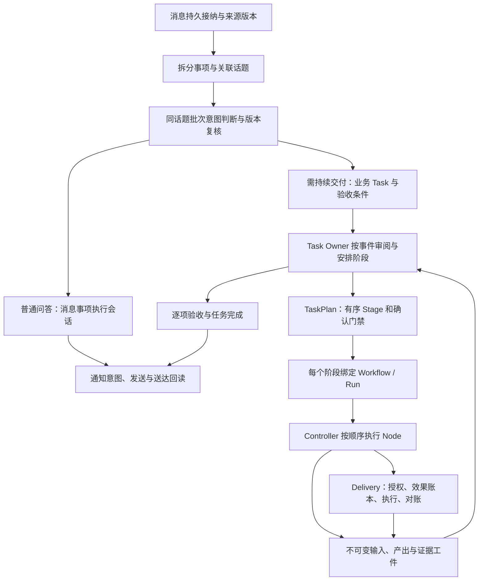

# 新任务流程编排建设手册

适用对象：为本项目新增、组合或升级任务流程的开发者与维护者。正文说明职责、阶段和建设方法，附录提供当前分支接口。框架实施与隔离验证记录见 [round-41](../../docs/acceptance/topic-context-completeness/round-41.md)；部署和真实业务验收仍需独立回读。

历史审查见 [round-39](../../docs/acceptance/topic-context-completeness/round-39.md)。其结果接纳、调查完成和旧阶段版本解析三个反例作为框架回归项保留。新增流程还须覆盖自身产物、失败和恢复合同。

设计依据见[职责与结果交接方案](../../docs/spec/workflow-session-responsibility.md)。实现复用 Owner、执行会话、工件和效果账本，通过冻结定义的 `ownerContract` 提供领域产物读取、完成判断与受信修复。

## 1. 先明确职责

建设流程时，先回答“这一阶段交付什么、谁判断完成、遇到问题由谁继续”。不要从节点字段或错误码清单开始设计。

| 责任方 | 核心职责 |
| --- | --- |
| Task Owner | 管整个业务目标：安排阶段、理解用户补充、逐项审阅验收、调整计划和决定任务结束 |
| 执行会话 | 完成当前阶段内的具体工作；在已有权限和预算内处理工具反馈，提交实际产物及未解决事项 |
| 业务流程 / 受信能力 | 声明输入、产物与必要验收；执行领域操作，提供独立核验和允许的恢复路径 |
| 框架 | 保证身份、版本、持久状态、结果交接、权限、排空与外部效果对账，让执行可以可靠继续 |

Owner 的语义判断和 Host 的可信证据检查共同决定完成。调查可以以有证据的“无法确认”结束；修复缺少必需验收时仍不能结束。不能把所有未知都交给用户，也不能由会话自行宣布缺少的证据已经成立。

**当前实现边界**：消息执行会话绑定消息事项、输入版本与租约；持久调查会话绑定 Agent NodeRun/租约。两者共用执行底座，只能使用 `pure/read` 工具。工程修改和平台写入由受信 code 节点及 Delivery 执行。会话处理问题以实际配置的能力为前提；Owner 能读取当前成功阶段的正式证明及失败/等待节点的诊断，两类证据分别使用。

工具执行前按已注册参数 schema 核验，未进入工具体的格式错误反馈给原会话修正；合法提交后不允许覆盖结果。权限拒绝、身份失效、取消、执行体异常及未知错误继续停止。纠错共用本次执行的步数与时间预算，不重领节点或重置额度。确定性操作由 code 执行器承担。

## 2. 按交付与恢复边界划分阶段

先写有业务意义的阶段，例如“调查与方案 → 实现与本地验收 → UAT 交付”，再确定阶段内哪些动作需要持久节点。以下情况值得单独建立节点或阶段：有可独立验收的产物、权限变化、用户确认、外部效果身份，或需要单独恢复。

读取多个文件、修正查询参数、调整分析方法通常属于会话内部工作；构建、业务验收、提交和交付仍需各自的事实及门禁。一个业务 Stage 可以由多个节点和会话实现，不要求持有一个永久会话。

页面展示步骤与调度节点可以分离：节点内部事件可用于展示动作、耗时和产物，不必每个动作都增加调度节点。当前页面主要按 Node 展示；事件展示是后续可选改进，不能用展示事件替代状态提交或验收证明。

## 3. 选择复用路径

| 需求 | 优先选择 | 需要改动的层 |
| --- | --- | --- |
| 同一目标需要先调查、再方案、再开发、再提测 | 一个业务 Task 的多个 Stage，复用现有流程 | 阶段输入、证据交接、授权和完成判据 |
| 一次问答、查资料或查数据后回复即可结束 | 消息 `answer` 直接执行，不建 Task 或 Workflow | 查询能力、主体授权、结果与通知核验 |
| 明确需要持续跟进、交付调查结论或服务后续开发的目标 | 一个 `task-investigation` 阶段内持续查询与判断 | 专业指引、输入、证据与完成合同 |
| 将已核验调查结果保存为正式文档 | Owner 安排受信 `task-general-capability` 写阶段 | `file.write` 授权、实际路径、内容摘要与独立回读 |
| 新的重复业务操作，产物和失败路径有独立合同 | 新增固定 Workflow | 定义、Host 接入、恢复、产物与验证 |
| 同一种部署方式增加仓库或环境 | 复用平台适配器，增加受信目标配置 | 配置验证和平台回读 |
| 新的外部平台或写入种类 | 新平台适配器 + 对应流程 | 受信 Host、效果账本、授权、对账、恢复 |

不要仅因业务名字不同复制整个框架。也不要把“能力未配置”包装成通用任务，让模型直接执行 shell、SQL、合并或部署。当前框架是随代码发布的受信编排，不提供业务 JSON、提示词或页面动态生成任意执行代码的能力。

## 4. 理解当前执行结构



| 对象 | 负责什么 | 不能替代什么 |
| --- | --- | --- |
| MessageRun / 话题意图批次 | 解释来源消息、绑定话题、提出动作；提交时重查来源及版本 | 不负责直接执行开发或部署 |
| Task | 一个业务目标、当前要求、控制状态及验收条件 | 不因增加一个阶段就再创建同目标 Task |
| Task Owner | 用事件、当前计划、阶段工件和验收条件决定下一步；Host 接纳决定 | 不直接获得任意外部写权限 |
| TaskPlan / Stage | 排列业务阶段，绑定前序产物与确认；修改计划保留审计 | 阶段成功不等于整个 Task 已完成 |
| Workflow / Run | 固定定义及其一次执行；绑定定义摘要和要求工件 | 修改同名代码不能接管旧运行 |
| NodeRun | 当前节点、尝试、输入摘要、会话及执行租约 | 进程退出、聊天结束都不能直接证明成功 |
| Artifact | 以内容摘要保存的 JSON 事实 | 引用存在不能证明业务结论正确 |
| Effect | 外部操作身份、授权、资源占用、派发及回读记录 | 本地账本不能承诺任意平台全局 exactly-once |

Task Owner 可以有持续会话，但每个 Agent 节点按 NodeRun/租约绑定会话，靠显式输入和工件交接上下文。新流程不要依赖“前一个 Agent 应该记得”。话题意图按批次独立判断，不为每个话题新建永久执行会话。

普通问答由消息动作 `answer` 承接，参数为非空 `arguments.objective`。判断会话只交接目标，不能把自己生成的答案冒充执行结果。Host 异步启动消息事项的执行会话，持久记录 command、输入版本、会话、租约和结果，不创建 Task，也不占用路由等待整段执行。需要持续交付的目标才进入 `research/create` 与 Task Owner；一次查询不应拆成多个 Workflow 或 capability Stage。

执行结果先持久化，再完成消息命令；重启发现已有结果时使用当前命令租约接纳缓存，不重跑调查。未证明只读的旧命令结果未知仍须对账。答复复用通知账本，按原消息引用、当前披露权限和 `replyPolicy` 发送并独立回读；发送结果未知时核对原通知，不重发。消息事项取消须匹配受信来源、同发送者同群及明确事项；多个候选通过现有澄清请求选择，Host 复核版本，不能凭模糊取消指令批量结束执行。

收到自身通知的回声时，必须匹配同群通知的独立送达证据才可封存；ACK 本身不能授权封存。封存会同步结束尚在处理的模型节点并撤销本机调用，迟到结果不得重新生效，累计预算保留。旧版已封存但遗留活动节点或引用屏障的消息由 `message.echo.reconciliation` 只读预检、`message.echo.reconcile` 按 `expectedDigest` 接纳修复，日常恢复扫描也使用同一入口；只处理 `superseded/outbound_echo`，若存在业务命令、通知或外部效果则拒绝。仅释放该回声自己创建、与原通知来源及明确引用一致的消息屏障；跨所有者、指向 Task 或不匹配引用的屏障拒绝修复，不修改被引用来源或业务任务。

入口代码：[消息与目录](message-context.js)、[Host 装配](workflow-service.js)、[Owner](task-owner-controller.js)、[Controller](execution-controller.js)、[控制账](execution-store.js)。旧 Resident 的 domain v9 / Task contractVersion 2 与原生 `workflow-v2` 的 SQLite 控制账是不同边界；不能把旧 `task_plan_prepare` / 报告工具当作新 Node 提交接口。兼容查询仍可能同时展示旧历史和新任务。

## 5. 在编码前写清合同

在 `docs/spec/<主题>.md` 记录以下内容。写不清的项应成为待补信息，不能由模型猜测。

1. **目标与结束条件**：用户希望得到什么；明确成功、失败、等待、取消各是什么。调查可以以“现有证据无法确认，并已说明原因”交付；修复必须有对应验收证据。
2. **入口与授权**：从消息还是受信 Web 接纳；谁可以发起；仓库、环境、数据范围由哪里提供；哪些步骤需要独立确认。
3. **输入合同**：必要字段、来源、版本、大小限制；前序阶段提供什么；缺字段问什么、由谁补充。
4. **阶段与实际产物**：先定义阶段交付与完成判据，再拆必要节点；每个节点明确执行器、依赖、输出、业务校验和展示摘要。
5. **外部操作**：目标身份、授权依据、资源键、幂等键、`execute` 和独立 `reconcile` 如何实现。
6. **失败与恢复**：明确未执行、明确失败、结果未知、进程未排空分别怎么处理；可自动重试的条件和上限。
7. **验收**：逐项预期、实际证据、验证者、数据/进程清理；哪些检查必须对同一候选版本执行。
8. **升级与交付**：新定义版本、在途旧定义、配置或 schema 迁移、发布和部署回读。

建议节点表：

| 节点 ID / 用户名称 | 执行器 | 输入与前序依赖 | 实际产物 | 成功证明 | 副作用与失败恢复 |
| --- | --- | --- | --- | --- | --- |
| `prepare` / 核对执行条件 | code | 冻结要求 | 已核对的范围与版本 | 必填和身份校验 | 缺失则停止并说明缺项 |
| `propose` / 编写方案 | agent | 材料与目标 | 方案文档及结构化动作候选 | 结果 schema + 独立规则校验 | 无写权限；不能自行宣称执行 |
| `execute-action` / 执行操作 | code | 受信 prepared | 原操作回执 | Delivery 接纳和平台事实 | unknown 先对账 |
| `verify-result` / 核对结果 | code | 目标及回执 | 实际与预期的对照 | 精确对象、版本和业务条件一致 | 不符则阻止下游交付 |

这是建设模板，不是已注册的通用节点类型。

产物交接至少让接手方知道：实际得到了什么、哪些验收已有证据、什么尚未解决、外部操作结果是否确定。复用工件引用和执行状态，不要求所有领域共用一个庞大产物 schema。失败材料用于诊断；成功验收引用须经过相应身份与业务核验。

## 6. 让问题有明确的接手者

| 遇到的问题 | 应如何处理 |
| --- | --- |
| 工具反馈可在当前能力范围内修正 | 执行会话处理，保留尝试、预算和产物 |
| 验收失败，现有流程提供修复能力 | 会话分析证据，经 Owner/受信修复入口继续；候选变化后重新验收 |
| 缺目标环境、必要资料或验收要求 | Owner 请求明确缺项，回复后核对版本和影响范围 |
| 要改业务目标或后续阶段 | Owner 修订计划，保留有效前缀，失效受影响后缀 |
| 外部结果未知或执行器未排空 | 框架与适配器先对账/排空，相关操作暂不重发 |
| 状态持久化或框架程序异常 | 阻止推进并暴露原因；实现修复不属于执行会话的隐含权限 |

交接要可持久读取。Controller 为执行失败、未提交及结果合同错误保存诊断；受信执行器还可在异常的 `evidence` 数组提供 JSON 事实（最多 126 项）。Owner 通过持久事件及阶段状态重新发现失败，读取允许范围内的工件。失败材料不会进入成功阶段的 `completionEvidenceRefs`；磁盘或控制账不可写时仍须恢复原存储后核对，不能伪造已经交接。

## 7. 建设顺序与完成判据

1. 明确目标及验收条件，选择可复用的流程和能力。
2. 划分业务阶段，再按交付、权限和恢复边界确定必要节点。
3. 写清输入、产物、校验及问题交接；业务规则由对应流程负责。
4. 按附录 A/B 接入当前受信接口，核对来源、能力与权限；当前需要显式接入的地方不可省略。
5. 验证正常执行和错误处理：问题能被会话处理或明确交接，缺证据不能完成，重启不能重复效果。
6. 按附录 H/I 完成独立回读与交付，分别报告实现、部署和真实业务结果。

评价框架扩展是否合理：新增流程应主要增加自身合同和能力接入。若每增加一个领域都要改 Controller/Store 的业务判断，应回查职责划分。领域完成与修复规则由 `ownerContract` 承载；目录、受信适配器和持久注册仍需显式接入。

---

以下附录描述当前实际接口，用于落地和查阅。

## 附录 A：Workflow 与 Node 定义

真实入口是 `defineExecutionWorkflow(definition)`；返回固定定义及 `digest`。当前每个 Workflow 包含 **1–32 个有序节点**，每个 Run 顺序执行；`inputDependencies` 只能引用前面出现过的节点。它提供跨步骤读产物，不提供 DAG 分支或节点并行。独立 Run 可并发，Controller 默认最多 4 个，可配置 1–32。

| 字段 | 当前合同 |
| --- | --- |
| `id`、`version` | Workflow 和 Node 都必填；字母/数字开头，后续允许字母、数字、`_ . : -`，总长不超过 128 |
| `executor` | `code` 或 `agent` |
| `inputSchema`、`outputSchema` | `@deepseek-ai/dsh-tools` 支持的 JSON Schema 子集；不是任意 JSON Schema 草案 |
| `mapInput` | 必填函数，接收 `{ requirement, previousOutput, dependencyOutputs }`，返回本节点完整输入 |
| `inputDependencies` | 可选；无重复且仅引用前序节点；按 ID 读取对应成功产物 |
| `allowedEffects` | 非空集合；见附录 D。它约束 `perform` 准入，不是 Node.js 沙箱 |
| `execute` | code 必填；接收 `input, signal, taskId, runId, nodeRunId, generation, requirementDigest, perform` |
| `provider, model, prompt, allowedTools` | agent 必填；模型来自受信配置，工具必须属于 Host 准入清单 |
| 持续执行 | Agent 与 code 不设插件层步数或总时长截止；code 响应 AbortSignal，取消后独立确认排空 |
| `validateOutput / classifyOutputError` | 可选纯提交校验与受信错误分类；只有显式 correctable 允许会话修正，最终仍独立核验 |
| `admitOutput` | 可选受信结果接纳，将业务结果映射为成功、等待或失败，不能以 schema 合法替代业务完成 |
| `allowInputContinuation` | 显式 Agent 同节点输入续行合同；版本历史与原会话身份须由 Host 持久验证 |
| `drainPolicy` | 可选且当前只接受 code 的 `external-process`；表示恢复需核对真实进程排空，并不会自动提供进程托管 |
| `rulesDigest` | 把闭包配置、适配器身份、检查规则和导入助手的规则版本纳入定义身份 |

定义摘要包含节点函数文本、schema、模型、提示词及规则摘要。函数调用的外部助手实现、捕获的闭包值不会自动展开进入摘要。工厂选项变化必须体现在 `rulesDigest`；更新规则时还要增加 Workflow/Node 版本，并处理在途定义。

输入映射保持纯转换，禁止网络调用或写文件。首节点从 `requirement` 取输入；紧邻前序可用 `previousOutput`；需要较早的产物时声明 `inputDependencies`。不要连续扩展 `{...previousOutput}`，然后假定几十步以后所有字段还存在。为每条依赖单独校验形状，尤其要覆盖分支、无需修改、修复新 generation 和旧定义恢复。

业务 Owner 使用的 Workflow 还须提供 `ownerContract`。独立 Controller 执行可不提供，接入业务完成或修复时缺失则明确报 `WORKFLOW_OWNER_CONTRACT_UNAVAILABLE`。

| 合同字段 | 作用 |
| --- | --- |
| `id / version / rulesDigest` | 身份及导入规则版本；回调函数字符串和这些字段进入 Workflow digest |
| `validateCompletion(context)` | 必填，核对该领域必需证明，只有严格返回 `true` 才能完成 |
| `readArtifacts(context)` | 可选，提供当前 Run 已登记的原始节点引用和正式完成证据；不能扩大到其他任务工件 |
| `inspectRepair(context)` | 可选，给出可修复条件、失败证据及绑定当前版本的修复身份 |
| `prepareRepair(context)` | 可选，准备新输入及修复材料引用；由 Host 正式接纳输入，不能直接改控制账 |

通用分发位于 [task-workflow-contracts.js](task-workflow-contracts.js)，上下文包含 Task/Stage/Run、计划及只读工件/控制账接口。领域函数引用的外部规则仍须纳入 `rulesDigest` 并保留历史版本。框架的身份、权限、排空、效果对账和验收引用校验不由领域回调解除。

`prepareRepair` 返回 `{ input, contextRef }`；修复材料必须带当前 `taskId/runId/generation`。Host 将准备结果与冻结定义绑定，再由 Controller 独立回查，Store 在事务内核对版本、排空及效果状态。直接构造 `changeInput({ repair: ... })` 不能取得修复准入。接纳事件为 `workflow.repair.accepted`；工程材料读取保留对既有 `engineering.repair.accepted` 历史事件的读取，不改写旧记录。

Agent 只能声明 `pure/read`。结果通过 `execution_node_submit` 提交，由适配器提供，不放入 `allowedTools`。普通最终聊天文本不能推进节点；提交之后仍需 Host 核对租约、版本、schema、工件及后继输入。

当前动作的失败诊断同时交给持久 Owner。`inspectCurrentExecution` 覆盖 running/blocked；领域修复优先，其他可纠正 Agent 节点由 `inspectNodeRecovery` 提供 `mode=resume-agent` 和当前绑定。Owner 读取诊断后通过既有 `repairCurrentStage` 交回修复方向，`resumeNode` 在同一节点和原生会话续行，不创建新 Task/代际，不修改用户输入。续行只准入纯读取 Agent、已排空且前后节点关系正确、输入/需求/来源版本当前、该节点无外部效果且全 Run 无未决效果；持久 `node.resume` 记录原失败及恢复上下文。相同输入/失败问题再次出现返回 `strategy-change-required`，不再自动重放。code 操作、审批等待、外部 unknown、权限/身份损坏不经此通路。重复无效 Owner 候选按既有持久退避恢复，不能据此宣布任务永久失败。

### 可运行的最小例子

以下是一个纯 code 的材料整理流程，仅用于演示定义接口，不是普通问答或新增调查领域的推荐产品结构。它保留来源 ID 并做独立产物检查，不调用模型或外部服务。工厂可放入包内的新流程模块；完成附录 B 接入前，它不会自动出现在业务目录。

<!-- workflow-authoring-example:start -->
```javascript
import { executionDigest, executionError } from './execution-artifacts.js'

export function createEvidenceSummaryWorkflow() {
  const text = { type: 'string' }
  const inputSchema = {
    type: 'object', properties: { sourceId: text, text },
    required: ['sourceId', 'text'], additionalProperties: false,
  }
  const resultSchema = {
    type: 'object', properties: {
      summary: text, evidenceIds: { type: 'array', items: text },
    }, required: ['summary', 'evidenceIds'], additionalProperties: false,
  }
  const rulesDigest = executionDigest({ rulesVersion: '1', maxBytes: 8000 })
  return { id: 'task-evidence-summary', version: '1', ownerContract: {
    id: 'evidence-summary', version: '1',
    async validateCompletion({ output, state, artifacts }) {
      const source = await artifacts.read(state.run.requirementRef)
      return output.summary === source.text.trim() && output.evidenceIds.length === 1
        && output.evidenceIds[0] === source.sourceId
    },
  }, nodes: [
    { id: 'prepare', version: '1', executor: 'code', allowedEffects: ['pure'],
      rulesDigest, inputSchema, outputSchema: inputSchema,
      mapInput: ({ requirement }) => requirement,
      execute: async ({ input, signal }) => {
        signal.throwIfAborted()
        if (!input.sourceId.trim() || !input.text.trim()
          || Buffer.byteLength(JSON.stringify(input), 'utf8') > 8000)
          throw executionError('EVIDENCE_INPUT_INVALID')
        return input
      } },
    { id: 'summarize', version: '1', executor: 'code', allowedEffects: ['pure'],
      rulesDigest, inputSchema, outputSchema: resultSchema,
      mapInput: ({ previousOutput }) => previousOutput,
      execute: async ({ input }) => ({
        summary: input.text.trim(), evidenceIds: [input.sourceId],
      }) },
    { id: 'validate-result', version: '1', executor: 'code', allowedEffects: ['pure'],
      rulesDigest,
      inputSchema: { type: 'object', properties: {
        requirement: inputSchema, result: resultSchema,
      }, required: ['requirement', 'result'], additionalProperties: false },
      outputSchema: resultSchema, inputDependencies: ['prepare'],
      mapInput: ({ previousOutput, dependencyOutputs }) => ({
        requirement: dependencyOutputs.prepare, result: previousOutput,
      }),
      execute: async ({ input }) => {
        const { requirement, result } = input
        if (result.summary !== requirement.text.trim()
          || result.evidenceIds.length !== 1
          || result.evidenceIds[0] !== requirement.sourceId)
          throw executionError('EVIDENCE_RESULT_INVALID')
        return result
      } },
  ] }
}
```
<!-- workflow-authoring-example:end -->

此示例验证的是来源引用与内容一致，不证明材料本身真实，也不执行复杂语义摘要。相关隔离验证脚本见 [手册校验脚本](../../docs/acceptance/topic-context-completeness/scripts/verify-workflow-authoring-guide.mjs)。运行它会提取本段代码，用一次性控制库走真实 Controller，并读取落盘输出。

## 附录 B：当前业务接入点

框架底座和业务 Host 是两个入口：独立 Host 可以通过 `ctx.provide('executionWorkflows', definitions)` 装配 `./execution`；本项目消息业务则由 `openWorkflowService` 建立目录、权限、冻结输入、Owner、持久注册和恢复。底座 `controller.registerWorkflow` 只注册内存定义，不会自动完成业务接入。

按下表检查适用位置；已有工厂自动覆盖的路径无需重复实现，但必须验证。

| 接入点 | 代码位置 | 必须完成的事项 |
| --- | --- | --- |
| 业务目录与消息参数 | [message-context.js](message-context.js) 的 `taskWorkflowCatalog/actionArguments` | 增加 ID、中文名、目的、mode；新参数加入严格 schema，用户材料不能带任意执行函数或命令 |
| Workflow 工厂 | [agent-work.js](agent-work.js)、[task-workflow.js](task-workflow.js) 等 | 定义节点、schema、业务校验、规则身份；选最近的现有实现复用 |
| 定义注册、持久配置、历史恢复 | [workflow-service.js](workflow-service.js) 的 `workflows`、`historicalWorkflows`、`suppliedExecution` 分支 | 当前定义与历史定义都能按原 digest 找回；`workflow.register` 保存可重建的受信配置，不能把函数存成用户数据再执行 |
| 目录展示与可用性 | 同文件 `visibleDefinitions/workflowCatalogState` | 目录可见不等于可执行；缺仓库、目标或适配器时显示不可用原因 |
| Owner 可选流程及能力 | 同文件创建 `createTaskOwnerController` 的目录参数 | Owner 只能选择已接入、已准入的流程；用户限制必须进入当前要求 |
| 首阶段与后续阶段输入 | 同文件 `prepareInitialStage/advanceBusinessTask` | 两条路径都处理新类型；后续阶段绑定当前前序产物，不能仅复制模型给出的 ID |
| 阶段及最终准入 | 同文件 `authorizeStages/authorizeCompletion`、[合同分发](task-workflow-contracts.js) | 公共授权与版本门禁保留在 Host，领域必需验收放入冻结的 ownerContract |
| 外部操作 | 同文件 `createExternalRegistry`、[workflow-trusted-platforms.js](workflow-trusted-platforms.js)、[platform-host.js](platform-host.js) | 当前外部注册按受信种类显式装配；新种类要补 requirement、execute/reconcile 分发和配置 schema，不能只加目录行 |
| 产出和状态展示 | 同文件 `describeTaskNodeOutput`、[Observer](../dingtalk-dsh-observer/web-client.js) 的 `nodeTitle` | 增加用户名称、实际产物摘要、详情投影；核对等待和失败时也能读懂 |
| 完成与通知 | [task-owner-controller.js](task-owner-controller.js)、[workflow-notifications.js](workflow-notifications.js) | 完成引用来自当前成功阶段；通知失败恢复原意图，不重做业务 |

新增调查领域应扩充共享 Agent 的专业指引与产物约束，不再复制 prepare/assess/validate 材料骨架。查询通过共享工具在同一会话内执行；Owner 不安排只读 capabilityStep。`task-general-capability@4` 仅承担受信 `file.write`：按 `id/effectClass/identity/authorize/prepare/verify` 合同准备写入，再经 Delivery 执行与对账；不能只提供一个写文件函数。工程和平台写操作继续走专用流程。

当前 `file.write.prepare` 必须同步返回 prepared，不能返回 Promise。`verify` 必须返回 `passed: true`、与 `executionDigest(output)` 相同的 `outputDigest`，以及非空且每项为非空字符串的 `sourceRefs` 数组；只返回 `{ passed: true }` 会被拒绝。授权与 verify 都要检查 scope，不能把调用者给出的来源当作已获授权。

同一业务的多个阶段保留一个 Task。阶段由 Host 绑定准确前序输出；目标或约束改变时，TaskPlan 修订负责保留有效前缀、失效受影响后缀。Run 的 `changeInput` 接口则是整份要求替换，排空后从首节点建立新 generation；它不是任意字段补丁，也不会自动复活已完成 Run。

阶段容量受入口约束：控制账最多 32 个阶段，Owner 准入每次至多 16 个，消息 `explicitStages` 至多 8 项；不能把底层上限当作所有入口的可用上限。动态阶段定义解析当前专用于工程流程，任意新类型需要显式接入。

### 查询能力与证据交接

意图输入中的 `executionMaterialRefs` 由 Host 列举当前事项可依赖的来源与附件引用。`requiredExecutionMaterials` 只能从该集合选择，I/IB 落账前逐事项校验；误填查询资源 ID 会在原节点预算内反馈纠正。真实附件未就绪仍由材料链路等待。项目、仓库、数据库及状态资源属于后续查询目标，不作为未取得的启动材料。

查询工具使用 [共享 Agent 查询工具合同](../../docs/api/agent-query-tool-contract.md)，由 Host 注册参数 schema、逻辑资源及能力身份，并按当前主体、群和项目范围选择工具。资源已登记不等于群已授权；每次调用仍依次执行 authorize、execute、verify。模型不能提供任意 SQL、连接串、URL 或终端命令，也不能选择未注册工具扩权。

工具返回 `{evidenceRef,result,sourceRefs}`。最终 `evidenceRefs` 应引用真实 `evidenceRef` 工件；`sourceRefs` 是业务来源标识，不能替代工具证据。Host 核对工件内容摘要、能力身份、当前授权范围以及实际执行 binding。历史查询只有在持久账证明该输入版本和租约真实执行过时才可复用；不得忽略 lease，也不得接受模型提交的 allowedBindings。工程新 generation 不因此继承旧验证有效性。

调查 v5 的 completed 仅表示取证、分析和结论产物完成；原始整体要求仍保留。保存文档、修复和提测由 Owner 安排后续已授权阶段，不能因调查会话没有写工具而阻塞已完成的调查，也不能把阶段成功当成整体交付。调查本身缺少必要资料或能力仍须等待或受阻。

文档阶段复用前序调查的正式产物与证据，不要求再次调查同一事实。Host 绑定前序输出、核对写入范围和来源，写后独立读回路径及内容摘要；调查结论已生成、文档已保存、消息已送达是三个不同事实。

### 提交纠正与输入续行

共享会话在 schema 通过后、最终接纳前执行纯 `validateOutput`。只有 Host 的 `classifyOutputError` 明确分类为 correctable 的格式或证据引用错误才反馈原会话修正，仍消耗原会话预算；默认错误、越权、身份失效和取消不软化。最终节点接纳及后续 `accept-result` 仍独立核验，模型说“完成”不足以通过。

持久调查的 `needs_input` 保存问题和产物，将节点置为 waiting，不执行下游；`blocked` 保存证据并失败交给 Owner，不伪装阶段成功。有证据的“无法确认”若已满足用户询问目标，可以作为 completed 结论，而不是机械等待补充。

调查补充复用现有请求提交入口。IM 核对原群及发起人/Owner，Web 核对配置主体；页面 `investigationRequest.canAnswer` 决定是否提供输入框。Host 校验 request、当前输出、输入版本和事件身份，通过 `continueNode` 将答案追加为新输入版本，保留同一 node、generation 和 session；重领产生新租约，预算不重置。同事件改写、过期请求和跨群越权拒绝。仅显式 `allowInputContinuation` 合同适用，普通工程输入变更仍走新 generation。

消息问答等待使用同一套请求与来源核验，补充增加输入版本并续原会话。等待须先真实排空，取消或失效后迟到结果不得生效；不能仅发出 abort 就把 maintenance 判为已排空。

## 附录 C：产物与展示合同

成功提交有三个层次，建设者须分别实现：

1. **结构合法**：纯 JSON、schema 满足、尺寸和集合限制合理。拒绝 Date、Map、Buffer、BigInt、undefined、NaN 和循环值；时间用明确格式字符串，大整数按业务合同用字符串。
2. **身份匹配**：当前 Task/Run/Node、generation、租约、输入和候选摘要正确；来源引用必须属于授权范围和本次执行。
3. **业务成立**：文档确已保存、目录实际存在、平台精确对象已回读、预期与实际相符。Controller 的 schema 检查不会替流程实现这一层。

`openExecutionArtifacts` 把规范化 JSON 存为 `sha256-<digest>.json`，读回再次核对内容摘要。Node 的 `outputRef` 和 `evidenceRefs` 记录引用，后续节点通过这些工件交接；不要从会话正文抓取“好像已经完成”的语句。

工件存储本身没有通用业务体积上限。流程和能力须明确限制材料、集合与日志大小，大正文采用受控工件引用及分页；不能假定存储层会自动截断或防止上下文膨胀。

| 节点动作 | 应保存和展示的产物 |
| --- | --- |
| 核对项目与起点 | 选定项目、开发分支、远端起点及版本回执 |
| 准备独立工作目录 | 真实目录、来源仓库、隔离方式、开发/目标分支；当前工程实现是独立 Git 仓库，不能显示为 git worktree |
| 编写修改方案 | 实际方案文档及结构化修改计划；页面按当前约定显示工件路径，正文按需读取，不能虚构 `.md` 文件路径 |
| 读取或修改文件 | 文件计数、必要摘要和可展开列表；“读取文件”不能作为“修改完成”的证明 |
| 构建检查 | 实际命令及结果、耗时、候选摘要；跳过测试必须明示 |
| 业务验收 | 验收项、操作、预期、实际、通过情况、候选版本与清理回执 |
| 创建/合并 PR 或部署 | 精确对象身份、目标环境和独立回读；草稿、已创建、已合并、已部署分开表达 |
| 只读调查 | 结论、来源、已确认事实、范围与未确认事项；任务是否结束按用户验收条件决定 |

控制器默认将已校验的输出工件本身列为节点证据；不会自动把嵌套业务证据提升为可信验收。工程流程由 `readEngineeringDeliveryProof` 进一步核对同 Run 的候选、提交、推送、PR 和本地验收链，Owner 才能读取相关明细。新领域如需类似证据，须实现同等身份核验。

展示沿用编号时间线、右侧耗时、紧凑摘要。成功节点需有可解释产物，缺失历史字段显示未记录。任务总耗时、执行耗时、当前尝试耗时含义应分别说明；超过 60 分钟换算小时。列表不传全量技术上下文，文档和历史会话按需加载。现在中文节点名和产出投影有显式映射，任意 Node 的 `title` 字段不会自动形成完整展示合同。

## 附录 D：受信 Delivery

| `perform` action | 对应 `allowedEffects` | 现有路由 |
| --- | --- | --- |
| `workspace` | `workspace.prepare` | 受管工作目录 |
| `edit` | `workspace.edit` | 受管文件修改 |
| `commit` / `push` | `git.commit` / `git.push` | Git 交付 |
| `pr` | `github.pr` | GitHub PR |
| `external` | `external.operation` | 本地验收或平台操作 |
| `file` | `file.write` | 受信任务文档写入 |

实现形态是 **核对事实 → 准备操作 → perform → 独立回读 → 核验产物**。参考 [task-release-workflows.js](task-release-workflows.js)、[execution-delivery.js](execution-delivery.js)。`perform({ action, prepared })` 的 prepared 必须来自受信适配器，绑定运行、目标、输入版本及资源范围；具体字段按现有适配器合同提供，不是任意 command 字符串。

适配器要具备 `execute` 和 `reconcile`。操作发出后超时，不知道是否生效就保持 unknown，通过原对象身份查询；不能换一个新 operationKey 再执行。重复 commandId/效果身份读回原回执，ID 相同而内容改变应拒绝。资源键必须覆盖真实共享资源：UAT1～9 共用数据库，不能用不同环境编号把相同数据资源隔离锁拆开。

当前效果身份按 `nodeRunId + action` 派生：同一个节点不能用相同 action 连续执行不同 prepared。需要两次同类业务操作时拆成两个节点；跨多对象批量操作若由一个适配器承载，适配器须自己定义批次身份、部分成功和逐项对账合同。

首次准备 Effect 时由 Host authorizer 提供权限依据；重用已 prepared 的 Effect 不会重新调用该回调。派发 `effect.begin` 时核对当前节点、租约、任务控制状态、安全 fence、审批及资源占用。撤销既有授权必须接入安全 fence 或 approval revoke，不能只修改 authorizer 的返回值。阶段 `gate: confirmation` 负责确认是否进入当前阶段；外部 Effect 的审批绑定具体操作和目标，两者不能互相替代。用户消息正文里的“已批准”、模型自填 actor 或 approval receipt 不构成许可。

`allowedEffects` 是受信调用约束。code 本身仍有宿主 Node.js 权限，`pure/read` 无法拦住函数私自 `execFile`、写文件或发请求。审查必须检查真实实现；业务写操作不得绕过 Delivery。本地准备等已有受信实现有自身回读合同，不代表所有写盘都自动纳入效果账。

## 附录 E：超时、排空、错误与恢复

关闭资源时按依赖顺序尝试全部清理，并保留各项原始错误；会话关闭异常不能跳过控制库或 Runtime 的关闭。`closeExecutionResources` 汇总错误后仍向调用者抛出，调用者不能将“已尝试关闭”记为成功。宿主的插件卸载事件可能在捕获异常后发出，部署须继续核验原生执行、资源锁及进程状态。

新 code 节点若启动进程或请求平台，必须把 `signal` 传到底层，设置有限超时，等待退出，并核对自己创建的进程/资源。Windows 进程身份使用 PID 与创建时间，避免 PID 复用误杀。Abort 请求只是停止意图，`node.drained` 表示 Host 已确认执行器真正结算；不能提前返回一个 Promise.race 超时就报告清理完成。

| 情况 | 当前处理与建设要求 |
| --- | --- |
| 输入缺字段、配置缺失、确定性校验不符 | 返回明确错误/缺项；不要放进暂态错误白名单让定时器反复执行 |
| 已知暂态网络错误 | 仅 [execution-recovery-policy.js](execution-recovery-policy.js) 的白名单可以自动恢复；最多 3 次恢复重领并持久化退避记录 |
| 平台结果未知 | 保留原效果和资源占用，先 reconcile；不得凭进程退出或 HTTP 超时认定未执行 |
| 平台明确失败 | 保存失败证据；终态失败与 unknown 分开；UAT 重建须核对同提交、无等价构建及无更新运行版本 |
| 暂停/取消或新输入 | 先阻止新效果，再排空，之后按控制状态推进；取消不意味着远程回滚 |
| 进程无法证明已停止 | 保持未排空与阻塞，不释放为成功，不盲杀其他进程 |
| 预算耗尽 | 明确等待；现有受信 Web 续行绑定当前完整版本，同 Run 仅允许一次，不能自行循环补额 |
| 新输入或失败修复 | 通过正式 Controller/Owner 入口建立新 generation 或失效后缀，保留原证据与已消耗预算 |
| 定义缺失或摘要变化 | 报 `WORKFLOW_VERSION_UNAVAILABLE` / 定义漂移；不得强改数据库 digest 或套用新代码 |

`whenIdle()` 返回只说明当前调度结束；必须再看 Run、节点、等待原因和工件。非普通 JSON 产出、后继 mapper 与输入 schema 错误在纯结果处理边界转为持久失败，保留失败位置及已经合法保存的产物。工件 I/O、控制账提交异常不套用这个分类；提交回执未知时回查原记录，不重做已经完成的操作。磁盘不可写时可能仍保留 running 和 Controller 错误，不能把无法落盘包装成确定失败。

code execute 抛出普通业务错误，目前一般进入 waiting/recovery；不能假设 throw 会自动产生最终 failed。如新领域需要明确终态失败，须设计受信错误分类与控制账接纳路径，并用反例证明不会把存储未知误判为业务失败。

## 附录 F：现有开发与交付流程

当前新工程定义为 v18，包含冻结的工程交付合同；Host 将当前 Task、需求版本与原生成功查询证明核验后固定为方案节点的 taskContext，不需要前序调查阶段或 Run。v17 及既有工程定义按原冻结摘要恢复，不把新查询输入补写进历史定义。伪造、跨任务或旧需求证明拒绝；查询事实仍须按当前代码基线核实，不能视为已实现或验收通过。受控写入及插件真人审批边界不变。按职责理解节点即可，不应复制工程历史工厂来建设无关业务流程。

1. 明确仓库、验收条件、UAT 环境；UAT 编号由请求/已授权来源确定。映射固定为 `uatN → feature/uatN-base`，N 为 1～9。缺失就询问，不能推断默认 UAT 或 main。
2. 核对已有开发分支；存在则复用远端最新提交，在独立目录开发。冻结目标 UAT 和任务起点，合并树/冲突处理属于验收对象。
3. 保存真实修改方案及补丁；已有实现符合要求可 `no-change`，仍须后续构建、验收与交付。
4. 对冻结候选构建检查，再执行专门本地业务验收：验收项绑定场景、候选与预期，本地服务连接共享 UAT 数据；核对数据和进程清理。
5. 提交前再次核对有效验证票据。生成并回读精确提交、推送及 PR，目标保持指定 UAT 分支。
6. 独立 UAT 合并阶段校验 PR、head、目标基线、必要检查和审批。当前 UAT 合入采用带 expectedBase 的快进策略，发生并发变化就阻断并重新审查候选。
7. UAT 部署阶段按精确合并提交构建，独立核对仓库 SHA、镜像 digest、运行版本、Ready 和入口。运行版本已确认不自动等于业务 E2E 或测试负责人正式验收。
8. 合并 main 使用 `task-main-pr-merge`；生产发布是另一个 `task-production-release`，当前 v2 先核对 main 合并，再审批、打 Tag、构建和运行回读。不能在工程开发 PR 阶段默认转到 main。

本地验收的命令、连接文件、允许场景和清理逻辑来自受信项目配置。基于场景的验收不是任意自然语言测试生成器：没有对应场景就停止补配置，不能用启动成功或接口 200 代替功能验收。前后端联调须记录各自版本和后端来源。

配置与运维见 [受信平台工作流](../../docs/ops/trusted-platform-workflows.md)；本轮手册未重跑真实平台。此前两个 UAT 样本的验收结果见 [round-36](../../docs/acceptance/topic-context-completeness/round-36.md)，不能据此声称生产 main 流程也已真实验收。

## 附录 G：升级、重启与部署

定义版本与工件是历史证据。行为、schema、依赖或规则身份改变后，必须用新定义，新运行选新定义；活跃旧 Run/待运行 Stage 仍需要原 digest 的工厂和适配器。源码注册、`workflow.register` 的持久配置和启动恢复三者要一致。当前没有为任意新类型自动保存所有旧函数版本的机制。

已冻结但尚未创建 Run 的 Stage 与既有 Run 一样，按原 digest 解析定义；未绑定的新运行使用当前定义。原定义缺失时明确阻塞。

当前共享调查为 `task-investigation@5`，文档写能力为 `task-general-capability@4`；旧 analysis/只读材料骨架已退出新入口及执行工厂，终态历史仍保留。工程及外部流程仍按各自冻结定义恢复；外部流程配置记录 `ownerContractVersion: '1'`。原无合同定义保持原 digest，不自动套新合同，旧终态仍可读取。升级前先让旧活动任务在原版本完成，或通过正式取消/重执行入口建立新任务；否则旧任务到 Owner 完成/修复入口会明确阻塞。不要手改 digest 或工件补合同。本次没有 schema 迁移。

旧流程退役前，在正式维护窗口重新清点非终态 Run、当前待执行 Stage、消息命令、未排空节点和未确认效果。`assertRetiredWorkflowsDrained` 发现旧流程活动引用会以 `WORKFLOW_CUTOVER_ACTIVE_REFERENCES` 拒绝启动；必须用原包收尾或明确授权的正式终止路径处理，不能套用新定义。终态历史、原摘要、会话及工件保留，不删除运行账来制造零引用。安装后独立核对新目录、旧历史可读及无旧命令重放；先前清点为零不能替代切换时检查。

升级前列出在途任务所需定义、未排空节点和未对账效果；若不能重建旧定义，写明受控结束旧运行和新建执行的方案，保留历史身份与业务分支。不能靠覆盖已有记录绕过版本检查。

部署按 [本地部署 runbook](../../docs/ops/resident-review-local-deployment.md) 和 [执行底座运维](../../docs/ops/execution-foundation-local.md) 实施：检查、维护排空、seal 取得绑定旧进程的停机许可、备份、安装、进程/文件/数据回读、新实例 resume。`initialize` 仅用于显式创建新实例；正常启动不得静默创建或迁移活动库。

## 附录 H：验证与交付清单

按风险选择隔离测试和业务实跑，先准备依赖 `pnpm install --frozen-lockfile`；禁止整体链接主仓 node_modules。测试数据用一次性目录/库/合成来源。真实外部写入须在授权范围内使用正式入口，并独立回读。

| 维度 | 至少证明 |
| --- | --- |
| 定义 | 支持的 schema；非法 ID、重复/前向依赖拒绝；规则/配置变化能改变身份 |
| 输入 | 首阶段和后续阶段；缺字段、跨范围引用、过期版本、容量超限都明确停止 |
| 正常执行 | 每个节点实际产物；最终业务条件；运行成功与任务完成分别读取 |
| 模型结果 | 普通聊天不能代替提交；结构错误、伪造证据和空产物不通过 |
| 业务完成 | 真正缺少必需证据不能完成；仅范围说明不会把已完成调查永久挂起 |
| 输入变化 | 旧输出失效、无重复效果、保留可用前缀和原证据 |
| 暂停取消 | 副作用之前/执行中/已生效三个时点；停止与排空分开 |
| 恢复 | 同 ID 重放、结果未知、明确失败、暂态上限、进程重启和定义不匹配 |
| 外部效果 | 未授权反例、审批错目标/版本、并发资源争用、平台真实回读不符 |
| 验收与清理 | 同候选、同预期，失败也执行清理；清理未确认阻止提交 |
| 展示 | 节点名、编号、等待原因、实际产物、右侧耗时、长文按需加载及缺失历史 |
| 交付 | PR 状态、目标、合并 SHA；包/进程/业务分别取证，通知单独回读 |

参考测试：`test/execution-controller.test.js`、`test/execution-task-plan.test.js`、`test/task-readonly-workflows.test.js`、`test/task-owner-store.test.js`、`test/execution-effects.test.js`、`test/execution-delivery.test.js`、`test/workflow-service.test.js`、`test/task-release-workflows.test.js`。只运行与新增行为和风险相关的集合，发现新问题再补相应反例。

对跨轮或高风险流程，在 `docs/acceptance/<主题>/` 保存 matrix、逐轮结果和复用脚本。失败证据不覆盖，修复重跑另起一轮。文档/检查通过、PR 合并、本地安装、真实业务通过、消息送达分别报告。首次生产或新平台缺少条件时明确写“未验收”。

## 附录 I：交付物

- 需求与验收合同、节点表和权限边界。
- 受信流程定义及全部适用接入点；当前定义、历史恢复与配置身份一致。
- 每个节点的实际工件、业务校验和可读展示。
- 确认、失败、重试、对账、暂停取消及清理的可验证路径。
- 定向测试、必要业务实跑证据、配置与部署说明。
- 更新根 README 入口、相关接口契约及本手册中受影响的能力边界。

后续可以把本手册和一份新任务目标一起交给实现者；先按正文确定职责、阶段和合同，再按附录接入与验证。交付必须说明目标如何达成、问题如何交接、重启如何继续。
